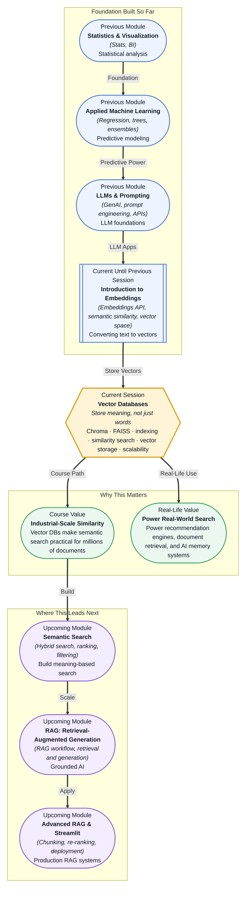

# Pre-read: Vector Databases

## Context of This Session in the Course

You have built an embedding pipeline. Every customer support ticket, product description, and internal policy document in your company has been converted into a vector — a dense list of numbers that captures semantic meaning. You can pick any two texts and measure how similar they are using cosine distance. But now your embedding collection has grown to five hundred thousand vectors, spread across dozens of categories, and querying them one at a time takes seconds per comparison. Your manager asks: "Find me the top ten documents most similar to this customer complaint — in under a second." Your for-loop over every vector crashes at that scale. Even a vectorised NumPy comparison of half a million embeddings takes too long for a real-time application.

The naive approach — store vectors in a flat list, compare against every one — works for a thousand vectors but breaks at a hundred thousand. The mathematics of semantic similarity is correct, but the engineering of storage and retrieval is missing. You need a system designed specifically to hold vectors, index them for fast lookup, and return the nearest neighbours in milliseconds, not minutes. That is where **Vector Databases** become essential.

A vector database is not a traditional database with a new column type. It is a purpose-built storage and retrieval engine that organises vectors into data structures optimised for **approximate nearest neighbour (ANN)** search. Instead of comparing your query vector against every stored vector, it builds indexes that narrow the search space intelligently — like a library that does not make you walk every aisle, but hands you the three most promising sections based on the topic of your book.

---

**What if** you were building the recommendation engine for an e-commerce platform with ten million products. Each product has a text description, and you have already converted each description into an embedding vector using the Embeddings API from the previous session. A user searches for "lightweight waterproof jacket for trail running." Your system must find the products whose embeddings are closest in meaning to that search query — and return results in under 200 milliseconds. Without a vector database, you would need to compute similarity against all ten million embeddings for every single query. Even a highly optimised cosine similarity calculation on a GPU would struggle to keep up with thousands of concurrent users. With a vector database, you pre-index the embeddings, and each query searches only a fraction of the total vectors, returning results at interactive speed. That combination — semantic understanding from embeddings plus millisecond retrieval from a vector database — is what powers modern recommendation, search, and AI memory systems.

---

The core idea is deceptively simple: a **vector database** stores embedding vectors alongside metadata, builds an index that organises them for fast retrieval, and exposes a query interface that returns the nearest neighbours to any input vector. But the simplicity ends there. The hard part is how the index works, what trade-offs you accept between speed and accuracy, and which tool you choose for your specific scale and latency requirements.

Think of a vector database like a filing system designed for meaning rather than alphabet. A traditional database stores rows and columns; you query it with exact conditions — `WHERE price < 100`. A vector database stores vectors in high-dimensional space; you query it with fuzzy conditions — "find documents similar to THIS meaning." The filing clerk in a traditional database knows exactly which drawer to open because you gave a precise label. The filing clerk in a vector database knows which neighbourhood to explore because your query vector falls into a region of space where similar documents cluster.

During this session, you will explore four connected ideas. First, what a vector database is and why traditional databases cannot replace one. Second, how **indexing** works — building data structures like IVF (Inverted File Index) or HNSW (Hierarchical Navigable Small World) that make fast search possible. Third, how **querying for similarity** translates a query embedding into ranked results using distance metrics. And fourth, how **Chroma** and **FAISS** compare as two popular vector database tools — one prioritising developer experience and rapid prototyping, the other prioritising raw performance at massive scale.

---

In the **previous session**, you learned how to convert text into embeddings using the Embeddings API. You explored the concept of **semantic similarity** by measuring distances between vectors in high-dimensional space, and you understood how dimensionality shapes what an embedding can represent. That was the moment you learned how to translate meaning into numbers. This session takes the next step: how do you store those numbers so that millions of them can be searched in real time? The embeddings you created are now the raw material. The vector database is the engine that turns that raw material into a practical search system.

---

In this pre-read, you will discover:

- How to **understand** why traditional databases cannot efficiently perform similarity search at scale.
- How to **learn** the mechanics of vector indexing and approximate nearest neighbour search.
- How to **apply** a vector database to store embeddings and retrieve similar documents by meaning.
- How to **recognise** the trade-offs between Chroma and FAISS for different application requirements.

---

## Why Traditional Databases Cannot Handle Vector Search at Scale

A standard relational database or document store is built for exact matches and range queries. You ask for all rows where `category = 'electronics'` and `price < 100`, and the database uses a B-tree index to locate those rows in logarithmic time. The operation is precise: a row either satisfies the condition or it does not. There is no notion of closeness or proximity.

Vector similarity search is fundamentally different. You are not looking for exact matches — you are looking for the vectors that are closest to your query in high-dimensional space. This requires computing distances — cosine, Euclidean, or dot-product — between the query vector and every stored vector. In a naive implementation, that is an O(n) linear scan through the entire collection. At a hundred thousand vectors, this becomes slow. At ten million, it is impractical for real-time use.

A vector database solves this problem by building a specialised index that does not store vectors in a naive flat arrangement. Instead, it organises them so that only a small fraction of vectors need to be examined per query. The index sacrifices a tiny amount of recall — you might miss a few of the truly nearest neighbours — in exchange for dramatic speed gains. This trade-off, known as **approximate nearest neighbour (ANN) search**, is the core innovation behind every vector database. The index does not tell you "these are the exact 10 closest vectors." It tells you "these are approximately the 10 closest vectors, and I found them a thousand times faster than checking every one."

## How Indexing and Similarity Querying Work Together

Two indexing algorithms dominate modern vector databases: **IVF (Inverted File Index)** and **HNSW (Hierarchical Navigable Small World)**. They approach the same problem — find nearest neighbours quickly — from different angles.

IVF works by clustering the vector space during indexing. When you insert vectors, IVF groups them into clusters using K-means. Each cluster has a centroid — a representative vector. When you query, IVF first finds which cluster centroids are closest to your query vector, then searches only within the top few clusters. If you have a million vectors divided into a thousand clusters, each query searches only about a thousand vectors instead of a million. The trade-off: if your query vector falls near the boundary between clusters, you might miss its true nearest neighbours. Increasing the number of clusters to probe reduces this risk at the cost of speed.

HNSW takes a graph-based approach. During indexing, it builds a multi-layered graph where each vector is a node, and edges connect vectors that are close to each other. The top layers of the graph contain only a few long-range connections; the bottom layers contain dense connections among nearby vectors. When you query, HNSW starts at the top layer, finds the closest node, then descends to the next layer using that node as entry point, repeating until it reaches the bottom layer where it finds the nearest neighbours. This hierarchical approach gives HNSW exceptional speed and accuracy, making it the default choice in many vector databases.

The query itself is evaluated using a **distance metric**. **Cosine similarity** measures the angle between vectors, making it robust to differences in magnitude — useful when comparing documents of varying length. **Euclidean distance** measures straight-line distance in vector space, which can be more intuitive when the magnitude itself carries meaning. Both Chroma and FAISS support multiple distance metrics, and choosing the right one depends on how your embeddings were trained.

## Where Vector Databases Appear in Real Life

Vector databases power the similarity search layer in applications where understanding meaning — not just matching keywords — is the core requirement. In **e-commerce and retail**, recommendation engines use vector databases to find products similar to what a user has browsed or purchased. When you look at a product page for "wireless noise-cancelling headphones" and see a "You might also like" section with "Bluetooth earbuds" and "travel headphone case," a vector database likely retrieved those recommendations by comparing the embedding of the current product against millions of others. The system does not need to know that headphones and earbuds are related — the embeddings capture that relationship automatically from product descriptions and user behaviour.

In **legal and compliance**, law firms and regulatory bodies use vector databases to search through decades of case law, contracts, and policy documents. A lawyer researching a precedent does not need to guess the exact phrasing used in a 1993 ruling — they describe the legal principle in natural language, and the vector database retrieves the documents whose embeddings are closest to that description. This transforms legal research from a keyword-matching scavenger hunt into a meaning-based discovery process.

In **healthcare**, clinical decision support systems use vector databases to match patient symptoms and medical histories against millions of research papers, drug interaction databases, and treatment guidelines. A physician inputs a description of a rare symptom combination, and the system retrieves the most relevant studies and case reports within seconds, even when the exact medical terminology differs between the query and the source documents.

In **media and content platforms**, video and music streaming services use vector databases to power personalised discovery. The embedding of a song you just listened to is compared against the embedding of every track in the catalogue; the service returns the ones whose vectors are nearest in the embedding space, creating a continuous listening experience that adapts to your taste without requiring explicit tags or genres.

In **AI infrastructure**, vector databases serve as the memory layer for LLM-powered applications. When a chatbot needs to answer a question about a company's internal policies, it embeds the question, retrieves the most relevant policy chunks from a vector database, and passes them to the LLM as context. This pattern — **retrieval-augmented generation (RAG)** — is one of the most common production use cases for vector databases today, and it is the topic of your upcoming sessions.

---

## What's Next

After this session, you will be able to:

- Explain the difference between a traditional database and a vector database in terms of query semantics and indexing strategy.
- Index a collection of embedding vectors using Chroma or FAISS for fast approximate nearest neighbour search.
- Query a vector database using cosine or Euclidean distance and interpret the ranked results.
- Compare IVF and HNSW indexing algorithms and choose the right one for a given latency and recall requirement.
- Decide when to use Chroma for rapid prototyping versus FAISS for production-scale performance and fine-grained control.

You do not need to memorise the internal details of every indexing algorithm right now. The goal is to understand vector databases as the missing storage layer for meaning-based retrieval: **embeddings give you the language of meaning; vector databases give you the speed to use it at scale.**

---

## Interesting Questions for the Live Session

- If ANN search is approximate by design, how do you measure whether your vector database is returning results that are "good enough," and how would you validate this in production?
- When a user searches for "affordable wireless earbuds" and the database returns "premium noise-cancelling headphones" because the embeddings are close in vector space, is that a success of semantic understanding or a failure of intent alignment?
- If you indexed the same embeddings in both Chroma and FAISS with identical parameters and queried them, would you always get the same top-k results, or are the differences non-deterministic?
- What happens to your vector database search quality when you add new documents over time — do old and new vectors remain comparable, or does the index need to be periodically rebuilt?

By the end of this session, vector databases should feel less like an exotic new technology and more like the natural storage layer for any system that needs to search by meaning: **embeddings capture what things mean; vector databases make that meaning searchable at scale.**
