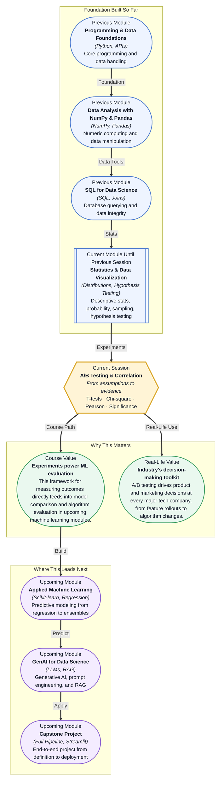

# Pre-read: A/B Testing & Correlation

## Context of This Session in the Course

Imagine you are a data scientist at an e-commerce company. Your team has redesigned the checkout page — fewer steps, bigger buttons, a brighter "Buy Now" colour. The design team is convinced it will boost conversion by 15%. Your manager wants to push it live tomorrow. But you pause: how do you know the new design is actually better? Maybe the old design converts better for mobile users, or the new one only seems stronger because the holiday shopping surge is inflating every metric.

You could compare the average order value before and after the launch — but that naive comparison is riddled with traps. External factors like day of week, marketing campaigns, and seasonal trends all muddy the water. Even a clear-looking difference could be nothing more than random fluctuation. Gut feelings and dashboard eyeballing will not tell you whether the result is real. You need a disciplined, statistical way to decide whether what you are seeing is a genuine signal or just noise.

That is where **A/B Testing & Correlation** becomes essential. This session gives you the tools to design controlled experiments, measure whether differences are statistically significant, and quantify how strongly two variables move together — skills that separate opinion-driven decisions from evidence-driven ones.

What if you were asked to decide whether a new recommendation algorithm actually increases user engagement — and your answer would determine whether the company invests millions in rolling it out? You would need more than intuition. You would need to set up a controlled experiment, choose the right statistical test, interpret the p-value correctly, and explain the result to stakeholders who have never taken a statistics course. By the end of this session, you will have the framework to do exactly that — and to defend your conclusion with confidence.

At its heart, **A/B testing** is a controlled experiment where you split your audience into two groups — a control group that sees the current version (A) and a treatment group that sees the new version (B). The goal is to measure whether the difference in outcomes between the two groups is larger than what you would expect from random chance alone. This is where **statistical significance** enters the picture — it is the yardstick that tells you whether your observed effect is real or just noise. Think of it like a courtroom. The **null hypothesis** (the "innocent until proven guilty" position) assumes the new version makes no difference. Your data is the evidence. A **p-value** is the probability of seeing evidence this strong if the null hypothesis were actually true. If that probability drops below a threshold (typically 0.05), you reject the null and declare the result statistically significant. But picking the right test matters — **T-tests** compare means between two groups, **Chi-square tests** check whether categorical variables are independent, and **Pearson Correlation** measures how linearly related two continuous variables are. In this session, you will explore all four of these tools: T-tests for comparing group averages, Chi-square tests for analysing relationships between categories, Pearson's r for quantifying correlation strength, and the art of interpreting significance without falling into common pitfalls like p-hacking or ignoring effect size.

In the **previous session**, you learned the structure of hypothesis testing — formulating null and alternative hypotheses, interpreting p-values, and understanding Type I and Type II errors. That framework gave you the grammar of statistical decision-making. This session now puts that grammar to work: instead of testing abstract hypotheses, you will design real experiments, compute test statistics from actual data, and quantify relationships between variables. The null hypothesis framework you built in Hypothesis Testing Basics becomes the engine that powers every T-test and Chi-square test you run today.

In this pre-read, you will discover:

- How to **build** a controlled A/B experiment and choose the right statistical test for your data.
- How to **apply** T-tests and Chi-square tests to compare groups and analyse relationships.
- How to **interpret** Pearson correlation coefficients and understand their limitations.
- How to **recognise** statistical significance and avoid common misinterpretation traps.

---

## Why T-tests and Chi-square Tests Answer Different Questions

Your data comes in different shapes — and each shape demands its own statistical tool. A **T-test** is designed for comparing the means of two groups when your outcome is a continuous number: average session duration (control vs. treatment), average order value (old checkout vs. new checkout), or average test score (teaching method A vs. method B). It asks: "Is the difference between these two averages larger than what random chance could account for?" The T-test calculates a t-statistic by dividing the difference between group means by the standard error of that difference, then maps that statistic to a p-value using the T-distribution. The larger the t-statistic, the stronger the evidence against the null hypothesis.

A **Chi-square test** tackles a fundamentally different kind of question. When your outcome is categorical — did the user click or not? Did the customer churn or stay? What browser did they use? — you cannot compute a meaningful average. Instead, you build a contingency table of observed counts and compare it to the table you would expect if the two variables were independent. The Chi-square statistic measures how far the observed counts deviate from the expected ones. A large deviation suggests the variables are related. For example, if you want to know whether browser choice (Chrome, Firefox, Safari) is independent of whether a user completed a purchase, a Chi-square test tells you whether the observed purchase rates per browser are too uneven to be coincidence.

Choosing the wrong test is one of the most common mistakes in applied statistics. If you run a T-test on categorical data, your results are meaningless. If you run a Chi-square test on continuous data, you throw away information by arbitrarily binning values. The mental model to internalise: continuous outcomes → T-test; categorical outcomes → Chi-square test. This distinction will guide every experiment you design.

## The Art of Interpreting Statistical Significance

A p-value below 0.05 is not a magic stamp of truth. **Statistical significance** only tells you that the observed effect is unlikely to have occurred by chance — it says nothing about whether the effect is practically important or economically meaningful. A large enough sample can make a trivial 0.1% conversion lift appear statistically significant even though the change would never justify the engineering cost of implementing it. This is where **effect size** and **confidence intervals** become your anchors. Instead of asking only "Is there a difference?" (the p-value's job), you must also ask "How big is the difference?" and "What range of plausible values does the data support?"

A T-test gives you a p-value, but it also gives you a confidence interval around the difference in means — and that interval is often more informative than the significance flag alone. If the confidence interval for your conversion lift ranges from 0.02% to 0.08%, the p-value might be significant, but the practical impact is minuscule. Similarly, **Pearson's r** comes with its own significance test, but the real insight is the magnitude of r: a correlation of 0.03 might be statistically significant with 10,000 data points, yet it is essentially meaningless in practice. The most dangerous phrase in data science is "the result is significant." Train yourself to replace it with: "the result is significant, the effect size is X, and the confidence interval ranges from A to B."

## Where A/B Testing and Correlation Appear in Real Life

You will encounter T-tests, Chi-square tests, and correlation analysis across nearly every data-driven industry. In **e-commerce**, A/B tests decide everything from button colours to checkout flows to personalised recommendation algorithms — companies like Amazon and Netflix run thousands of concurrent experiments, each judged by a T-test comparing conversion rates or engagement metrics. In **healthcare**, clinical trials are the ultimate A/B test: the control group receives the placebo, the treatment group receives the drug, and a T-test on the primary outcome determines whether the drug is effective. **Marketing teams** rely on Chi-square tests to determine whether customer segments (age group, region, channel) are independent of campaign response — a statistically significant dependency tells them exactly where to target their spend for maximum return. **Product teams** at social media platforms use correlation analysis to understand whether time spent on a new feature relates to user retention, directly informing product roadmaps and feature prioritisation. Even **finance** uses Pearson correlation to quantify how asset prices move together, forming the foundation of portfolio diversification, risk management, and hedging strategies.

## What's Next

After this session, you will be able to:

- Design a controlled A/B experiment and determine the appropriate sample size for reliable results.
- Perform a two-sample T-test to compare means between control and treatment groups.
- Apply a Chi-square test of independence to determine whether categorical variables are related.
- Calculate and interpret Pearson correlation coefficients for pairs of continuous variables.
- Communicate statistical results — including p-values, effect sizes, and confidence intervals — to non-technical stakeholders with clarity and honesty.

You do not need to memorise every formula right now. The goal is to develop a statistical instinct — to look at any comparison or relationship and know which tool to reach for and how to read its output with healthy scepticism.

## Interesting Questions for the Live Session

- If your A/B test runs for too short a time, you risk concluding the wrong version is better — what specific biases does a "peeking" problem introduce, and how do you guard against it?
- A Chi-square test tells you two categorical variables are dependent, but can it tell you anything about the direction or strength of that dependency beyond a yes-or-no answer?
- Pearson's r only measures linear relationships — what would a near-zero r look like for a strong but non-linear relationship shaped like a U-curve?
- If a large-sample A/B test shows a statistically significant but tiny effect size, should the company implement the change, and what factors beyond the p-value should enter that decision?

By the end of this session, A/B testing should feel less like abstract hypothesis testing and more like a practical decision-making superpower: **the difference between guessing and knowing.**
