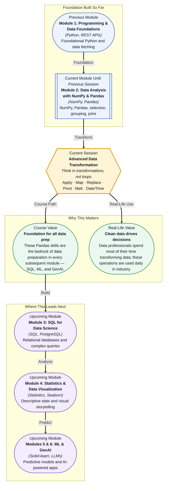

# Pre-read: Advanced Data Transformation

## Context of This Session in the Course

Your team just handed you a messy CSV with 50,000 rows of customer transactions — dates in three different formats, product categories that need to be standardised, and a column that needs to be split into weekday versus weekend sales. The business team needs the clean dataset by end of day, and your first instinct is to reach for a `for` loop and start processing row by row.

But looping through each row manually is painfully slow in Python, and the moment the data throws an unexpected format — a missing value, a date written as "Jan 5th 2025" instead of "2025-01-05" — your loop crashes and you are back to debugging. Even if you manage to clean one column, the next one has its own inconsistencies, and the stakeholders need answers across multiple dimensions: monthly trends, category breakdowns, per-customer summaries. The naive approach does not scale.

That is where **Advanced Data Transformation** becomes essential. This session teaches you a set of Pandas operations — apply, map, pivot, melt, and date/time handling — that let you transform thousands of rows in a handful of expressive, readable lines. No loops. No scattered debugging. Just clean, declarative transformations.

What if you could take a raw, messy dataset — thousands of rows with inconsistent dates, cryptic category codes, and a tangled structure — and reshape it into a polished, analysis-ready table in under ten lines of code? Imagine receiving a customer feedback spreadsheet on Monday morning and having a pivot table of sentiment trends by region ready before lunch. This session gives you the Pandas toolkit to turn that vision into reality.

Data transformations are the bridge between raw data and meaningful analysis. **Apply functions** allow you to run custom logic across every row or column without writing a loop — the function is *applied* to the entire dataset at once. **Map and replace** let you translate values from one form to another, like converting product codes to human-readable names or standardising "N/A", "null", and "NaN" into a single missing-value marker. Think of a data transformation as a factory assembly line. Raw ingredients (your DataFrame) enter at one end. Each station — apply, map, pivot, melt — performs a specific modification. By the time the data exits the line, it is packaged and ready for analysis, whether you have 100 rows or 10 million. In this session, you will explore **Pivot and Melt**, which restructure an entire table by turning rows into columns or columns into rows. You will also work with **Date/Time handling**, learning to parse inconsistent date strings, extract day-of-week or month, and compute time differences across thousands of records.

In the **previous session** (Session 7.1 — Data Joins & Merges), you learned how to combine multiple DataFrames using inner, outer, left, and right joins — bringing scattered data together into one unified table. That skill gives you a single, rich dataset to work with. Now, in Advanced Data Transformation, you take that unified table and reshape it, enrich it, and prepare it for deeper analysis. The joins gave you a complete picture. Apply, map, pivot, melt, and date/time handling give you the power to manipulate that picture into any form you need.

In this pre-read, you will discover:
- How to **apply** custom functions efficiently across every row or column of a DataFrame
- How to **connect** inconsistent values using map and replace operations
- How to **build** pivot tables and melted DataFrames for multi-dimensional analysis
- How to **interpret** date and time data to extract meaningful temporal patterns

---

## Why `apply()` Beats Loops for Row-Wise Logic

You have a DataFrame with 50,000 rows. You need to compute a complex value for each row — say, a risk score based on purchase amount, frequency, and recency. The instinctive approach is a `for` loop: iterate over every row, check conditions, assign a score. But Python loops over Pandas rows are agonisingly slow because each iteration incurs overhead from the Python interpreter, and they make the code harder to read, debug, and reuse.

The `apply()` method solves this by taking a function and running it on every row (or column) in a single, readable line. Behind the scenes, Pandas optimises the iteration using Cython, making it dramatically faster than a manual loop. More importantly, it separates the logic (your function) from the iteration mechanics — you write the function once, test it on a single row, then let `apply()` handle the rest. For example, a classification function that assigns "High", "Medium", or "Low" priority based on three numeric columns can be written in isolation and then passed directly to `df.apply()`. No `.iterrows()`, no index tracking, no accidental mutation. This pattern — write a function, apply it to every row — is the same mental model used in SQL window functions, Spark UDFs, and even MapReduce. Mastering it in Pandas prepares you for distributed computing later in the course and beyond.

## How Pivot and Melt Give You Two Views of the Same Data

Data rarely arrives in the shape you need for analysis. A sales dataset might store one row per product per month, but your charting library wants one column per month. Or you receive a wide table with twelve monthly columns and need to reorganise it into a tidy, two-column format for statistical modelling. Manually rearranging columns with loops and list operations is error-prone and does not scale when the number of categories or time periods changes.

**Pivot** turns unique values in a column into separate columns — it makes the table wider by rotating row labels into column headers. **Melt** does the opposite: it unpivots columns into rows, making the table longer by collapsing multiple value columns into a single column with a label column that records which original column each value came from. Together, they let you switch between analytical views of the same data without ever changing the underlying values. Think of pivot as turning a stack of labelled boxes on its side so each label becomes a separate shelf. Melt is the reverse — taking separate shelves and stacking them into one column of boxes with a label column that tells you which shelf each came from. Both views contain the same information; they just organise it differently for different questions. Pivot and melt are fundamental to Exploratory Data Analysis (you will need melted data for Seaborn's `hue` and `col` parameters) and to Machine Learning (many Scikit-learn models expect data in a specific orientation). Mastering them now means you can adapt any dataset to any tool.

## Where These Transformations Appear in Real Life

These operations are not classroom exercises — they are the daily tools of data professionals across industries. An e-commerce data scientist uses **map and replace** to standardise product categories from hundreds of suppliers, then **pivots** transaction logs to build a user-item matrix for a recommendation engine. A financial analyst receives raw trade data with millisecond timestamps, uses **Date/Time handling** to resample into daily OHLC candles, and **applies** a custom volatility function across thousands of instruments simultaneously. In healthcare analytics, messy diagnosis codes from different hospitals are cleaned with **map and replace**, and patient vitals recorded as one column per timepoint are **melted** into a long format for time-series analysis. A marketing analyst merges campaign data from Google Ads, Facebook, and email (building on the previous session's joins), then uses **pivot** to compare performance metrics across channels side by side, while **date/time extraction** reveals the exact hours and days that drive the highest conversion rates. Whether you work in fintech, healthtech, e-commerce, or marketing, the ability to reshape and transform data at scale is the skill that separates a data analyst from a data wrangler.

## What's Next

After this session, you will be able to:
- Apply a custom function to every row or column of a DataFrame using `apply()`
- Map and replace values in a column to clean and standardise categorical data
- Pivot a DataFrame to create a summary table with unique values as column headers
- Melt a wide DataFrame into a tidy long format for visualisation and analysis
- Parse inconsistent date strings into Pandas datetime objects
- Extract temporal features like day of week, month, and time differences from date columns

You do not need to memorise every parameter of every function right now. The goal is to build a mental model of data transformation as an assembly line — each operation is a station, and your job is to route the data through the right stations in the right order.

## Interesting Questions for the Live Session

- When you `apply()` a function across rows in a DataFrame with mixed data types, what assumptions does Pandas make about the result, and how can that silently break your analysis?
- What happens to the index when you pivot a DataFrame with duplicate entries for the same row-column combination, and how would you detect and handle that?
- If you melt a DataFrame and the value columns have different data types (integers and strings), how does Pandas handle the combined column, and what are the implications for downstream analysis?
- Why might converting a date column to datetime fail on a seemingly valid dataset, and what strategies would you use to diagnose and fix the issue without inspecting 50,000 rows manually?

By the end of this session, data transformation should feel less like a chore and more like a superpower: **You do not wrestle with data — you reshape it.**
