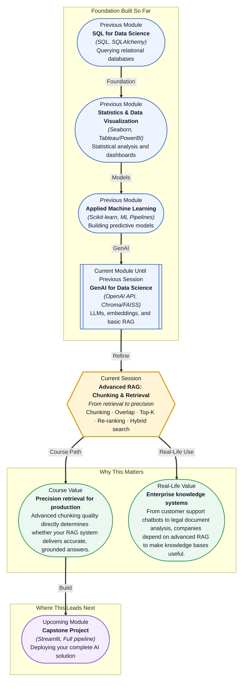

# Pre-read: Advanced RAG: Chunking & Retrieval

## Context of This Session in the Course

You are building a customer support chatbot for a company with over ten thousand product documentation pages. You connect it to an LLM, feed it a question from a frustrated user, and wait. The answer comes back confident, fluent, and completely wrong — it cited a warranty policy from an unrelated product line. The LLM did exactly what it was asked: it generated text based on the pieces of information it retrieved. The problem was that those pieces were only loosely relevant.

The naive approach — just shove entire documents into a vector database, retrieve the top five closest matches, and hope for the best — fails the moment your data has nuance. A paragraph about refunds might sit next to a paragraph about shipping times, and the retrieval system, seeing them as equally similar to "return policy," returns both. The LLM then weaves them into a single misleading answer. The issue is not the generation step. It is that retrieval quality was never tuned.

You need a way to control what the LLM sees with surgical precision — how documents are broken down, how relevance is measured, and how results are refined before they reach the model. That is where **Advanced RAG: Chunking & Retrieval** becomes essential.

What if you were tasked with building a research assistant for a legal team that needs to sift through thousands of case documents, each hundreds of pages long, and retrieve only the clauses relevant to a specific argument? The naive approach would miss the nuance of legal language, returning entire sections when only a single sentence matters. After this session, you will know how to structure your document preprocessing so that the retrieval system surfaces the exact piece of text needed — and how to rerank those results so the most critical ones appear first.

At its core, advanced RAG is about controlling the signal your LLM receives. The process begins with **chunking** — splitting documents into manageable, meaningful pieces. A fixed-size chunking strategy splits by character or token count, which is fast but can cut through a sentence mid-thought. **Semantic chunking**, by contrast, uses natural boundaries like paragraphs, sections, or topic shifts to preserve meaning. The overlap between chunks — a small number of repeated tokens at the boundaries — ensures no context is lost at the seams.

Think of chunking like cutting a long transcript into index cards. If you cut arbitrarily by line count, a single idea might end up split across two cards, and the reader (your LLM) sees only half the story. But if you cut by topic, each card becomes a self-contained unit of meaning. Then, when you retrieve, you pull only the cards directly relevant to the question. This session explores how to make those cuts wisely, how to measure whether your retrieval is working, and how to combine vector similarity with traditional keyword matching for the most robust results.

In the **previous session**, you learned the core RAG workflow — how retrieval and generation combine to ground LLM outputs in factual data, and how vector databases enable semantic search over large document collections. You saw the architecture from above: embed documents, store them, query for similarity, and pass results to the LLM. What you did not yet explore is how the quality of the pieces you store — their size, their boundaries, and how you rank them — determines whether the system delivers truth or hallucination. This session turns the dial from "does it work" to "how well does it work."

In this pre-read, you will discover:

- How to **apply** chunking strategies (semantic and fixed-size) to balance context completeness with retrieval precision
- How to **build** a reranking pipeline that elevates the most relevant results above the noise
- How to **connect** vector and keyword search for robust hybrid retrieval across diverse queries
- How to **interpret** retrieval quality metrics to diagnose and fix RAG failures

---

## Why Document Chunking Is the First Lever of RAG Quality

Every RAG system begins with the same hidden assumption: that the pieces of text you store are the right pieces. If those pieces are poorly chosen, no amount of clever retrieval or prompt engineering will fix the output. This is why **chunking strategy** is the single most consequential design decision in a RAG pipeline.

Fixed-size chunking is predictable and cheap. You decide on a token count — say 256 or 512 — and split every document at that boundary, optionally adding a small **overlap** of ten to twenty tokens between chunks to prevent a sentence from being severed. The trade-off is that the chunk boundaries are blind to meaning. A fixed-size chunk might start mid-explanation and end before the conclusion. **Semantic chunking** solves this by splitting at natural breakpoints: paragraph ends, section headers, or sentence boundaries detected by an NLP model. The cost is complexity — semantic chunking requires a model or heuristic to identify where one unit of meaning ends and another begins. In practice, many production systems use a hybrid: semantic splitting for initial structure, then fixed-size limits to prevent any single chunk from exceeding a maximum length.

The overlap parameter is often underestimated. Without overlap, a sentence bridging two chunks is invisible to the LLM when it retrieves only one of them. With too much overlap, you inflate your vector database and risk returning near-duplicate results. The right overlap depends on your data: dense technical documentation needs more overlap than conversational text. Getting this balance wrong means your RAG system either misses critical context or drowns in redundancy.

## How Reranking Changes What Retrieval Means

Initial retrieval — the top-K step that pulls candidate chunks from your vector database — is designed for speed. It casts a wide net, using approximate nearest neighbour search to find the vectors closest to your query. Speed comes at a cost: the initial results are noisy. A chunk that happens to use overlapping vocabulary with the query can rank higher than a chunk that is genuinely more relevant but uses different phrasing. This is where **reranking** enters the pipeline.

A reranker is a more expensive, more accurate model that takes the initial candidate list and scores each query-chunk pair from scratch. It can use cross-encoder models that jointly attend to both the query and the chunk, producing a relevance score far more reliable than cosine similarity between embeddings. The reranker typically processes only the top 20 to 100 candidates, so total latency remains manageable. The impact is dramatic: reranking can lift top-1 accuracy by 15 to 30 percent in many benchmarks.

Alongside reranking, **hybrid search** combines vector similarity with keyword-based matching (typically BM25) to cover cases that pure semantic search misses. A user searching for "Python 3.12 release date" benefits from the exact keyword match on "3.12," while a user asking "when was the latest version of Python released" benefits from semantic matching. Hybrid search retrieves candidates from both methods and merges them using weighted scoring or reciprocal rank fusion. This dual approach ensures that both precise and fuzzy queries are handled well by the same system.

## Where Advanced RAG Appears in Real Life

The techniques in this session power some of the most widely used AI applications today. In **legal technology**, firms deploy advanced RAG to search through millions of case documents and retrieve clauses matching a specific legal argument — semantic chunking preserves the logical structure of legal reasoning, while reranking ensures the most on-point precedents surface first. In **healthcare**, clinical decision support systems retrieve relevant passages from medical literature, where chunking at the paragraph level preserves the nuance of drug interactions and contraindications. A poorly chosen chunk boundary here could mean the difference between a correct and a dangerous recommendation.

**Customer support** platforms use hybrid search to handle the wide variety of user phrasing — one customer asks "how do I return this?" and another asks "what is your refund policy?" — with the same retrieval system returning the correct answer for both. **Educational technology** companies build personalized tutoring systems that retrieve lesson content tailored to each student's current question, using overlap and reranking to maintain coherence across topics. And in **enterprise knowledge management**, internal documentation search across thousands of repositories uses advanced chunking to keep code examples, API references, and architectural explanations intact as self-contained units. In every case, the difference between a frustrating and a delightful AI experience comes down to how well the system retrieves.

## What's Next

After this session, you will be able to:

- Chunk documents using both fixed-size and semantic strategies with appropriate overlap
- Implement a reranking pipeline to improve the relevance of retrieved results
- Design a hybrid search system combining vector embeddings with keyword-based matching
- Evaluate retrieval quality using metrics like precision@K, recall@K, and NDCG
- Diagnose common RAG failures caused by poor chunking or retrieval configuration
- Apply advanced retrieval techniques to improve the factual grounding of LLM outputs

You do not need to implement a production-grade retrieval system right now. The goal is to see retrieval not as a simple lookup, but as a design decision that determines whether your AI application is trustworthy or unreliable.

## Interesting Questions for the Live Session

- If fixed-size chunking is fast and semantic chunking is accurate, is there a scenario where the speed of fixed-size chunking actually produces better results than the accuracy of semantic chunking?
- When you rerank results, you add latency. At what point does the improvement in retrieval quality stop justifying the extra milliseconds for a real-time application?
- Hybrid search combines vector and keyword signals — but what happens when the two signals consistently disagree? How do you debug which one is misleading you?
- Your retrieval quality metric shows 95% precision@K, yet the LLM still hallucinates on 20% of queries. What does that gap tell you about what retrieval metrics actually measure?

By the end of this session, retrieval quality should feel less like a black-box performance number and more like a deliberate set of design trade-offs you can control: **chunking, reranking, and hybrid search are not implementation details — they are the difference between an AI that guesses and an AI that knows.**
