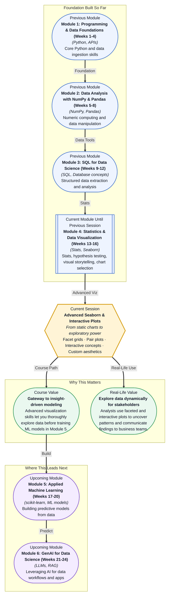

# Pre-read: Advanced Seaborn & Interactive Plots

## Context of This Session in the Course

You have just finished cleaning a messy customer churn dataset — hundreds of thousands of rows with demographics, usage patterns, and support interactions. You run a couple of quick `sns.scatterplot()` calls and a `heatmap()` for correlations. The basic charts confirm what you suspected: churn is correlated with lower engagement. But then your manager asks, "Can you show me how churn differs across customer segments, by region, over time, and which combination of factors matters most?" Suddenly, your static scatter plot feels like trying to describe a forest by looking at a single leaf.

The gap between a simple scatter plot and the multi-dimensional question your manager just asked is enormous. One chart shows two variables; the question involves five. The naive approach — creating dozens of individual charts — produces visual noise, not clarity. Patterns that cut across groups and dimensions stay hidden because each chart lives in isolation. You need a way to slice your data across multiple categorical dimensions simultaneously and let the trends reveal themselves without manually comparing side-by-side plots. That is where **Advanced Seaborn and Interactive Plots** becomes essential. With tools like **facet grids** and **pair plots**, you can decompose a multi-dimensional question into a clean matrix of focused subplots, and by introducing interactivity, you turn static snapshots into surfaces the stakeholder can explore themselves.

What if you could hand your manager a single visual where they can filter by region, toggle customer segments, and watch how churn patterns shift in real time — without writing a single additional line of code? What if exploring a twenty-variable dataset required only a few lines of Python, producing a grid of plots that reveals cluster separations, trend divergences, and outlier groups at a glance? This session gives you the Seaborn and interactive tooling to turn that scenario from a wish into your everyday workflow.

**Facet grids** let you split your data across one or more categorical variables and draw the same type of plot for each subset, aligned in a clean grid for direct visual comparison. Think of it like a spreadsheet where every cell contains not a number but a full chart — letting you scan dozens of subplots and instantly spot which group behaves differently. **Pair plots** extend this idea to every numeric column in your dataset, plotting each pair of variables against one another so you can visually detect correlations, clusters, and outliers at a glance, without writing a separate plot command for each combination. These are not merely conveniences; they represent a shift in how you approach data exploration. Instead of asking "which chart type should I use?", you ask "which dimensions might interact?" and let the grid reveal the answer. In this session, you will explore **facet grids**, **pair plots**, **customizing aesthetics** (palettes, styles, themes), and get your first taste of **interactive visualization concepts** — the bridge from Seaborn's static excellence to tools like Plotly that let you zoom, hover, and filter live.

In the **previous session**, you learned the principles of visual storytelling and how to map specific data types — distributions, comparisons, trends, relationships — to their optimal chart forms: histograms for distributions, bar charts for comparisons, line charts for trends, and scatter plots for relationships. You developed the vocabulary to choose the right chart for the right question. Now, in this session, you will scale that skill dramatically. Instead of choosing one chart at a time, you will learn to generate dozens of them in a single coordinated grid, preserving that "right chart for the right question" instinct while exploding the number of questions you can ask simultaneously. The design principles you just mastered become the building blocks for multi-plot narratives.

In this pre-read, you will discover:

- How to **build** faceted grid plots that reveal patterns across categorical groups at a single glance.
- How to **use** pair plots to spot correlations and clusters across multiple numeric dimensions.
- How to **customize** Seaborn aesthetics to produce publication-ready visuals.
- How to **connect** static Seaborn charts to the concepts behind interactive visualization.

---

## Why One Chart Is Never Enough — Enter the Facet Grid

A single scatter plot or bar chart answers one question at a time. In practice, data scientists rarely have the luxury of a single question. A typical exploration might ask: "Does the relationship between income and spending differ across age groups, regions, and membership tiers simultaneously?" Answering that with individual charts means generating nine separate plots and mentally cross-referencing them — a recipe for missed patterns and tired eyes.

A **facet grid** solves this by taking a categorical variable (or two) and "facetting" your data into subplots arranged in rows and columns. Seaborn's `FacetGrid` and its convenient wrappers like `catplot()` and `relplot()` handle this in one call. You specify the row variable, the column variable, and the plot type, and Seaborn automatically splits the dataset, draws each subset as its own chart, and aligns them on shared axes for direct comparison. The mental model is simple: facet grids are the visual equivalent of a SQL `GROUP BY` — they partition your data and let you inspect each partition without leaving the canvas. This becomes especially powerful when you combine facetting with a **hue** parameter, adding a third categorical dimension through color, so a single grid can surface interactions across three or four variables at once.

## Pair Plots: Your Multi-Dimensional Explorer

When you have a dataset with ten numeric columns, testing every pair of variables manually would require forty-five scatter plots. No one has the patience or the time for that. More importantly, you do not know in advance which pairs will reveal something interesting — the whole point of exploration is to discover the unexpected.

A **pair plot** (`sns.pairplot()`) solves this by computing every pairwise scatter plot and arranging them in a matrix, with histograms or KDE curves on the diagonal showing each variable's distribution. The result is a single figure that encodes hundreds of visual comparisons. Patterns that would otherwise remain hidden — a cluster that separates cleanly on two specific features, a non-linear relationship between two seemingly unrelated columns, an outlier group that stands out only in combination — become immediately visible. By adding a `hue` parameter (for example, coloring points by churn status), you can overlay a categorical grouping across every pair simultaneously, letting you see which features best separate your classes. This is the closest thing data science has to a "doctor's stethoscope" for numeric data: a fast, systematic first-pass diagnostic that tells you where to look deeper.

## Where Faceted and Interactive Visualization Appears in Real Life

The skills you build in this session appear across nearly every data-intensive industry. In **marketing and customer analytics**, teams use facet grids to compare campaign performance across channels, regions, and customer segments in a single view, quickly identifying which combination drives the highest conversion. In **healthcare and clinical research**, pair plots help researchers spot adverse event patterns across patient subgroups, visualizing how lab values, dosage levels, and demographic factors interact — a critical early-warning system before formal statistical testing. In **finance and risk analysis**, analysts facet time-series plots by asset class and region to surface diverging trends, while interactive visualizations power the dashboards that traders and portfolio managers rely on for real-time decisions. In **operations and supply chain**, faceted views of delivery times across warehouses, seasons, and shipment modes reveal bottlenecks that a single aggregate would mask. And in **data journalism**, interactive, multi-panel graphics let readers explore how policy changes affect different demographic groups, turning a static article into a personalized investigation. Across all these domains, the common thread is the same: the ability to slice data across multiple dimensions and let patterns emerge naturally is the difference between a chart that shows data and a chart that tells a story.

## What's Next

After this session, you will be able to:

- Build facet grids using `FacetGrid`, `catplot()`, and `relplot()` to compare subpopulations across categorical dimensions.
- Generate pair plots with `sns.pairplot()` to visually explore multivariate relationships in a single command.
- Customize Seaborn themes, color palettes, and style parameters to produce professional, publication-quality visuals.
- Interpret the core concepts behind interactive visualization (tooltips, zoom, pan, filtering) and connect them to static Seaborn workflows.
- Diagnose which dimensions and interactions in a dataset deserve deeper statistical or modeling attention based on visual patterns.
- Apply aesthetic customization rules (palette choice, axis labels, legend placement) to make your charts accessible to non-technical stakeholders.

You do not need to memorize every Seaborn parameter right now. The goal is to adopt multi-dimensional curiosity — letting grids and pairs do the heavy lifting so your brain can focus on the patterns.

## Interesting Questions for the Live Session

- When would a facet grid mislead rather than clarify — what assumptions about data distribution does it silently make?
- Is a pair plot always the best first step for high-dimensional data, or can it become visually overwhelming at a certain number of features?
- If you had to choose between interactivity and publication-quality aesthetics for a stakeholder presentation, which would you prioritise and why?
- How does the mental model of "slicing by categorical variables" in facet grids map to the `GROUP BY` and window-function operations you learned in SQL?

By the end of this session, multi-dimensional exploration should feel less like a manual chore and more like a single, deliberate command: **Seaborn grids and pairs turn your data into a conversation.**
