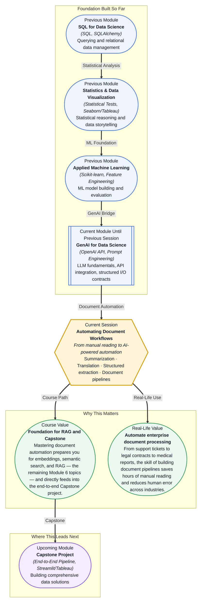

# Pre-read: Automating Document Workflows

## Context of This Session in the Course

It is Monday morning, and your inbox holds 47 support tickets, 12 internal memo PDFs, and a quarterly report written in dense legal language — all needing to be read, categorized, and summarized before the 10 AM standup. You have 90 minutes. The obvious move is to open each document, copy the content into a chat interface, and ask for a summary one at a time. By the fifth document you notice the summaries are inconsistent — one is a paragraph, another is a bullet list, and the third omits the single data point you actually needed. By the tenth document your formatting breaks entirely, and you realize you have no way to ensure that the same fields (customer name, issue category, urgency level) are extracted from every ticket with the same structure. The manual approach simply cannot scale, and the cost of inconsistency is a missed insight or a wrong decision.

The deeper problem is not that LLMs are incapable of handling documents — they are. The problem is orchestration. Every document is slightly different: a PDF has different layout than a web page; a Spanish support ticket needs translation before extraction; an executive memo needs a different summary length than a bug report. Doing each task by hand guarantees inconsistency and burnout. What you need is a repeatable, programmable pipeline — a sequence of automated steps that ingests raw files, applies the right LLM operation at each stage, and outputs structured data you can load straight into a DataFrame or a database.

That is where **Automating Document Workflows** becomes essential.

What if you could write a single Python script that watches a folder, and every time a new document lands — a support ticket CSV, a French contract PDF, a quarterly earnings transcript — it automatically runs the correct pipeline: detect the language, translate if needed, classify the document type, extract structured fields, and produce a summary, all without you touching a single prompt? Your morning routine would shift from frantic reading to reviewing a dashboard that already did the work, flagging only the anomalies that need your judgment. That is the capability this session places in your hands: the shift from reactive manual processing to orchestrated, repeatable automation.

At its core, automating document workflows means designing a **pipeline** — a sequence of processing steps — that takes unstructured text in and returns structured, actionable information out. The pipeline rests on three capabilities. The first is **text extraction**: pulling raw text from heterogeneous sources — PDFs, emails, web pages, scanned notes. The second is **transformation**: the LLM-driven operations that reshape the content — summarizing long passages, translating between languages, or extracting specific fields like invoice numbers or complaint categories. The third is **structuring**: enforcing a consistent output format — a JSON record, a DataFrame row, or a database entry — that downstream systems can consume without guesswork. Think of it like an assembly line in a factory: raw materials (unstructured documents) enter at one end, pass through specialized stations (summarization, translation, extraction), and emerge as finished products (structured datasets). Each station is powered by an LLM, but the orchestration logic — what goes where, in what order, and what to do when a step fails — is code you write and control. In this session, you will explore **summarization** as a technique for condensing reports and ticket threads, **translation** as a cross-language bridge, **extracting structured data** from free text using schema-driven prompts, and **building a document pipeline** that chains these operations together into a coherent, reusable workflow.

In the **previous session**, you learned how to design input-output contracts — building clean interfaces between Python code and LLM responses. You parsed JSON outputs, handled API errors gracefully, and managed retries with backoff logic. That contract-first thinking is the exact foundation this session builds on. Where before you handled a single prompt-response pair, now you will chain multiple LLM calls together: the output of the translation step becomes the input to the summarization step, and the summary feeds into the structured extraction step. The discipline of designing predictable I/O contracts is what makes the pipeline reliable — each stage trusts that the previous stage delivered data in the agreed format, and if it did not, the pipeline fails early and clearly instead of silently producing garbage.

In this pre-read, you will discover:
- How to **build** a document processing pipeline that chains summarization, translation, and extraction steps into a single automated workflow
- How to **apply** LLMs to extract structured data from unstructured text using schema-driven prompts and few-shot examples
- How to **recognise** the key design patterns — error boundaries, batching, and schema enforcement — that make pipelines reliable at scale
- How to **connect** these techniques to real-world enterprise automation use cases in support, legal, healthcare, and finance

---

## Why Summarization Needs a Strategy, Not a Single Prompt

A naive "summarize this" prompt gives you a paragraph, but it may miss the specific information your team needs. The challenge is not getting an LLM to summarize — it is controlling what gets summarized, at what level of detail, and in what format. A customer support ticket might need a one-sentence triage label ("billing issue, high urgency, customer ID 4432"), while a quarterly earnings transcript demands a structured breakdown by business segment. The technique is to treat summarization as a **parameterized operation**: you design a prompt template that accepts a target length, a focus area, and an output format, so the same summary function can handle both cases by changing arguments instead of rewriting prompts. This approach converts a vague request into a predictable, testable contract — and predictability is what makes automation safe.

## Extraction Is a Mapping Problem, Not a Writing Problem

When you ask an LLM to extract structured data, you are asking it to map free text onto a fixed schema. This is fundamentally different from open-ended generation: the output space is constrained (a JSON object with predefined keys), but the input is unpredictable (a document you have never seen before). The skill lies in designing a schema that is precise enough to guide the model but flexible enough to handle edge cases — and providing few-shot examples that demonstrate exactly how edge cases should be parsed. For example, an extraction prompt for invoice data must specify not just what fields to return (vendor name, invoice date, total amount) but also how to handle missing values, date formats, and currency symbols. The output should always parse into a DataFrame without post-hoc cleanup. This is where the input-output contracts from the previous session become a practical discipline: you define the extraction schema once, write examples that cover the boundary cases, and treat every extraction as a function call that either returns valid structured data or raises a clear error.

## Where Document Pipelines Appear in Real Life

The pattern of ingesting unstructured documents and producing structured insight shows up across nearly every industry. **Customer support teams** use document pipelines to categorize and prioritize incoming tickets, generate draft responses, and flag recurring issues before they escalate — turning a firehose of complaints into a prioritized backlog and a weekly trend report. **Legal departments** automate contract review: a pipeline ingests hundreds of pages, extracts clauses, parties, obligations, and expiration dates, and populates a structured database that lawyers can query instead of re-reading every agreement. **Healthcare operations** process clinical notes through extraction pipelines that identify diagnoses, medications, and lab results and write them into structured EHR records, reducing documentation time for clinicians. **Financial services** firms automate report generation by ingesting quarterly earnings PDFs, translating them from multiple languages, and producing analytical datasets that feed into trading models or compliance dashboards. And **product teams** aggregate user feedback — from app store reviews, survey responses, and support logs — into prioritized feature requests, using summarization to condense thousands of comments into the top three pain points. In every case, the technical pattern is identical: unstructured text in, structured insight out, orchestrated by a pipeline that replaces hours of manual effort with a single script.

## What's Next

After this session, you will be able to:

- Design a multi-stage document pipeline that chains extraction, translation, and summarization using Python and the OpenAI API
- Write schema-driven prompts that extract structured fields from free-text documents into consistent JSON or DataFrame rows
- Handle pipeline failures gracefully with retries, error logging, and fallback outputs when a stage produces unexpected results
- Batch-process hundreds of documents while managing API rate limits and cost budgets
- Evaluate the quality of LLM-generated summaries and extractions using both automated metrics and human review templates
- Translate document content between languages as a preprocessing step before downstream analysis

You do not need to build a production-grade pipeline on your first attempt — the goal is to get one end-to-end flow working, then iterate on reliability. The mental model to carry into the session is this: every document is a potential structured record waiting to be extracted, and your job is to design the assembly line, not to read every box on the belt.

## Interesting Questions for the Live Session

- If a summarization prompt produces different outputs for the same document on two different runs, is that a bug or a feature — and how would you decide which output to keep?
- When building a pipeline that processes 500 support tickets, should you send them one at a time or batch them into a single prompt? What tradeoffs emerge at each extreme?
- Imagine an extraction prompt that works perfectly on English invoices but starts hallucinating fields when given a French invoice. What aspects of the prompt design could cause this, and how would you fix it without training a new model?
- A pipeline step fails midway through a batch of 200 documents — some documents are processed, some are not. What strategies would you use to restart the pipeline without reprocessing the successful documents and without missing the failed ones?

By the end of this session, document workflows should feel less like a manual chore and more like a design problem with reusable building blocks: **from inbox chaos to orchestrated clarity.**
