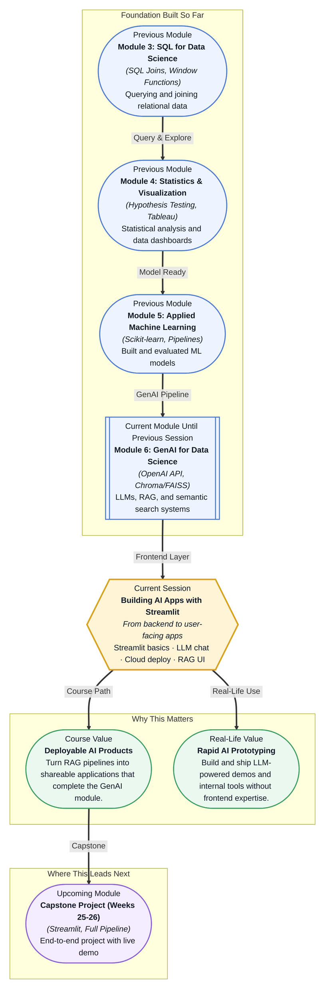

# Pre-read: Building AI Apps with Streamlit

## Context of This Session in the Course

You just wrapped up a late-night debugging session. Your RAG pipeline is returning clean, cited answers from a 500-page policy document. You close your laptop, satisfied. The next morning, your teammate asks: "Can I try it?" You open your notebook, run cells one by one, and type the query as a Python string. Your teammate watches over your shoulder, waiting. There is no text box. No submit button. No way for them to interact without you sitting at the keyboard.

This is the silent gap in every AI project. A working backend — whether it is a fine-tuned LLM, a RAG pipeline, or a classification model — is only half the solution. Without a frontend, your work stays locked inside notebooks and terminal windows: invisible to stakeholders, unusable by non-technical colleagues, impossible to ship as a real tool. The instinct is to reach for a full web framework like Django or React, but that would mean weeks of learning HTML, CSS, and JavaScript. You need something that lets Python do what Python does best — express logic — and handles the rest automatically.

What if you could turn any Python script into a living, interactive web application in a single afternoon — without writing a single line of frontend code? That is where **Building AI Apps with Streamlit** becomes essential.

What if your team lead asked you to build a company-facing Q&A bot that answers questions from internal policy documents by next week? You already have a RAG pipeline ready — the retriever is tuned, the vector store is populated, and the LLM returns grounded answers. But now you need to wrap it in a simple UI where colleagues can type questions, see relevant citations, and get answers in real time. Then you need to deploy it to the cloud so the whole team can access it from their browsers. Without the ability to rapidly ship a frontend, your RAG pipeline never becomes a product. This session hands you the missing piece.

**Streamlit** is an open-source Python library that turns data scripts and AI backends into interactive web applications without writing HTML, CSS, or JavaScript. Think of it as a translator: your Python code — full of functions, API calls, and dataframes — gets converted into a web page that speaks in buttons, text inputs, and live outputs. The core mental model is reactive: every time a user interacts with a widget, Streamlit re-runs your script from top to bottom, updating the UI to reflect the latest state. This means you write your app as a linear Python script, and the interface emerges naturally from how you arrange widgets like `st.text_input()`, `st.button()`, and `st.chat_message()`. An analogy: imagine describing a restaurant to a friend over the phone versus building a 3D model from Lego bricks. Streamlit is the phone call — it captures the full experience with a fraction of the material. During this session, you will explore how to create input widgets, connect an LLM chat interface using Streamlit's native chat elements, integrate your existing RAG pipeline as a backend callback, and deploy the entire application to **Streamlit Cloud** with a single git push.

In the **previous session**, you built an advanced RAG pipeline covering document chunking strategies, overlap logic, top-K retrieval, and re-ranking. You learned how to split large documents intelligently and retrieve the most relevant passages so your LLM could ground its answers in verified content. That backend — the retriever, the vector store, and the LLM chain — is the engine of your AI application. This session gives you the dashboard, the steering wheel, and the ignition. The RAG pipeline without Streamlit is invisible to anyone who cannot read Python. Streamlit without a RAG pipeline has nothing useful to show. Together, they form a complete, deployable AI product — and this session is where those two pieces finally connect.

In this pre-read, you will discover:
- How to **build** interactive web interfaces using Streamlit's widget system
- How to **connect** an LLM chat interface to your Python backend
- How to **deploy** a working AI application to Streamlit Cloud
- How to **integrate** a RAG pipeline into a user-facing UI

---

## How Streamlit Transforms Python Scripts into Instant Web UIs

The fundamental shift you will make in this session is moving from a "run-and-read" mindset (write code, execute it, see output) to a "render-and-respond" mindset (write a script that describes an interface, then let users drive it). In a traditional notebook workflow, you are both the operator and the audience. With Streamlit, you become the *architect* of an experience that others navigate independently. Every Streamlit app is a Python script that runs top-to-bottom, but instead of printing to a console, it renders widgets onto a web page. When a user clicks a button or types into a text box, the script re-runs, and the new output replaces the old. This reactive loop — user action → script re-run → UI update — is the single most important concept to internalise.

Streamlit provides a catalog of **widget functions** that each map to a specific UI element. `st.text_input("Your question")` renders a text box and returns whatever the user types. `st.button("Search")` renders a clickable button and returns `True` only when clicked. `st.selectbox("Choose a model", ["GPT-4", "GPT-3.5"])` renders a dropdown. The beauty is that these are still Python functions — you can store their return values in variables, pass them to your RAG pipeline, and display the results using `st.write()` or `st.markdown()`. There is no separate template language, no route definitions, no HTTP handlers. Your existing Python code integrates directly, and the layout is controlled by the order of your function calls and a few containers like `st.sidebar` and `st.columns`.

A common first surprise: because the script re-runs on every interaction, you cannot store data in ordinary Python variables between runs without them being reset. Streamlit solves this with **session state** — a dictionary-like object (`st.session_state`) that persists across re-runs for a single user session. This is how you will maintain conversation history in a chat app, cache expensive API calls, and keep track of which documents have been loaded. The pattern is simple: initialise your state variables once at the top of the script, then read and write them freely. This architectural choice — explicit state management inside a reactive loop — is what makes Streamlit apps both simple to write and predictable to debug.

## Building a Chat Interface That Talks to Your LLM

The most exciting feature Streamlit offers for AI developers is its native chat interface elements. `st.chat_message()` renders a chat bubble — you choose who the message is from ("user" or "assistant") and what content it displays. `st.chat_input()` provides a persistent text input at the bottom of the chat area that waits for the user to press Enter, then returns the typed message. Together, these two functions let you build a full conversational interface in roughly a dozen lines of code. The key insight is that the chat history is stored in `st.session_state` as a list of messages, and on each re-run, you loop through that list rendering each message as a bubble, then append the new user message and the LLM's response.

Connecting this chat interface to an LLM — whether through OpenAI's API, a local model, or your RAG pipeline — is where the magic happens. When the user submits a question, you append their message to the session state, call your LLM or retrieval function with that question, stream or return the response, and append the assistant's reply. Because Streamlit runs Python natively, you can import your existing `rag_query()` function, chain it to `st.chat_input()`, and display the answer inside `st.chat_message("assistant")`. You can also stream tokens incrementally using Streamlit's `st.write_stream()` to give the user a real-time typing effect — the same experience they get from ChatGPT. The pattern is consistent and reusable: any AI backend, whether a simple prompt or a multi-step RAG pipeline, can be plugged into this chat shell.

A practical consideration you will encounter: LLM calls can take several seconds, and during that time the app appears frozen. Streamlit natively supports **spinner indicators** (`st.spinner` and `st.status`) to show progress, and you can use these to signal that the model is thinking. You will also want to handle edge cases gracefully — empty inputs, API errors, hallucinated citations — by wrapping your LLM calls in try-except blocks and displaying user-friendly error messages inside chat bubbles. This attention to the experience transforms a raw API demo into a tool that non-technical users trust and enjoy.

## Where Streamlit-Powered AI Apps Appear in Real Life

Streamlit has become the default prototyping and internal-tooling platform across the AI industry, and the pattern you will learn in this session appears in dozens of real-world contexts. In **enterprise legal and compliance departments**, teams deploy internal RAG assistants that let lawyers query thousands of pages of regulations and past case rulings through a chat interface. Instead of emailing a data analyst and waiting three days, a partner types a plain-English question and gets cited answers in seconds — the Streamlit frontend wraps a private vector database and an LLM behind a simple text box. In **healthcare analytics**, clinical researchers build Streamlit apps that allow doctors to upload patient notes and receive structured summaries, risk scores, or literature-based treatment suggestions. The sensitivity of medical data means these apps are often deployed on private clouds behind authentication, but the frontend logic is identical to what you will build in this session: upload → retrieve → generate → display.

In **financial services**, quantitative analysts and risk managers use Streamlit to build dashboards that combine live market data with LLM-generated commentary. A single app might show a portfolio's performance as an interactive chart, accept a natural-language query like "Which sectors are overexposed to inflation risk?", and return a written analysis backed by the latest numbers. The same architecture — a frontend that collects input, a backend that retrieves and generates, and a UI that displays results — powers everything from customer support triage bots to internal knowledge management tools. **E-commerce companies** build product recommendation explainers, **EdTech platforms** build tutoring bots, and **startups** build investor-facing demos of their AI products, all using this same Streamlit-plus-LLM pattern. The skill you are about to learn is not a toy — it is the fastest way to turn any AI capability into something another human being can actually use.

## What's Next

After this session, you will be able to:
- Build a Streamlit app with input widgets, buttons, and dynamic output areas
- Implement a chat interface that maintains conversation history across user interactions
- Connect an LLM API to Streamlit's chat elements and stream responses in real time
- Deploy a complete AI application to Streamlit Cloud from a GitHub repository
- Integrate a RAG retrieval pipeline into a user-facing question-answering interface
- Handle session state, loading indicators, and error states in a production-style app

You do not need to be a frontend developer or know any JavaScript to succeed here. The goal is to feel the shift from "I built a model" to "I built something people can use" — and to realise that deploying an AI product is just one `git push` away.

## Interesting Questions for the Live Session

- What happens to your Streamlit app when multiple users connect to the same deployed app — does each user get their own session state, or do they share it?
- If your RAG pipeline returns conflicting or low-confidence results, what UI patterns could you design to surface that uncertainty without confusing the user?
- Streamlit re-runs the entire script on every interaction — how could this become a problem in a chat application with a long conversation history, and what caching strategies could mitigate it?
- When deploying a Streamlit app that calls the OpenAI API, where should you store your API key, and what security considerations arise if the app is publicly accessible on Streamlit Cloud?

By the end of this session, building an AI frontend should feel less like learning a new framework and more like wrapping your Python logic in a layer that speaks to users: **Your AI is only as powerful as the interface that lets people use it.**
