# Pre-read: Building Interactive Dashboards

## Context of This Session in the Course

```mermaid
%%{init: {"flowchart": {"nodeSpacing": 45, "rankSpacing": 65, "diagramPadding": 20}} }%%
flowchart TB
    subgraph Foundation["Foundation Built So Far"]
        P1(["Previous Module<br/><b>Programming &amp; Data Foundations</b><br/><i>(Python, REST APIs)</i><br/>Built Python foundation and data fetching skills"])
        P2(["Previous Module<br/><b>Data Analysis with NumPy &amp; Pandas</b><br/><i>(NumPy, Pandas)</i><br/>Mastered numeric computation and transformation"])
        P3(["Previous Module<br/><b>SQL for Data Science</b><br/><i>(SQL Joins, Window Functions)</i><br/>Learned relational data querying and analysis"])
        C1[["Current Module Until Previous Session<br/><b>Statistics &amp; Data Visualization</b><br/><i>(Statistics, Tableau/PowerBI)</i><br/>Stats, probability, visual storytelling, BI tool basics"]]
    end

    CS{{"Current Session<br/><b>Building Interactive Dashboards</b><br/><i>From analyst to storyteller</i><br/>Calculated fields · Filters · Dashboards vs Worksheets · Geographic mapping"}}

    subgraph Value["Why This Matters"]
        CV(["Course Value<br/><b>Dashboards bridge analysis to ML</b><br/>This session unlocks the skill of communicating data insights — essential for presenting ML and GenAI outputs in upcoming modules."])
        RV(["Real-Life Value<br/><b>Turn data into business decisions</b><br/>BI engineers and analysts build dashboards that let executives explore data interactively without writing a single query."])
    end

    subgraph Future["Where This Leads Next"]
        F1(["Upcoming Module<br/><b>Applied Machine Learning</b><br/><i>(Scikit-learn, Regression)</i><br/>Build predictive models with supervised learning"])
        F2(["Upcoming Module<br/><b>GenAI for Data Science</b><br/><i>(LLMs, OpenAI API)</i><br/>Leverage generative AI for data tasks"])
        F3(["Upcoming Module<br/><b>Capstone Project</b><br/><i>(Streamlit, Tableau)</i><br/>Deliver end-to-end data solution"])
    end

    P1 ==>|&nbsp;Foundation&nbsp;| P2
    P2 ==>|&nbsp;Data Tools&nbsp;| P3
    P3 ==>|&nbsp;Stats&nbsp;| C1
    C1 ==>|&nbsp;Dashboards&nbsp;| CS
    CS ==>|&nbsp;Course Path&nbsp;| CV
    CS ==>|&nbsp;Real-Life Use&nbsp;| RV
    CV ==>|&nbsp;Build&nbsp;| F1
    F1 ==>|&nbsp;Predict&nbsp;| F2
    F2 ==>|&nbsp;Apply&nbsp;| F3

    classDef previous fill:#eef4ff,stroke:#4f7ccf,color:#111827,stroke-width:2px;
    classDef current fill:#fff4d6,stroke:#d9a321,color:#111827,stroke-width:3px;
    classDef value fill:#eaf8ef,stroke:#3f9f63,color:#111827,stroke-width:2px;
    classDef future fill:#f4ecff,stroke:#8a61d1,color:#111827,stroke-width:2px;

    class P1,P2,P3,C1 previous;
    class CS current;
    class CV,RV value;
    class F1,F2,F3 future;
    linkStyle default stroke-width:3px;
```

You have just spent three hours building a thorough analysis in Python — cleaning the data, calculating KPIs, identifying trends, and creating polished static charts. You open your laptop in a meeting and present your findings. Then your manager asks, "Can you show me just the North region? And compare it with last quarter?" You freeze. Another thirty minutes of code changes ahead of you.

Static charts are one-way communication. They show what you decided to show, not what your audience needs to explore. The moment someone wants to drill down, filter, or ask a follow-up question, the static chart becomes a bottleneck. Decision-making slows down because every question requires a new chart, a new query, or a new script.

That is where **Building Interactive Dashboards** becomes essential. Instead of being a gatekeeper to the data, you become an enabler — building once and letting everyone explore freely.

---

**What if** you could build a single dashboard where a product manager could filter by region, drill into a specific product category, see the geographic distribution of sales, and watch KPIs update in real time — all without asking you to create a single additional chart? That is the power of an interactive dashboard. And this session gives you the tools to make it happen.

---

Traditionally, data analysis ends with a chart or a table. But a **dashboard** is different. It is a collection of visualizations arranged on a single surface — not as separate exports, but as connected views that respond to the same data. At the core of every dashboard are **worksheets** (individual charts or tables) and **calculated fields** (new columns you create from existing data using formulas). A calculated field might compute profit margin as `SUM(Sales) - SUM(Cost)`, or flag high-value customers with a conditional formula. These fields exist only in the dashboard, not in the original data source — they are live computations.

**Filters** make dashboards interactive. Instead of creating one chart for every possible slice of data, you create one chart and let the viewer filter it. A filter applied to a worksheet shows only the relevant subset; a filter applied to the entire dashboard updates every chart at once.

Think of a dashboard like a car's instrument panel. Each gauge (a worksheet) shows a specific measurement — speed, fuel, engine temperature. But what makes the panel useful is that all gauges respond to the same car state. When you press the accelerator, every gauge updates simultaneously. Similarly, when you apply a filter on a dashboard, every chart, table, and calculated field reflects the same filtered reality. In this session, you will explore **calculated fields** (creating new data columns on the fly), **filters** (restricting what data appears), the distinction between **dashboards and worksheets**, and **mapping geographic data** — plotting locations like cities or countries directly on a map.

---

In the **previous session** (16.1), you were introduced to BI tools like Tableau and PowerBI. You learned how to connect to a data source, navigate the tool interface, and understand the basic building blocks of a visual analytics environment. That session gave you the canvas. This session teaches you how to paint on it. The connections and basic charts you set up in Session 16.1 become the raw materials for the calculated fields, filters, and interactive dashboards you will build in 16.2. Without that foundation, you would be learning dashboard mechanics in an empty environment. With it, you can focus on the design logic and interactivity that make dashboards powerful.

---

In this pre-read, you will discover:

- How to **build** calculated fields that transform raw data into live KPIs and derived metrics.
- How to **apply** filters to worksheets and entire dashboards for interactive data exploration.
- How to **recognise** the difference between a worksheet (a single view) and a dashboard (a connected collection of views).
- How to **interpret** geographic data by mapping locations and regions directly within a dashboard.

---

## How Calculated Fields Transform Raw Data Into Insight

A raw dataset contains columns like Sales, Cost, and Quantity. But the metric your stakeholder cares about is Profit Margin or Revenue Per Customer. You could compute these in Python or SQL before importing, but that creates a static snapshot. A **calculated field** lets you define the formula inside the dashboard itself — and the result updates live as filters change.

For example, a calculated field `Profit Ratio` defined as `SUM([Profit])/SUM([Sales])` will automatically recalculate when a region filter is applied. This means you build the logic once and it adapts to every view. Calculated fields also support conditional logic (IF/THEN), string manipulation, date arithmetic, and aggregations. They are the bridge between raw columns and decision-ready metrics.

## Why Filters and Dashboard Design Change How People Explore

A worksheet without a filter is a poster. A worksheet with a filter is a conversation. When you place multiple worksheets on a dashboard and connect them with shared filters, you create a unified exploration experience. If a user selects a specific month, every chart — the revenue trend, the regional breakdown, the product ranking — updates simultaneously.

This is the critical difference between **dashboards and worksheets**: a worksheet shows one perspective, while a dashboard shows multiple coordinated perspectives. The design challenge is choosing which filters to expose and how to arrange charts so the story emerges naturally. A well-designed dashboard answers the first three questions a stakeholder will ask before they even ask them.

## Where Interactive Dashboards Appear in Real Life

Interactive dashboards are everywhere in industry. A retail operations team uses a live dashboard to monitor store-level sales, inventory turnover, and regional performance — filtering by store, category, or season without waiting for a weekly report. A healthcare analytics team builds dashboards that map patient outcomes by geographic region, using filters for age group and diagnosis code to identify patterns in population health. In finance, risk analysts create dashboards that display portfolio exposure, asset correlations, and geographic concentration — with calculated fields computing real-time Value at Risk (VaR) as filters change.

Marketing teams rely on dashboards to track campaign performance, mapping conversion rates across cities and filtering by channel or demographic. Even in government and public policy, dashboards are used to visualise census data, vaccination rates, and economic indicators across regions.

In every case, the core pattern is the same: connect to live or refreshed data, define calculated metrics, apply filters, and let the audience explore. Geographic mapping adds a powerful dimension — because for many decisions, location is the most important variable. When you master these skills, you are no longer just reporting on data — you are designing an environment where insight becomes self-service.

---

## What's Next

After this session, you will be able to:

- Create calculated fields that derive new metrics from existing data using formulas and conditional logic.
- Apply worksheet-level and dashboard-level filters to enable interactive data exploration.
- Design a multi-worksheet dashboard that tells a coherent story through coordinated views.
- Map geographic data points (cities, states, countries) and customise map layers for clarity.
- Distinguish between when to use a single worksheet and when to combine worksheets into a dashboard.
- Use filters as a navigation tool, letting stakeholders explore the data without modifying the underlying dataset.

You do not need to memorise every Tableau or PowerBI function right now. The goal is to think in layers: **raw data → calculated metrics → filtered views → dashboard story.**

---

## Interesting Questions for the Live Session

- When you apply a filter on a dashboard, every chart updates. But what happens when different charts need different slices of the same data — can you have conflicting filters on the same dashboard?
- A calculated field that uses `SUM()` behaves differently at the row level versus the aggregate level. How would you design a metric that must work correctly at both levels?
- If geographic mapping is available, when would you choose a map over a bar chart showing the same regional data?
- What is a scenario where dashboards might mislead stakeholders despite every individual chart being accurate?

By the end of this session, dashboards should feel less like a collection of charts and more like a decision-making interface: **one canvas, many perspectives, zero waiting.**
