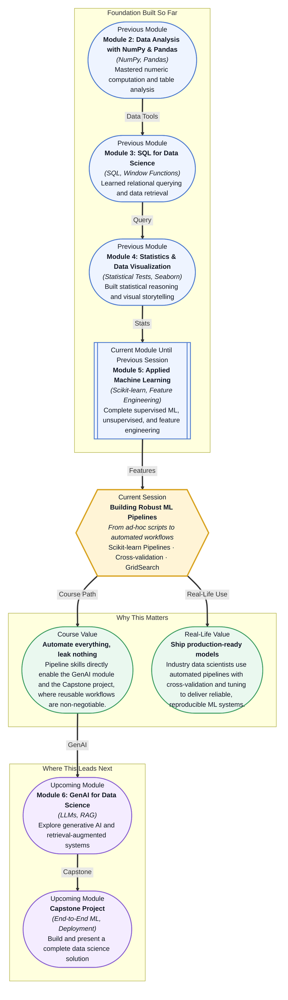

# Pre-read: Building Robust ML Pipelines

## Context of This Session in the Course

You have just finished training a solid classification model. Your accuracy looks great, your feature engineering was thoughtful, and your validation score matches your training score. But then your colleague asks: "Can you run the same pipeline on next month's data?" You open last month's notebook and realise everything is manual — file paths are hardcoded, scaling parameters were set by hand, and you cannot remember whether you applied one-hot encoding before or after the train-test split. What should be a one-click refresh turns into an hour of detective work.

The naive approach is to copy and paste cells, changing values as you go. One missed scaling step can silently destroy your model's performance. One forgotten validation split can leak future information into your training set, giving you an inflated score that will never generalise. What looks like a simple workflow quickly becomes a fragile chain of manual operations — each step an opportunity for silent failure. The more complex your preprocessing, the more ways there are to accidentally train on data you should not have seen.

You need a system that guarantees every transformation is applied consistently — to training data, validation data, and next month's data alike — with zero room for manual slip. That is where **Scikit-learn Pipelines, Cross-validation, and Hyperparameter Tuning (GridSearch)** become essential.

What if you were asked to deploy a model that automatically retrains itself on fresh data every week, running fifty preprocessing steps and testing hundreds of hyperparameter combinations without any human intervention? That level of automation would be impossible if every transformation had to be coded and sequenced by hand. You would need a single object that encapsulates the entire workflow — scaling, encoding, feature selection, and prediction — and can be searched, validated, and shipped as a unit. This session gives you the tools to build exactly that.

A **pipeline** is a sequence of data transformations and a final estimator wrapped into a single atomic object. Think of it like a factory assembly line: raw materials (your dataset) enter at one end, pass through a series of workstations — scalers, encoders, dimensionality reducers — and emerge as predictions at the other end. The critical insight is that every transformation inside a pipeline is fitted only on the training portion of your data, then applied identically to the validation or test portion. This prevents **data leakage** — the silent killer of model generalisation — automatically. With **cross-validation**, you can test the entire assembly line across multiple data folds without ever mixing training and validation statistics. And with **GridSearchCV**, you can treat the whole pipeline as a single tuneable object, searching over combinations of preprocessing parameters and model hyperparameters simultaneously. In this session, you will explore these three interlocking concepts — `Pipeline`, `cross_val_score`, and `GridSearchCV` — all within the Scikit-learn ecosystem.

In the **previous session**, you explored Feature Engineering & Selection — one-hot encoding categorical variables, scaling numerical features with Min-Max or StandardScaler, and creating new features from dates and text. These transformations are the building blocks of any real-world model, but they are also the most common source of pipeline leakage when applied inconsistently. This session takes those exact preprocessing techniques and wraps them into a formal **Pipeline** object that automatically applies the same fitted transformations to every fold during cross-validation and to any future data during prediction. The raw building blocks remain the same; the difference is that you now orchestrate them into a repeatable, error-proof workflow that can be shared, versioned, and deployed.

In this pre-read, you will discover:

- How to **build** preprocessing and modelling pipelines using Scikit-learn's `Pipeline` class
- How to **apply** cross-validation to evaluate pipeline performance without data leakage
- How to **discover** optimal hyperparameters automatically using `GridSearchCV`
- How to **recognise** the value of reusable ML workflows in production environments

---

## Why a Pipeline Is More Than a Shortcut

It is tempting to think of a pipeline as just a neat way to chain `.fit()` and `.transform()` calls. In reality, it enforces a discipline that is difficult to maintain with manual code: every transformation is fitted exclusively on training data and applied without refitting to test or validation data. Consider a simple workflow with a `StandardScaler` followed by a `LogisticRegression`. Written by hand, you might call `scaler.fit(X_train)`, then `X_train_scaled = scaler.transform(X_train)`, then repeat the same two-step dance for `X_test`. One careless `scaler.fit(X_test)` and your validation scores are optimistically biased. A **Pipeline** object eliminates this risk entirely — when you call `pipeline.fit(X_train, y_train)`, the scaler learns its parameters from `X_train` only, and when you call `pipeline.score(X_test, y_test)`, it transforms `X_test` using those saved parameters without ever refitting. This distinction seems small until you scale to dozens of transformations, multiple encoding schemes, and hundreds of cross-validation folds, where manual bookkeeping becomes impossible. The pipeline turns fragile multi-step scripts into a single callable, reliable unit.

Pipelines also unlock a capability that manual workflows cannot match: **composable search**. Because the entire preprocessing-plus-model workflow is a single estimator, you can pass it directly to `GridSearchCV` (or `RandomizedSearchCV`) and search over parameters from every step simultaneously. Do you want to compare `StandardScaler` vs. `MinMaxScaler` while also tuning the `C` parameter of a logistic regression and testing two different solvers? With a pipeline, that is a single parameter grid. Without one, it is a combinatorial explosion of manual bookkeeping. The pipeline transforms "what if" exploration from a chore into a one-line experiment.

## Cross-Validation: Your Model's Honest Report Card

A single train-test split gives you one number — but that number is just a sample from a distribution of possible scores. Change the random seed, and the score shifts. **K-fold cross-validation** addresses this by splitting the data into K equal folds, training on K−1 folds, and evaluating on the held-out fold, repeating this process K times so every data point serves in both training and validation. The result is a distribution of K performance scores rather than a single point estimate, giving you a much richer picture of how your model will behave on unseen data.

The synergy with pipelines is where cross-validation truly shines. When you use `cross_val_score` with a pipeline, each of the K folds gets its own freshly fitted preprocessing steps — scalers, encoders, everything. No fold ever sees statistics computed on data outside its training portion. This is not just a theoretical nicety; it is the difference between a trustworthy performance estimate and one that is silently inflated by data leakage. Many practitioners who carefully avoid leakage in their final model inadvertently introduce it during cross-validation by scaling or encoding the entire dataset before splitting. A pipeline combined with `cross_val_score` makes this mistake structurally impossible. The takeaway is simple: cross-validation without a pipeline is risky; a pipeline without cross-validation is incomplete.

## Where Pipelines and GridSearch Appear in Real Life

In **healthcare**, diagnostic models must undergo rigorous validation before deployment. A team building a sepsis early-warning system cannot afford to have its scaler parameters leak from future patients into training. Production pipelines ensure that every time the model is retrained on a new batch of patient data — weekly or even daily — the exact same preprocessing steps are applied consistently, and hyperparameters are retuned automatically using GridSearch on the latest data. Regulatory audits demand this level of reproducibility; a notebook full of manual steps would never pass.

In **finance**, credit scoring models process hundreds of features — income brackets, transaction histories, credit utilisation ratios — each requiring different scaling and encoding. A mortgage lender's model pipeline might include a `ColumnTransformer` that applies `StandardScaler` to numerical columns, `OneHotEncoder` to categorical columns, and a `VarianceThreshold` selector to remove near-constant features, all feeding into a gradient-boosted tree. The entire assembly is tuned via `GridSearchCV` across learning rate, tree depth, and subsample ratio, then deployed as a single serialised object. When regulations change or new data sources become available, the pipeline is updated and re-validated without rewriting a single line of transformation logic.

In **e-commerce**, recommendation and personalisation systems churn through user behaviour data that changes hourly. Pipelines allow data scientists to define the feature engineering workflow — time-since-last-purchase, session duration aggregates, category embeddings — as reusable components that are automatically refitted on fresh data each cycle. Cross-validation on time-series data (using `TimeSeriesSplit`) ensures that past data never contaminates future evaluations, and GridSearch tunes the tradeoff between exploration and exploitation. Every major tech company that runs ML at scale has internal abstractions that look remarkably like Scikit-learn pipelines, because the alternative — hand-coded, environment-dependent scripts — does not survive contact with production.

In **manufacturing**, predictive maintenance systems ingest sensor readings from thousands of machines, each producing high-frequency numerical streams that require normalisation, windowed aggregation, and anomaly detection. A pipeline might include a `FunctionTransformer` that computes rolling statistics, a `StandardScaler` fitted per machine, and a `RandomForestClassifier` to flag imminent failures. GridSearch tunes the window size, the scaler strategy, and the tree depth simultaneously. When a new factory comes online, the same pipeline is deployed with minimal adaptation. The ability to encapsulate domain-specific preprocessing into a composable, searchable pipeline is what separates a one-off analysis from a reusable industrial system.

---

## What's Next

After this session, you will be able to:

- Build a complete preprocessing-plus-model pipeline using Scikit-learn's `Pipeline` class and understand how it prevents data leakage
- Apply cross-validation to evaluate pipeline performance across multiple data folds using `cross_val_score`
- Use `GridSearchCV` to automatically search for optimal hyperparameter combinations across the entire pipeline
- Combine `ColumnTransformer` with `Pipeline` to handle heterogeneous feature types (numeric, categorical, text) in a single workflow
- Serialise and deploy a tuned pipeline as a single reusable object using `joblib` or `pickle`
- Diagnose and fix common pipeline pitfalls including scaling before splitting and encoding on the full dataset

You do not need to memorise every `Pipeline` method right now — you will use them repeatedly in every remaining session and the Capstone. The goal is that by the end of this session, building a pipeline should feel as natural as writing a function: **the only way to make ML reproducible is to automate every step, from raw data to final prediction.**

## Interesting Questions for the Live Session

- If your pipeline includes a `StandardScaler` and you use `GridSearchCV`, should you fit the scaler on the entire dataset before searching, or should it remain inside the pipeline? What happens in each case?
- Two pipelines produce identical cross-validation scores, but one uses a `MinMaxScaler` and the other uses `RobustScaler`. How would you decide which one to deploy, and what additional diagnostics would help you choose?
- You have a pipeline with ten preprocessing steps and three estimators to compare. The grid search space explodes. What strategies can you use to search efficiently without enumerating every combination?
- How would you modify a pipeline to handle a streaming data scenario where new categories appear in a categorical feature that the `OneHotEncoder` has never seen?

By the end of this session, pipelines should feel less like an optional convenience and more like the only reliable way to ship machine learning: **Automate everything, leak nothing, tune with confidence.**
