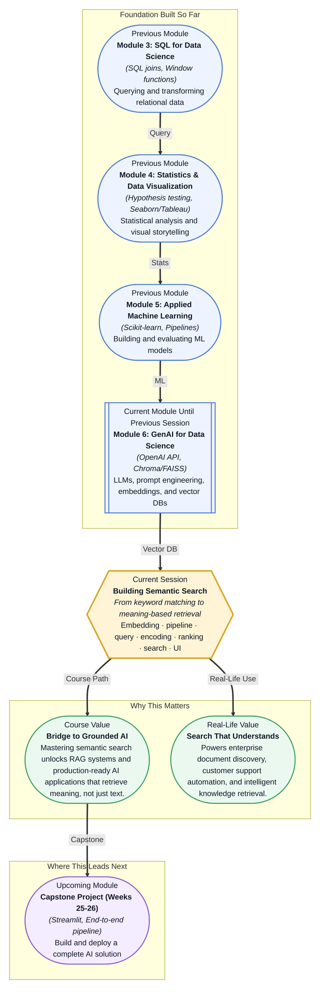

# Pre-read: Building Semantic Search

## Context of This Session in the Course

You type a query into your company's knowledge base — "How do I reset my multi-factor authentication?" — and the system returns seventeen results, each one containing the word "authentication" but not a single one telling you how to reset MFA. The search engine matched keywords, not meaning. It found every page that happened to share a word with your question and ranked them by frequency, leaving you to sift through noise.

This is the fundamental failure of keyword-based search: it treats language as a bag of unrelated tokens. It cannot distinguish between "apple the fruit" and "Apple the company," nor between "I love this product" and "I love this product, not." Synonyms, context, and user intent are invisible to it. The more documents you index, the more false positives it returns. The naive approach — string matching with TF-IDF or BM25 — hits a hard ceiling the moment a query uses different words than the document author chose. And in practice, every real-world query does exactly that.

The solution is to stop matching words and start matching meaning. By converting both documents and queries into dense numerical representations — **embeddings** — you can search by semantic proximity rather than lexical overlap. That is where **Building Semantic Search** becomes essential.

What if you could build a search engine that understands that "How do I reset my MFA?" and "Steps to reconfigure two-factor authentication" refer to the same thing, even though they share zero significant keywords? What if the same system could rank results not by how many times a word appears, but by how closely the meaning of each document aligns with the intent of the query? That is the capability this session places in your hands — a retrieval pipeline that sees language the way a human reader does, not the way a text editor does. By the end, you will know exactly how to wire embeddings, vector databases, and ranking logic into a working search interface.

At its core, semantic search replaces exact-match logic with **vector similarity**. Every piece of text — a document, a paragraph, a user query — is passed through an embedding model that maps it to a point in a high-dimensional vector space. The distance between two points in that space represents semantic distance: close points mean similar meanings, distant points mean unrelated concepts. A **vector database** like Chroma or FAISS stores these embeddings and supports fast nearest-neighbour lookups, so when a user types a query, the system embeds it, searches the database for the closest vectors, and returns the associated documents ranked by similarity. Think of it like a librarian who does not just scan index cards for matching words but actually reads every book, remembers what each one is about, and organises the shelves by conceptual proximity. The tools you will explore — embedding APIs, vector indices, encoding pipelines, and ranking heuristics — turn that metaphor into executable code.

In the **previous session**, you learned to store millions of text segments as vector embeddings inside a purpose-built vector database. You indexed data, queried for similar vectors, and compared Chroma versus FAISS as storage backends. That session gave you the warehouse. This session shows you how to build the storefront — how to accept a user's natural-language query, encode it into the same vector space, retrieve the most semantically relevant documents, and present them in a ranked, usable interface. The database is the engine; semantic search is the vehicle it powers.

In this pre-read, you will discover:
- How to **build** an end-to-end pipeline that combines embeddings with a vector database for document retrieval
- How to **encode** user queries into the same vector space as your indexed documents
- How to **apply** relevance ranking techniques to surface the most meaningful results first
- How to **connect** your retrieval engine to a search interface that users can interact with

---

## Why Keyword Search Falls Short — and How Embeddings Fix It

Keyword search systems like BM25 operate on a simple premise: count how many query terms appear in a document, weight them by inverse frequency across the corpus, and return the highest-scoring matches. This works well when queries and documents use the same vocabulary — a search for "credit card" against a financial database, for instance. But it collapses the moment a user asks "ways to pay later" and the database uses the phrase "deferred billing options." The words do not overlap, so the best match scores a zero.

**Embeddings** solve this by projecting both the query and every document into a shared **semantic space**. An embedding model — typically a transformer-based neural network — produces a dense vector of, say, 1536 floating-point numbers for any input text. These vectors encode meaning, not vocabulary. "Ways to pay later" and "deferred billing options" will land near each other in this space even though they share no tokens, because the model has learned that the concepts are related. The search then becomes a geometric operation: find the indexed vectors nearest to the query vector using a distance metric like **cosine similarity**. This shift — from term matching to distance measuring — is the conceptual leap that unlocks semantic retrieval.

## The Query Encoding and Ranking Pipeline: From Text to Results

A complete semantic search pipeline has three stages. First, **indexing**: you batch-encode all your documents through the embedding model and store the resulting vectors in your vector database, along with metadata and the original text. Second, **query encoding**: when a user submits a search, you pass their raw query string through the same embedding model to produce a query vector. Third, **retrieval and ranking**: you ask the vector database for the `top_k` nearest neighbours to the query vector, receive the matching documents and their similarity scores, and apply any additional ranking logic — such as boosting documents by recency, filtering by category, or re-ranking with a cross-encoder model for finer-grained relevance.

The practical implementation involves stitching together a few moving parts. An **embeddings API** (like OpenAI's `text-embedding-3-small`) gives you the vectors; a vector DB library (like Chroma) handles storage and nearest-neighbour search; and a lightweight web framework (like Streamlit or FastAPI) wraps the pipeline into a search bar and results page. **Hybrid search** — combining vector similarity with a keyword fallback — is a common production pattern that catches edge cases where exact matches still matter (product codes, names). The result is a system that feels intelligent to the user without requiring any understanding of the machinery behind it.

## Where Semantic Search Appears in Real Life

**Enterprise knowledge management** is the most immediate use case: companies with thousands of internal documents — policy manuals, runbooks, onboarding guides — use semantic search so employees can ask natural questions and get precise answers without knowing the exact phrasing used in the source material. **Customer support automation** relies on semantic search to route tickets, suggest help-centre articles, and power chatbots that actually understand paraphrased questions. **E-commerce product discovery** platforms use it to match vague shopper intent ("comfy office chair for back pain") against product descriptions that may describe "ergonomic lumbar support seating" using completely different vocabulary. **Legal and compliance teams** search through contracts and regulatory filings for conceptually relevant clauses, not just keyword hits. **Healthcare** applications let clinicians query medical literature or patient records by clinical concept rather than exact terminology. In every case, the core pattern is the same: convert text to vectors, store them, search by proximity, and rank by relevance. The industries differ, but the pipeline does not.

## What's Next

After this session, you will be able to:

- Build an end-to-end document indexing pipeline that generates and stores embeddings in a vector database
- Encode a free-text user query into a vector and retrieve the most semantically similar documents
- Apply hybrid search strategies that combine vector similarity with keyword matching for robust results
- Rank and filter search results using metadata, recency, and cross-encoder re-ranking
- Wrap your retrieval pipeline into a functional search interface using a web framework
- Diagnose common failure modes — poor embeddings, bad chunking, irrelevant results — and iterate on them

You do not need to build a production-grade search engine from scratch right now. The goal is to see retrieval not as a keyword-matching exercise, but as a **meaning-matching problem**: encode everything into the same space, measure distance, and let geometry do the ranking.

## Interesting Questions for the Live Session

- If two documents have identical vector embeddings but completely different meanings, which part of the pipeline failed — and how would you detect it?
- Cosine similarity is the default distance metric for most semantic search systems. When would Manhattan or Euclidean distance give you better results, and why?
- Hybrid search combines vector similarity with keyword scoring. How do you decide the relative weight of the two signals without overfitting to a specific test set?
- A user searches for "latest quarterly report" and gets results from last year because the embedding model does not understand recency. What architectural change would teach your system that "latest" implies a time filter, not a semantic one?

By the end of this session, semantic search should feel less like a complex AI system and more like a practical tool you can build and tune: **from keywords to meaning in one pipeline.**
