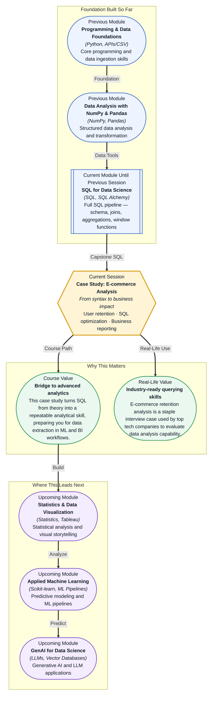

# Pre-read: Case Study: E-commerce Analysis

## Context of This Session in the Course

Your e-commerce manager walks up to your desk and asks: "We ran a flash sale three weeks ago — how many of those new customers came back to make another purchase this week?" Your first instinct is to export user logs from the database, pivot them in a spreadsheet, and calculate percentages by hand. But the transactions table has 2.3 million rows. The export takes twenty minutes. Your spreadsheet crashes. You realize the problem is not the question — it is the approach.

The naive strategy of pulling raw data and post-processing it in Python or Excel breaks down as soon as the dataset reaches production scale. To answer this question efficiently, you need to stay inside the database and write a query that defines "first purchase date," identifies "return visit date," computes the time delta, flags retained customers, and summarizes by cohort — all in a single pass of the data. That is not a simple SELECT statement any more. That is **analytical SQL**, and it demands a fundamentally different way of thinking about queries.

Building a query that can answer a multi-layered business question in one clean execution is what separates a data-entry operator from a data analyst. That is where **Case Study: E-commerce Analysis** becomes essential.

What if you could write a single SQL query that tells your product team exactly which customer cohorts are sticking around, which flash sales actually drove repeat purchases, and exactly where the drop-off happens — without exporting a single CSV to a dashboard tool? You would surface the insight that the Diwali campaign brought in 10,000 new users but only 12% returned, while the smaller weekend sale had a 38% repeat rate. You would identify the specific onboarding feature that correlates with long-term retention. You would be the person who does not just run queries but drives business decisions. By the end of this session, you will have the mental model to do exactly that — translating a fuzzy business question into an efficient, optimized SQL statement that runs in seconds, not minutes.

This session introduces **analytical SQL** — the practice of using SQL not merely to retrieve rows, but to answer layered business questions in a single, well-structured query. The three core concepts you will work with are **user retention analysis**, **query performance optimization**, and **business report generation**. User retention analysis begins with defining **cohorts** — groups of users who share a common first-action date — then computing whether each user returned in a subsequent period, and finally summarizing the return rate across cohorts. Think of it like running a restaurant: you do not just count how many diners walk in each evening. You track which first-time guests come back within a month, which menu items they ordered, and whether your weekend special actually built loyalty. SQL is your ledger, and this session teaches you how to build that ledger from scratch. You will construct queries using **Common Table Expressions (CTEs)** for step-by-step logic, **window functions** to compute per-user metrics without collapsing rows, and **execution plan analysis** to understand why some queries finish in milliseconds while others stall for minutes.

In the **previous session** (12.2: Database Interactions & Transactions), you learned how to safely modify database state using INSERT, UPDATE, DELETE, and transaction controls like COMMIT and ROLLBACK. You also explored SQL injection prevention — understanding how to interact with a database without compromising its integrity. That session gave you the operational layer: how to change data safely and correctly. This session flips your focus from writing to reading, but at a far more sophisticated level. Instead of single-row operations, you will build read-intensive analytical queries that scan thousands of rows, join across multiple tables, and produce executive-ready summaries. The safety mindset from transactions carries forward — just as you would not commit a half-baked transaction, you will not deliver a retention number that is off by 10% because of a misplaced join.

In this pre-read, you will discover:
- How to **build** a complete user retention analysis query using CTEs and window functions
- How to **apply** query performance optimization techniques to make analytical SQL run efficiently at scale
- How to **connect** business questions to SQL logic through cohort analysis and period-over-period comparisons
- How to **interpret** query execution plans to identify and fix performance bottlenecks

---

## Why User Retention Is Not a Simple COUNT

A beginner might try to compute retention by counting users who have any purchase in month one and any purchase in month two, then dividing the two numbers. This produces a single percentage and hides everything useful. It does not distinguish between a user who bought on day one and returned on day three from a user who bought on day one and never came back until month six. It cannot tell you whether your retention is improving or degrading over time. The problem is that retention is not a single number — it is a **distribution across cohorts**, and answering it requires a query that groups users by their first-action time window, then traces their behavior forward through successive periods.

The proper approach uses a **cohort table** built with CTEs. Your first CTE identifies each user's first purchase date. A second CTE joins every subsequent purchase back to that first date, computing the time interval in days or weeks. A third CTE flags each user as "retained" if they appear in a given subsequent period. Finally, a SELECT with GROUP BY rolls these flags into a retention matrix — rows are cohorts (users who first bought in Week 1, Week 2, etc.), columns are subsequent periods (Week 1, Week 2, Week 3), and each cell shows the percentage of that cohort that returned in that period.

What makes this hard is that the shape of the data changes at every step: you go from raw transactions to per-user first dates, to per-user period flags, to aggregate percentages. Each transformation must preserve the correct grain. A single missing DISTINCT or an accidental cross join will silently produce a retention number that looks plausible but is completely wrong. That is why analytical SQL demands a disciplined, step-by-step mental model — exactly the kind of structured thinking this case study is designed to build.

## The Hidden Cost of a Slow Query

Imagine you have built a retention query that joins four tables, uses two CTEs, and returns a beautiful cohort matrix. The only problem: it takes 47 seconds to run. Your manager wants this data in a weekly report, and 47 seconds per refresh is not acceptable. Where do you start? SQL performance optimization is not about guessing — it is about reading the **execution plan**, which shows you exactly how the database engine executed your query: which tables were scanned, which indexes were used, where data was sorted, and where the most time was spent.

The most common bottleneck in analytical queries is a **full table scan** on a large table that lacks an index on the join or filter column. In an e-commerce database, the transactions table may have millions of rows but no index on `customer_id` or `purchase_date`. A query that filters by date range will scan every row instead of jumping directly to the relevant block. Adding a composite index on `(customer_id, purchase_date)` can collapse a 47-second query into 300 milliseconds. But indexing is not free — every index slows down INSERT and UPDATE operations, so you must choose strategically. Another common win is rewriting **correlated subqueries** as JOINs or CTEs, because the database can optimize set-based operations far better than row-by-row lookups.

Performance optimization is a trade-off between readability, speed, and maintainability. A retention query written entirely in a single nested SELECT might be fast, but it will be unreadable to anyone who needs to modify it next quarter. A well-structured CTE pipeline might add 50 milliseconds, but it will save hours of debugging. The best analytical SQL writers understand these trade-offs and make deliberate choices — and this session gives you the framework to start making them yourself.

## Where Analytical SQL Appears in Real Life

The pattern you will learn in this case study — define a cohort, trace behavior forward, summarize in a matrix — is not limited to e-commerce. In **SaaS companies**, the exact same query structure powers churn analysis: users who signed up for a free trial in January are checked against login activity in February and March to compute activation and retention curves. In **financial services**, transaction data is cohorted by account opening date to measure customer lifetime value and detect unusual drop-offs that might signal a systemic issue. In **logistics and food delivery**, orders are grouped by user acquisition channel to compare whether customers acquired through Instagram ads return at the same rate as those who came through referral codes. In **healthcare**, patient readmission rates are computed by cohorting patients by discharge date and checking for subsequent visits within 30 days — a critical metric tied to hospital funding and quality of care. And in **media and publishing**, content platforms cohort users by sign-up week to measure daily active usage and identify which onboarding flows produce the most engaged long-term subscribers. Every one of these scenarios uses the same SQL building blocks — CTEs, window functions, joins, and careful aggregation. Master the e-commerce case study here, and you have a template you can adapt to any industry.

## What's Next

After this session, you will be able to:
- Build a multi-step user retention analysis query using CTEs and window functions
- Optimize a slow-running analytical query by reading its execution plan and identifying scan bottlenecks
- Generate a business-ready cohort report directly from a database using aggregation and conditional logic
- Define user cohorts by first-action date and compute period-over-period retention rates in a single query
- Distinguish between query patterns that scale well and those that trigger expensive full-table scans

You do not need to memorize every SQL function or execution-plan symbol right now. The goal is to stop thinking of queries as commands you type at a database and start thinking of them as analytical conversations — where the skill is knowing the right question to ask and the right order to ask it in.

## Interesting Questions for the Live Session

- If a retained user is defined as someone who returns within 30 days, how would your business decision change if you used a 7-day window instead — and what does each threshold hide?
- When computing retention, should you count only users who made a purchase or all registered users — and what kind of bias does each denominator introduce?
- If a four-table retention join runs for 12 seconds on a production database, where would you look first for the bottleneck, and what trade-offs would you accept to bring it under one second?
- How would your query structure change if the e-commerce platform stored web sessions, mobile sessions, and actual purchase orders in three separate tables with different time granularities?

By the end of this session, SQL should feel less like a data retrieval language and more like a business analysis toolkit: **A well-written query is worth a thousand dashboards.**
