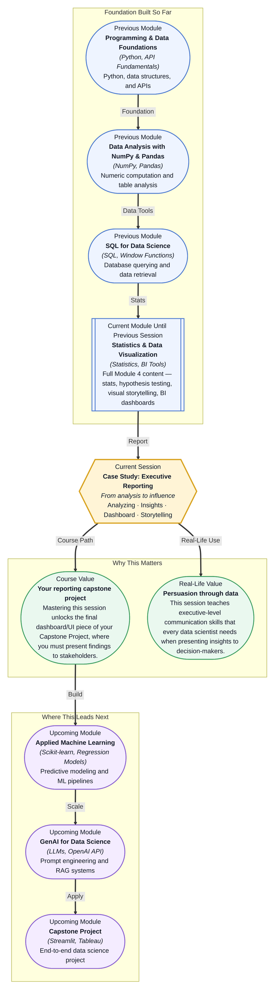

# Pre-read: Case Study: Executive Reporting

## Context of This Session in the Course

Imagine you have just finished analyzing a quarter's worth of customer data. You ran your statistical tests, built your charts, and discovered three critical patterns affecting retention. Your manager asks you to present your findings in the all-hands meeting — and you have exactly ten minutes to convince leadership that action is needed.

The challenge is not finding the insights — you have already done that. The challenge is that a raw statistical report or a dozen disconnected charts will lose your audience before you reach the second slide. Executives do not want to parse p-values or toggle through dashboard tabs. They need a clear, compelling narrative that cuts through the noise and answers one question: "What should we do differently?"

That is where **Case Study: Executive Reporting** becomes essential. This session teaches you to transform your technical analysis into a single, persuasive deliverable that speaks the language of decision-makers.

What if you were a data scientist at a mid-sized e-commerce company, and the CEO asked you in the weekly stand-up, "Should we invest more in our mobile app or desktop experience?" After this session, you would know exactly how to frame that question as a data-driven analysis — pick the right dataset, extract the three most impactful insights, and build a dashboard that tells a complete story in under sixty seconds. You would walk into that meeting not with a spreadsheet, but with a narrative that leads directly to a decision. That is the power of executive reporting.

The core concept of this session is **synthesizing** — the art of combining multiple analytical outputs into a single coherent story. You have already learned to compute statistics and build individual charts. Now the skill is knowing which three insights matter most and how to present them so a busy executive can grasp them immediately. Think of this like writing an executive summary memo. A junior analyst lists every number they found; a senior analyst picks three numbers that change the conversation. The tools you will explore — **dashboard design** principles, **visual hierarchy**, and **insight prioritization** — are the methods professionals use to guide attention toward what matters. You will practice analyzing a dataset, identifying three key insights, and presenting findings via a dashboard that stands on its own.

In the **previous session**, you learned to build interactive dashboards using BI tools like Tableau or PowerBI, working with calculated fields and filters to let stakeholders explore data on their own. That gave you the technical ability to construct a dashboard. This session shifts the focus from building the tool to crafting the message. Where Session 16.2 taught you *how* to create interactive elements, Session 16.3 teaches you *what* to put in them and *why*. The filters and calculated fields are now in service of a specific narrative — you are no longer just enabling exploration; you are directing the audience toward three critical takeaways.

In this pre-read, you will discover:
- How to **analyze** a dataset with the specific goal of finding high-impact insights for decision-makers.
- How to **identify** the three most actionable insights from a sea of possible findings.
- How to **build** a dashboard that presents those insights in a clear, persuasive narrative.
- How to **connect** statistical analysis with business communication to drive real-world decisions.

---

## Why Three Insights Is a Magic Number

When you present findings to an executive audience, less is almost always more. The human brain can hold roughly three to four ideas in working memory at once — a phenomenon known as **cognitive load**. If you present ten findings, your audience will remember none. If you present three, they will remember all three. The discipline of choosing exactly three insights forces you to rank your findings by impact. Was the two percent conversion lift more important than the seasonal dip in retention? Which insight, if acted on, would move the revenue needle? This prioritization is itself a data science skill — one that separates analysts who report numbers from those who drive decisions.

Your job in this session is not to exhaust every possible angle in the data. It is to step back, look at the full picture, and ask: "If the executive remembers only three things from this dashboard, what should they be?" Every chart, every annotation, and every filter you include must serve those three insights. Anything else is noise.

## Designing for the Executive Eye

A dashboard for a data team and a dashboard for a CEO look very different. The executive dashboard uses **visual hierarchy** to draw attention first to the headline number, then to supporting context, and finally to the detail. Color is used sparingly — to highlight urgency or success, not decoration. Every chart earns its place by answering a specific question the executive would ask. This is where your earlier work on visual storytelling and choosing the right chart comes together. The scatter plot that helped you discover a correlation might become a single bold annotation on a line chart. The full statistical report becomes a tooltip, not the main event.

Think of your dashboard as a conversation. The title is the opening statement. The largest chart is the first argument. The smaller panels are the supporting evidence. And the filter controls let the executive ask their own follow-up questions without leaving the narrative flow. Every design decision — from chart type to color palette to layout order — should reinforce the story your three insights are telling. If a visual element does not strengthen that story, remove it.

## Where Executive Reporting Appears in Real Life

The skill of executive reporting appears wherever data meets decision-making. In a **retail company**, a data analyst might synthesize weekly sales data into a single dashboard that tells regional managers which stores need attention and why. In **healthcare**, a data scientist might present population health trends to a hospital board, distilling thousands of patient records into three actionable interventions that can reduce readmission rates. In **finance**, a risk analyst builds a quarterly dashboard that surfaces shifts in portfolio exposure before they trigger regulatory limits, giving leadership time to rebalance. In **product management**, dashboards track feature adoption and funnel conversion so leadership can decide where to allocate engineering resources for the next quarter. In every case, the pattern is the same: analyze broadly, distill ruthlessly, and present so clearly that the decision becomes obvious.

## What's Next

After this session, you will be able to:

- Analyze a raw dataset with the explicit goal of extracting decision-relevant insights.
- Prioritize findings by business impact and select the three most important to present.
- Design a dashboard layout that guides an executive audience through a clear narrative.
- Use visual hierarchy, color, and annotation to highlight the "so what" in every chart.
- Synthesize statistical outputs, visualizations, and business context into a single persuasive deliverable.

You do not need to memorize every BI tool feature right now. The goal is not to become a dashboard expert overnight — it is to learn how to think like a data storyteller who turns analysis into action.

---

## Interesting Questions for the Live Session

- How do you decide when a finding is "interesting" but not "actionable" enough for an executive audience?
- What happens when your three key insights tell a story the executive team does not want to hear — how do you present uncomfortable truths?
- If you had to remove eighty percent of a dashboard's content to fit a single slide, how would you choose what stays and what goes?
- When is a single well-chosen number more persuasive than an entire dashboard with charts and filters?

By the end of this session, executive reporting should feel less like a presentation task and more like a strategic skill: **the ability to turn data into decisions with clarity and conviction.**
