# Pre-read: Choosing the Right Chart

## Context of This Session in the Course

```mermaid
%%{init: {"flowchart": {"nodeSpacing": 45, "rankSpacing": 65, "diagramPadding": 20}} }%%
flowchart TB
  subgraph Foundation["Foundation Built So Far"]
    P1(["Previous Module<br/><b>Module 1: Programming &amp; Data Foundations (Weeks 1-4)</b><br/><i>(Python, APIs)</i><br/>Python programming, data structures, and API fundamentals"])
    P2(["Previous Module<br/><b>Module 2: Data Analysis with NumPy &amp; Pandas (Weeks 5-8)</b><br/><i>(NumPy, Pandas)</i><br/>Numeric computation and structured data analysis"])
    P3(["Previous Module<br/><b>Module 3: SQL for Data Science (Weeks 9-12)</b><br/><i>(SQL, Database Design)</i><br/>Database querying and relational data management"])
    C1[["Current Module Until Previous Session<br/><b>Module 4: Statistics &amp; Data Visualization (Weeks 13-16)</b><br/><i>(Statistics, Seaborn)</i><br/>Stats, probability, hypothesis testing, visual storytelling"]]
  end

  CS{{Current Session<br/><b>Choosing the Right Chart</b><br/><i>Data types inform visual marks</i><br/>Distributions · Comparisons · Trends · Relationships}}

  subgraph Value["Why This Matters"]
    CV(["Course Value<br/><b>Bridge stats to decision visuals</b><br/>This session is the bridge that turns raw statistics into clear, decision-ready visuals — essential for communicating ML results in Modules 5 and 6."])
    RV(["Real-Life Value<br/><b>Charts that speak to stakeholders</b><br/>Every data professional is judged by the clarity of their charts; this session equips you to choose the right visual for any audience."])
  end

  subgraph Future["Where This Leads Next"]
    F1(["Upcoming Module<br/><b>Module 5: Applied Machine Learning (Weeks 17-20)</b><br/><i>(Scikit-learn, ML)</i><br/>Supervised and unsupervised predictive modeling"])
    F2(["Upcoming Module<br/><b>Module 6: GenAI for Data Science (Weeks 21-24)</b><br/><i>(LLMs, Vector DBs)</i><br/>Large language models and generative AI applications"])
    F3(["Upcoming Module<br/><b>Capstone Project (Weeks 25-26)</b><br/><i>(Streamlit, Full-stack)</i><br/>End-to-end data science project delivery"])
  end

  P1 ==>|&nbsp;Foundation&nbsp;| P2
  P2 ==>|&nbsp;Data Tools&nbsp;| P3
  P3 ==>|&nbsp;Stats&nbsp;| C1
  C1 ==>|&nbsp;Chart&nbsp;| CS
  CS ==>|&nbsp;Course Path&nbsp;| CV
  CS ==>|&nbsp;Real-Life Use&nbsp;| RV
  CV ==>|&nbsp;Build&nbsp;| F1
  F1 ==>|&nbsp;Predict&nbsp;| F2
  F2 ==>|&nbsp;Apply&nbsp;| F3

  classDef previous fill:#eef4ff,stroke:#4f7ccf,color:#111827,stroke-width:2px;
  classDef current  fill:#fff4d6,stroke:#d9a321,color:#111827,stroke-width:3px;
  classDef value    fill:#eaf8ef,stroke:#3f9f63,color:#111827,stroke-width:2px;
  classDef future   fill:#f4ecff,stroke:#8a61d1,color:#111827,stroke-width:2px;

  class P1,P2,P3,C1 previous;
  class CS current;
  class CV,RV value;
  class F1,F2,F3 future;
  linkStyle default stroke-width:3px
```

You have just finished analyzing a quarter's worth of sales data. You know the numbers inside out — which regions grew, which products stalled, and which customer segment drove the most revenue. You build a chart to share with your team, pick a default option from your tool, and feel confident the data will speak for itself.

But when you present it, the room is confused. Someone asks if the numbers are totals or averages. Another person misreads the trend direction. A third wonders why you chose that chart type at all. The data was correct, but your visual choice muddled the message. The truth is: the same dataset can tell completely different stories depending on whether you show a bar chart, a line graph, or a scatter plot.

Choosing a chart is not an artistic decision — it is a structural one, governed by the type of data you have and the question you need to answer. That is where **Choosing the Right Chart** becomes essential.

What if you walked into a stakeholder meeting and, within seconds of projecting a chart, everyone in the room nodded and said "I see exactly what you mean"? Imagine being able to glance at a dataset — whether it is sales by region, website traffic over time, or customer age versus spending — and know instantly whether a histogram, bar chart, line chart, or scatter plot will make the insight undeniable. This session gives you that instinct: a repeatable framework for matching data types to visual marks so that your audience sees the point before you say a word.

At its core, data visualization is about mapping **data types** — the kinds of information you have — to **visual marks** — the geometric elements (bars, lines, dots, boxes) that represent that information on a screen. The choice is not arbitrary: every mark type encodes a specific kind of relationship. A **bar chart** excels at comparisons because its length maps naturally to a single numeric value per category. A **line chart** reveals trends because its connected points show continuous change over ordered intervals. A **histogram** shows distributions by grouping continuous data into bins, revealing where values cluster. And a **scatter plot** uncovers relationships between two numeric variables by placing each observation as a point in a two-dimensional space.

Think of it like choosing a lens for a camera. A wide-angle lens (a bar chart) is great for showing the whole scene at once. A telephoto lens (a line chart) isolates a single moving subject over time. A macro lens (a histogram) zooms in on the texture and density of a single variable. And a panoramic stitch (a scatter plot) reveals how two dimensions interact. Each lens is powerful — but only when used for the right kind of shot.

In this session, you will explore four fundamental chart types — **Distributions (Histograms)**, **Comparisons (Bar charts)**, **Trends (Line charts)**, and **Relationships (Scatter plots)** — and learn the precise conditions under which each one clarifies rather than confuses.

In the **previous session**, Principles of Visual Storytelling, you learned how to design charts that communicate effectively — using visual hierarchy, color theory, and the discipline of removing clutter to highlight the "so what" of your data. You built a foundation for what makes a good chart look and feel professional. You now know the grammar of visual communication. This session gives you the vocabulary — the specific chart types you choose when you encounter a distribution, a comparison, a trend, or a relationship. The two sessions together form a complete visual literacy: you now know both how to design a chart and which chart to design.

In this pre-read, you will discover:

- How to **distinguish** the four core data relationships — distributions, comparisons, trends, and relationships — by looking at your raw data.
- How to **map** each relationship type to its most effective visual mark, from histograms to scatter plots.
- How to **recognise** when a common chart type like a bar chart is being misused and what to choose instead.
- How to **apply** this framework to real-world business scenarios where the wrong chart can cost a decision.

---

## When a Bar Chart Lies — Comparisons Done Right

The humble bar chart is the most used — and most abused — chart in business. Its strength is comparing a single numeric value across distinct categories. But it fails the moment you try to show composition, trend, or distribution. The mistake is understandable: all of these involve bars, but the data type is different. A bar chart with 12 bars for monthly revenue invites the eye to compare heights — fine. The same bar chart with 50 bars for daily revenue turns into a noisy mess, because the human eye struggles to compare that many discrete heights. The rule is simple: bar charts work best when the number of categories is small (under 10) and the message is "this one is bigger than that one." When you compare more than that, or when the order conveys time, reach for a line chart instead. This distinction between nominal comparison and temporal trend is the first test of chart literacy.

## The Scatter Plot Superpower — Seeing Relationships That Averages Hide

Averages are comfortable, but they conceal as much as they reveal. Two groups can have the same mean age, income, and satisfaction score yet be completely different populations. A **scatter plot** exposes this by plotting every individual point in a two-dimensional space — age on one axis, spending on another — letting you see clusters, outliers, and correlations that no summary statistic can capture. If the points form a clear upward diagonal, you have a positive correlation. If they scatter randomly, you have independence. If they form a curve, you have a non-linear relationship that a simple correlation coefficient would miss. This is why scatter plots are the first tool data scientists reach for during exploratory analysis: they show you what the numbers are hiding.

## Where Chart Choice Appears in Real Life

Chart choice plays out in high-stakes decisions across industries every day. A product manager at an e-commerce company needs to compare conversion rates across five landing page designs: she reaches for a bar chart to rank them at a glance. A logistics analyst tracking delivery times over the past year needs to show whether delays are increasing: a line chart reveals the upward trend that a table of averages would obscure. A healthcare researcher studying the relationship between patient age and recovery time after a procedure plots a scatter plot to see whether younger patients truly heal faster — and spots a surprising cluster of outliers. A quality engineer examining the distribution of defect sizes in a manufacturing run uses a histogram to see whether most defects fall within an acceptable range or whether the process is drifting off-target. In each case, the professional who chooses the right chart saves time, avoids misinterpretation, and earns the trust of their audience. The professional who picks the wrong one — a bar chart for a trend, a pie chart for too many categories — creates confusion and loses credibility.

## What's Next

After this session, you will be able to:

- Identify whether a dataset calls for a distribution, comparison, trend, or relationship analysis.
- Select the correct chart type — histogram, bar chart, line chart, or scatter plot — for any given data question.
- Spot and fix common chart misapplications before they confuse an audience.
- Describe the data type constraints that make one chart type work and another fail.
- Explain why the same data can require different charts for different audiences and different questions.

You do not need to memorize every chart type that exists right now. The goal is to build a mental checklist: before you draw anything, ask yourself what kind of relationship you are showing — then pick the mark that makes that relationship obvious.

## Interesting Questions for the Live Session

- If a scatter plot reveals a strong correlation but no clear causal mechanism, is it still worth presenting — or does it risk misleading your audience?
- When should you break the "bar charts for comparisons" rule and use a line chart with categorical x-axis labels instead?
- A histogram and a bar chart look nearly identical — what happens if a stakeholder interprets your histogram as a bar chart and reads meaning into the order of bins?
- If your data has four variables you want to display simultaneously, what is the ethical trade-off between using a complex multi-dimensional chart and splitting into multiple simpler charts?

By the end of this session, chart choice should feel less like a subjective aesthetic decision and more like a repeatable engineering discipline: **one question, one data type, one right chart.**
