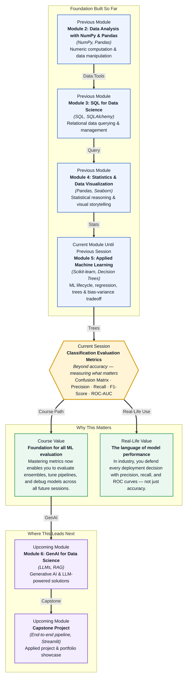

# Pre-read: Classification Evaluation Metrics

## Context of This Session in the Course

You submit your first classification model to a team review. The accuracy score is 94%. Your colleagues nod approvingly. Then someone asks: "How many of the positive cases did we actually catch?" You pause. You do not know. Across the table, the domain expert explains that 94% accuracy is meaningless here because only 6% of the data was positive to begin with — a model that simply predicts "negative" for everything would score the same 94% without catching a single real case.

Worse, when you dig deeper, you find two models with identical 94% accuracy: one catches 80% of fraudulent transactions, the other catches zero. Accuracy cannot tell them apart. What you need is a way to decompose performance into its components — to separate correct predictions from meaningful predictions, and to measure precisely what kind of mistakes your model is making.

That is where **Classification Evaluation Metrics** becomes essential. Instead of a single misleading number, you gain a vocabulary for describing exactly what your model does right and wrong.

What if you were asked to present a model to a hospital's ethics board, and they demand to know: "How many cancer cases would this system miss per thousand screenings?" Or a product manager asks: "How many false alarms can our support team expect each week?" A single accuracy percentage cannot answer those questions. You need to walk them through the confusion matrix, explain the precision-recall tradeoff, and justify the decision threshold using an ROC curve. This session gives you that vocabulary — the ability to defend a model's performance with metrics that executives, clinicians, and engineers all trust.

A **confusion matrix** is the starting point: a 2×2 grid that counts true positives, true negatives, false positives, and false negatives. From those four numbers, every other metric is derived. Think of it like a medical test. A **true positive** is a sick patient correctly diagnosed. A **false positive** is a healthy person told they are sick — a false alarm. A **false negative** is a sick patient sent home — a missed diagnosis. **Precision** asks: "Of all the cases we flagged as positive, how many were actually positive?" It measures whether you can trust a positive prediction. **Recall** asks: "Of all the actual positive cases, how many did we catch?" It measures whether the model is missing critical events. The **F1-score** is the harmonic mean of precision and recall — a single number that balances both when you cannot maximise one without sacrificing the other. **ROC-AUC** measures the model's ability to discriminate between classes across every possible threshold, giving you a big-picture view of classifier quality that is independent of where you draw the line. In this session, you will explore each of these metrics through hands-on examples: building confusion matrices, computing precision and recall on real data, finding the threshold that balances F1, and interpreting ROC curves to compare competing models.

In the **previous session**, you built decision trees and confronted the bias-variance tradeoff, learning how deep a tree could grow before it began overfitting to noise. You measured performance using accuracy on a hold-out set — a single number that worked reasonably well for balanced data. Now you will discover why accuracy alone is often dangerously misleading, especially when classes are imbalanced. The confusion matrix and its derived metrics give you a much more precise toolkit for evaluating not just decision trees, but any classifier you build from this point forward. Every future model — random forests, gradient boosting, logistic regression — will be judged using the same framework of precision, recall, F1, and ROC-AUC.

In this pre-read, you will discover:

- How to **build** a confusion matrix and extract the four fundamental error counts
- How to **interpret** precision and recall and understand their critical tradeoff
- How to **apply** the F1-score as a balanced single-metric summary of classifier performance
- How to **recognise** ROC-AUC curves as a threshold-independent measure of discrimination quality

---

## Why Accuracy Is Not Enough

Accuracy is intuitive: it is the fraction of all predictions the model got right. But intuition breaks down when reality is skewed. Imagine you are building a classifier to detect manufacturing defects on an assembly line where only 1% of products are defective. A lazy model that simply predicts "no defect" for every single product will achieve 99% accuracy — yet it is completely useless. This is the **accuracy paradox**: the more imbalanced your data, the less informative accuracy becomes.

The **confusion matrix** solves this by forcing you to look inside the four quadrants of predictions versus reality. True positives and true negatives are your correct calls; false positives and false negatives are your errors. Simply knowing that a model produced 50 false negatives (missed defects) versus 50 false positives (false alarms) changes the conversation entirely. A fraud detection system that misses 50 fraudulent transactions is a very different problem from one that falsely flags 50 legitimate customers. Accuracy alone cannot distinguish between these two scenarios, but the confusion matrix captures the tradeoff at a glance. This is the raw material from which every other evaluation metric is built.

## The Precision-Recall Tradeoff

Once you have the confusion matrix, you can compute **precision** and **recall** — and immediately hit a fundamental tension in machine learning. Improving one typically hurts the other. If you tune a cancer screening model to catch every possible case (high recall), you will also flag many healthy patients (low precision). If you tune it to only flag cases you are extremely confident about (high precision), you will inevitably miss some cancers (low recall). There is no free lunch.

The **F1-score** is the harmonic mean of precision and recall, designed to penalise extreme imbalance between the two. Unlike a simple average, the harmonic mean is low when either precision or recall is low — so a model must perform well on both to score highly. But even F1 has a subtlety: it weights precision and recall equally. In practice, the cost of a false positive versus a false negative is rarely equal. A spam filter that blocks an important client email (false positive) may be far more damaging than letting a few spam messages through (false negative). Understanding this tradeoff is what separates a metric-reporting exercise from a genuine business decision. The skill is not just computing these numbers, but reasoning about which one to prioritise given the real-world consequences of each type of error.

## Where Classification Metrics Appear in Real Life

In **healthcare**, false negatives carry the highest cost: a missed tumour or a misdiagnosed condition can be life-threatening. Medical AI systems are evaluated primarily on recall (sensitivity) to ensure as few positive cases slip through as possible, often accepting a higher rate of false alarms as the tradeoff. Radiologists reviewing AI-flagged scans already account for this — they expect the system to be overly sensitive, and they apply their expertise to rule out false positives.

In **finance**, fraud detection teams live in the precision-recall tradeoff every day. A model that blocks too many legitimate transactions (false positives) angers customers and drives churn. A model that misses fraud (false negatives) costs the bank directly. Fraud analysts tune their decision threshold based on dollar amounts — small transactions can tolerate lower precision, but high-value wire transfers demand near-perfect precision to avoid blocking VIP clients. The ROC curve becomes a practical tool for comparing candidate models before they ever see production data.

In **e-commerce and content platforms**, precision dominates for recommendation and search ranking. Showing a user an irrelevant product (false positive of relevance) degrades trust and engagement, while occasionally missing a relevant product (false negative) is less damaging. Spam and abuse detection systems, by contrast, prioritise recall to catch policy violations, accepting that some legitimate content may be temporarily flagged for manual review. Every industry that relies on classification — from autonomous vehicles detecting pedestrians to hiring platforms screening resumes — depends on the same core metrics you will explore in this session.

## What's Next

After this session, you will be able to:

- Build a confusion matrix from scratch using scikit-learn and interpret each of its four quadrants.
- Compute precision, recall, and F1-score for any binary classifier and explain the tradeoff between them.
- Plot an ROC curve, calculate the AUC, and use it to compare the discrimination power of different models.
- Select the optimal decision threshold based on the relative cost of false positives versus false negatives in a given business context.
- Communicate model performance tradeoffs to stakeholders using the right metric vocabulary instead of defaulting to accuracy.

You do not need to memorise every formula right now — you will reference them throughout the rest of the course. The goal is to realise that model performance is never a single number; it is a story told by the right metrics, and you are learning to tell that story with confidence.

## Interesting Questions for the Live Session

- If a model has high precision but low recall, what kind of mistakes is it making, and in which industries would that be acceptable versus dangerous?
- Can two models with very different precision-recall profiles have the same F1-score, and what does that reveal about the limitations of relying on any single metric?
- You have an ROC-AUC of 0.95, but your model's accuracy is only 70%. How is this possible, and which metric would you trust when presenting to a non-technical stakeholder?
- When evaluating a spam filter, would you prioritise precision or recall? How does your answer change if the same model is deployed for medical diagnosis?

By the end of this session, classification metrics should feel less like abstract formulas and more like a practical decision-making toolkit: **the right metric makes the difference between a model that looks good on paper and a model that actually delivers value in the real world.**