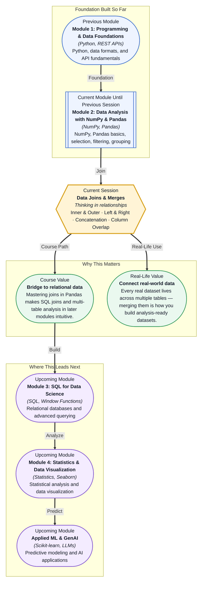

# Pre-read: Data Joins & Merges

## Context of This Session in the Course

You are staring at three separate spreadsheets. One contains customer names and email addresses from a sign-up form. Another has their purchase history with dollar amounts and dates. A third lists product categories and inventory levels. You need one unified table that answers a deceptively simple question: which customer segments drive the most revenue, and which products should you restock first?

Manually copying and pasting rows between sheets is not just tedious — it is error-prone and completely unscalable. A single misplaced row or a slight name mismatch silently corrupts your analysis, leading to inventory decisions based on incomplete data. Spreadsheet lookup functions might handle small cases, but they offer no visibility into what is being matched or lost during the process, and they fail entirely when your datasets grow to thousands of rows.

That is where **Data Joins & Merges** becomes essential. Instead of manual lookups or fragile formulas, you will learn a precise, database-inspired vocabulary for combining tables that guarantees every row lands exactly where it belongs — no guesswork, no silent data loss.

What if you could combine a year's worth of sales transactions from three different regional databases in under ten lines of code? Imagine a dashboard that updates daily by automatically joining fresh data from your CRM, your billing system, and your inventory tracker — without a single manual intervention. You would spend zero time wrangling spreadsheets and all your energy on the analysis that actually drives decisions. That capability starts with understanding how joins work.

A **join** is the operation of combining two tables based on a shared key column — a column that appears in both tables and identifies matching rows, such as a customer ID. Think of it like two separate registries for the same event: one has names and contact details, the other has names and dietary preferences. A join lets you create a single comprehensive list that tells you everything about each person. The critical insight is that the way you choose to combine the lists — the type of join you use — determines what information is kept and what is left behind.

Pandas provides four core join types — **inner**, **outer**, **left**, and **right** — each defining a different rule for which rows survive the merge. You will also explore **concatenation** for stacking tables vertically or horizontally, and strategies for **handling overlapping column names** so that your merged dataset stays clean and unambiguous. Together, these tools are the Pandas equivalent of SQL's JOIN clause, giving you a skill that transfers directly to relational database work in the upcoming modules.

In the **previous session**, you mastered the art of summarizing data using Pandas' `groupby` and pivot tables — splitting a single DataFrame into meaningful groups to compute averages, sums, and counts. That skill assumed all your data already lived in one well-organized table. But in the real world, it rarely does. Customer data lives in one file, transaction data in another, and product catalogs in a third. The grouping and aggregation techniques you practised were necessary preparation, but they become exponentially more powerful once you can first assemble a complete, multi-source dataset. The joins and merges covered in this session are exactly the tool that bridges single-table analysis and the multi-table reality of professional data work.

In this pre-read, you will discover:

- How to **apply** inner, outer, left, and right joins to combine DataFrames on shared keys
- How to **recognise** which join type preserves the data you need and which discards it silently
- How to **connect** multiple datasets using concatenation and handle overlapping column names
- How to **build** a unified dataset from fragmented sources, the same way a data engineer does

---

## Why Four Different Join Types?

Imagine you have two tables: one with customer names and IDs, another with customer IDs and purchase amounts. An **inner join** keeps only customers who appear in both tables — the intersection. This is the safest join because every row in the result has complete information from both sides, but it also means any customer who has not made a purchase yet disappears from your analysis without warning. A **left join** keeps every row from the first (left) table and fills in missing data from the second table with `NaN`. This is the workhorse of data analysis because it preserves your original dataset while enriching it with additional columns. A **right join** is the mirror image — it keeps every row from the second table. An **outer join** keeps everything from both tables, filling missing values with `NaN` wherever a row exists in only one source. Each type serves a different analytical purpose, and choosing the wrong one can silently corrupt your conclusions.

The practical takeaway is this: before you merge, you must decide what the "truth set" of rows should be. If you are joining order data to customer data, a left join (keeping all orders) ensures no transaction is lost. If you are looking for data quality issues, an outer join reveals records that exist in one system but not the other. This decision-making framework — not the syntax — is the real skill you are building.

## When Concatenation Beats Joining

Joins align rows by matching values in key columns. **Concatenation** is different: it stacks datasets on top of each other (row-wise) or side by side (column-wise) without any key-based matching. You would use `pd.concat()` when you have monthly sales reports for January, February, and March that share the same column structure and you simply want one combined table. This is far simpler than merging because there is no matching logic — the columns just line up by position or label.

The challenge with concatenation arises when column names do not perfectly align. If January's report has a column called "Revenue" and February's calls it "Sales", `pd.concat()` produces two separate columns instead of one, and your analysis silently breaks downstream. This is where handling overlapping and mismatched column names becomes critical. Pandas gives you fine-grained control through parameters like `join` (to choose inner or outer alignment of columns) and `ignore_index` (to reset the index after stacking). Mastering concatenation alongside merges means you can handle every table-combination scenario — structured lookups and simple stacking alike.

## Where Joins and Merges Appear in Real Life

Every industry that works with data faces the same fundamental challenge: the information you need is scattered across multiple tables, databases, or files. In **e-commerce**, joining customer profiles with purchase history and inventory data is how analysts answer questions like "which customer segments drive the most revenue?" and "which products should we restock?" A single customer ID is the key that connects sign-up data, order records, and shipping logs into a unified view. In **healthcare**, patient records are split across separate systems — lab results, prescriptions, billing, appointments — and merging them by patient ID is how clinicians and analysts build a complete health profile for each individual.

In **finance**, transaction data lives in one table, account metadata in another, and fraud flags in a third. Joining these tables is the first step in building a fraud detection system that can flag suspicious patterns across millions of transactions. **Marketing teams** blend campaign performance data from Google Ads, Facebook, and email platforms by joining on campaign IDs, enabling them to calculate true return on ad spend across channels. And in **logistics and supply chain**, shipment tracking, warehouse inventory, and supplier data are joined daily to optimize delivery routes and prevent stockouts. In every case, the core operation is the same — a join on a shared key — and the skill you are building in this session is the foundation for all of it.

## What's Next

After this session, you will be able to:

- Combine two DataFrames using `.merge()` with inner, left, right, and outer join types
- Use `pd.concat()` to stack DataFrames row-wise and column-wise
- Handle overlapping column names by assigning meaningful suffixes during a merge
- Diagnose which rows are preserved or dropped by each join type using indicator flags
- Choose between a merge, a join, and a concatenation based on the structure of your data

You do not need to memorise every parameter of `.merge()` and `.concat()` right now. The goal is to think of data as relational — once you see every dataset as part of a connected web, the code is just syntax.

## Interesting Questions for the Live Session

- An inner join on two tables might drop rows that exist in only one table — could this silence an important data quality issue or a legitimate business edge case that you need to investigate?
- When two column names overlap besides the key, Pandas adds suffixes like `_x` and `_y` — but what happens if your data already contains columns with those suffixes?
- Concatenating two DataFrames with different column names produces separate columns instead of aligning them — is there a way to catch and fix this before it corrupts your analysis?
- Pandas offers `.merge()`, `.join()`, and `pd.concat()` for combining tables — when would you choose one over the other, and what hidden assumptions does each make about your data?

By the end of this session, combining multiple DataFrames should feel less like a spreadsheet puzzle and more like asking a database a question: **think in relationships, not in rows.**
