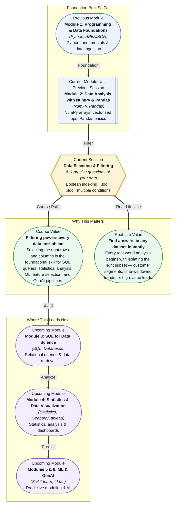

# Pre-read: Data Selection & Filtering

## Context of This Session in the Course

Your manager drops a CSV with 50,000 rows of customer transactions on your desk and asks: "How many premium users in the 25–35 age group made a purchase last quarter?" You open the file, scroll through a few columns, and realise the answer is hiding somewhere in those thousands of rows. Scrolling is futile. Your eyes glaze over by row 200.

You could write a Python script — loop through every row, check each condition with nested `if` statements, collect matching rows into a list. That works, but it is slow to write, slower to run, and the moment you need a different filter (say, changing "premium" to "basic" or "last quarter" to "this quarter"), you are editing tangled loop logic. The naive approach does not scale, and it definitely does not inspire confidence when your manager is waiting.

That is where **Data Selection & Filtering** becomes essential. Pandas gives you a declarative way to say exactly what you want — rows where age is above 30 AND status is premium AND purchase date falls in Q4 — and get the answer in a single line of code, in milliseconds.

What if you could ask your dataset any question — "show me all transactions above ₹10,000 from last month in Mumbai" — and get a clean subset back in a fraction of a second? What if you could chain multiple conditions, pick only the columns you care about, and never worry about the rest? What if exploring a 100,000-row dataset felt as natural as flipping through a well-organised spreadsheet, but infinitely faster? That is the power this session places in your hands.

At its core, data selection is about **Boolean indexing** — using `True` and `False` values as a mask to pick only the rows that matter. Imagine you have a stack of printed surveys. Boolean indexing is like having a highlighter that marks every survey where the respondent is female, over 30, and employed full-time. In Pandas, you express this highlight as a condition: `df['gender'] == 'Female'`. Wherever that condition is `True`, the row passes through; where it is `False`, it is left behind. This simple idea — expressing your filtering logic as a series of `True`/`False` questions — is the engine behind every data selection operation you will perform. In this pre-read, you will explore **Boolean indexing**, the difference between label-based selection (`.loc`) and position-based selection (`.iloc`), the art of combining multiple conditions with `&`, `|`, and `~`, and how to select exactly the columns you need.

In the **previous session**, you learned to load a CSV into a Pandas DataFrame, inspect its shape and column names, and distinguish between a Series (one column) and a DataFrame (many columns). You now have the data in a structured, tabular form. But having data in a DataFrame is like owning a library card — it is useful only if you know how to find the books you want. This session takes the next step: it teaches you to ask questions of that structure, to reach in and pull out exactly the rows and columns that answer your business question.

In this pre-read, you will discover:
- How to **apply** Boolean indexing to filter rows using logical conditions.
- How to **distinguish** between `.loc` and `.iloc` for label-based versus position-based selection.
- How to **combine** multiple filter conditions with `&`, `|`, and `~`.
- How to **select** specific columns from a DataFrame for focused analysis.

---

## Boolean Indexing — The Engine Behind Every Filter

Every filter you will ever write in Pandas rests on one idea: a Boolean mask. A Boolean mask is simply a Series of `True` and `False` values, one per row, where `True` means "keep this row" and `False` means "skip it." When you write `df['age'] > 30`, Pandas does not return a number — it returns a Boolean Series comparing every row's age to 30. Placing that mask inside the square brackets of a DataFrame — `df[df['age'] > 30]` — tells Pandas to keep only the rows that match.

This pattern scales beautifully. Want customers from Bangalore? `df['city'] == 'Bangalore'`. Want transactions over ₹5,000? `df['amount'] > 5000`. Want both? Combine them with the ampersand: `df[(df['city'] == 'Bangalore') & (df['amount'] > 5000)]`. Each condition is a simple yes/no question, and together they form a precise description of the subset you need. The parentheses around each condition are not optional — they tell Python where one condition ends and the next begins, avoiding operator-precedence surprises.

Boolean indexing is not just for filtering rows. It works for updating data in place, too. `df.loc[df['age'] > 60, 'discount'] = 0.15` finds every customer over 60 and sets their discount column to 15%. The same mental model — a mask that selects rows, then an operation that affects only those rows — reappears throughout data science, from SQL `WHERE` clauses to NumPy masking to feature engineering in machine learning pipelines.

## .loc vs .iloc: Navigating by Label and Position

Pandas offers two powerful selectors, and confusing them is one of the most common sources of bugs for beginners. `.loc` is label-based: you use row and column *names* (or labels) to specify what you want. If your DataFrame has a custom index — say, customer IDs — `df.loc[101:105]` selects rows with index labels 101 through 105, inclusive. `.iloc` is position-based: you use integer indices, just like Python list indexing. `df.iloc[0:5]` selects the first five rows, regardless of what their index labels say.

The distinction matters the moment your data has a non-default index. Imagine you filter a DataFrame down to 100 rows, and the remaining rows have original index values scattered across 1 to 10,000. If you then use `.loc[500]`, you are asking for the row whose label is 500 — which may or may not exist in your filtered subset. If you meant "the 500th row of my filtered result," you should use `.iloc[499]` instead (because Python indexing starts at zero). This subtle difference can cause silent errors: your code runs, but it returns the wrong row.

Mastering `.loc` and `.iloc` means you can navigate DataFrames with surgical precision. You will use `.loc` when you care about the identity of rows (fetch customer ID 42, no matter where it sits in the table), and `.iloc` when you care about the order (give me the top 10 rows of the sorted result). Most real-world pipelines use both, often within the same expression.

## Where Data Selection Appears in Real Life

In e-commerce analytics, data selection is the first step of almost every report. A product manager wants to know the average order value for new users in the electronics category during the Diwali sale. That is a three-condition filter — user tenure, product category, and date range — expressed as a Boolean mask on a transactions table. The same pattern recurs in finance (filtering trades by asset class, region, and risk tier), healthcare (isolating patient records by diagnosis code, age group, and treatment window), and marketing (segmenting leads by campaign source, engagement score, and sign-up date). In each case, the raw data is far too large to inspect manually; filtering is what turns a sea of rows into a decision-ready subset.

In fraud detection, analysts filter transactions in real time — "show me all transactions above ₹50,000 from new accounts with a different shipping address" — to surface suspicious patterns. In logistics, operations teams filter shipment records by warehouse, delivery status, and date to identify bottlenecks. In every industry, the ability to articulate what you need as a precise set of conditions is the skill that separates "I have the data" from "I have the answer." Data selection is the bridge between raw storage and actionable insight.

## What's Next

After this session, you will be able to:
- Filter rows using Boolean conditions with `df[df['column'] > value]`.
- Select data by label with `.loc` and by integer position with `.iloc`.
- Combine multiple filter conditions using `&`, `|`, and `~` operators.
- Extract specific columns from a DataFrame for targeted analysis.
- Chain selection and filtering operations for efficient data exploration.
- Write readable, bug-free filter expressions that other data scientists can understand at a glance.

You do not need to memorise every Pandas method right now. The goal is to think of a DataFrame as a question-answering tool: **you describe what you want, and Pandas finds it.**

## Interesting Questions for the Live Session

- If you use `.loc` with a slice like `df.loc['a':'c']`, the end label `'c'` is included — but `df.iloc[0:3]` excludes index 3. Why does Pandas treat these two selectors differently, and when might this inconsistency catch you out?
- What happens when you filter a DataFrame and the result is empty — no rows match your condition? How should your code handle that gracefully instead of crashing downstream?
- If you chain multiple filters using `&`, does Pandas evaluate every condition on every row, or does it short-circuit? How could this affect performance on a 10-million-row dataset?
- Consider `df[df['price'] > 100]['price'] = 99` — will this update the original DataFrame? Why or why not, and what does this reveal about how Pandas handles chained assignments?

By the end of this session, data selection should feel less like memorising syntax and more like having a conversation with your dataset: **ask clearly, get exactly what you need.**
