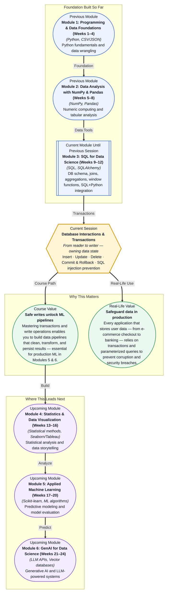

# Pre-read: Database Interactions & Transactions

## Context of This Session in the Course

You are building a checkout system for an online store. A customer adds items to their cart, enters payment details, and clicks "Place Order." The system deducts the item from inventory, charges the credit card, and creates a shipping record — three separate operations. Now imagine the credit card charge succeeds, but the inventory update fails. The customer is charged for an item that the system thinks is still in stock.

This is not a hypothetical bug — it is a class of failure that has cost real companies millions. The naive approach — running three independent operations one after the other — guarantees that partial failures will corrupt your data. Fixing it after the fact requires manual reconciliation, audit logs, and angry customer emails. The deeper problem is that databases treat each operation as an isolated event unless you explicitly tell them otherwise.

What you need is a way to say: "treat these three operations as a single, indivisible unit — either all of them succeed, or none of them take effect." That is where **Database Interactions & Transactions** becomes essential.

What if you could write code that modifies a database with the same confidence as reading from it? What if you could guarantee that even when your Python script crashes halfway through an update, your data remains perfectly consistent? Imagine leading a data pipeline that ingests thousands of records per minute from a live e-commerce feed, updating inventory levels, customer balances, and order statuses in real time. One network hiccup, one duplicate row, one half-committed transaction — and the entire nightly reconciliation breaks. After this session, you will know exactly how to wrap those writes in transactions, roll back on error, and guard your database against the most common and costly attack vector in web applications.

At its core, a **database transaction** is a logical unit of work that treats multiple operations as one atomic action. The acronym **ACID** — Atomicity, Consistency, Isolation, Durability — captures the guarantees a transaction provides. Think of it like a bank transfer: moving money from one account to another requires a debit and a credit. If the debit succeeds but the credit fails, money disappears. A transaction ensures both happen — or neither does. That is atomicity.

The tools for modifying data are the **INSERT**, **UPDATE**, and **DELETE** statements — the write counterparts to the SELECT queries you already know. INSERT adds new rows, UPDATE changes existing values, and DELETE removes rows. But writing data introduces a risk that reading never does: you can permanently damage your dataset with a single misplaced statement. That is where **COMMIT** and **ROLLBACK** come in. COMMIT finalises your changes; ROLLBACK undoes them as if they never happened.

You will also explore **SQL injection prevention** — the practice of writing parameterised queries that separate code from data. When you build a query by concatenating user input, you open the door for attackers to hijack your database. Prepared statements and bound parameters eliminate this risk entirely. Together, these concepts transform you from a read-only data consumer into someone who can safely manage production database state.

In the **previous session**, you learned how to bridge Python and SQL using SQLAlchemy — connecting to a database, executing SELECT queries, and fetching results as Python objects. You became comfortable with connection strings, cursors, and the read side of the database interface.

Now you are ready to complete the picture. Reading data is half the skill; writing data safely is what turns a query tool into a data pipeline. The same SQLAlchemy connection and cursor objects you used to fetch rows are the ones you will use to execute INSERT, UPDATE, and DELETE statements. The only difference is that writes demand a new mental model — one built around transactions, commit points, and rollback safety nets.

In this pre-read, you will discover:

- How to **insert**, **update**, and **delete** database records using SQL statements
- How to **use** COMMIT and ROLLBACK to control transaction boundaries
- How to **recognise** SQL injection vulnerabilities and defend against them with parameterised queries
- How to **apply** transactional thinking to ensure data integrity in real-world applications

---

## Why INSERT, UPDATE, and DELETE Demand a Different Mindset from SELECT

When you run a SELECT query, you are a spectator — the database shows you what exists, and nothing changes. The stakes are zero. But the moment you run an INSERT, UPDATE, or DELETE, you become a participant. You are permanently changing the state of the database. A missing WHERE clause on an UPDATE can rewrite every row in a table. A DELETE without a filter can empty a production table in milliseconds.

This asymmetry is why experienced data professionals treat writes with a ritual-like caution. They first run the SELECT equivalent to preview which rows will be affected. They wrap writes in transactions so they can roll back if the row count looks wrong. They test on a staging database before touching production. The technical skill of writing INSERT, UPDATE, and DELETE is simple — the professional skill is knowing how to wield them without causing damage.

## How COMMIT and ROLLBACK Give You a Safety Net

A **COMMIT** is your way of saying "I confirm these changes — make them permanent." Until you issue a COMMIT, your changes exist only in your session's view of the database; no other user can see them, and they can be undone. A **ROLLBACK** is your escape hatch — it discards every change made since the last COMMIT, restoring the database to its previous state. Together, they let you treat a sequence of writes as a single experiment: try it, verify it, and only commit if everything looks right.

Consider a real example: you need to update 10,000 customer email addresses based on a CSV import. Without a transaction, if the update fails at row 7,500, you are left with 7,500 changed and 2,500 unchanged — a corrupted dataset. With a transaction, you can wrap the entire operation, check the affected row count, and either COMMIT on success or ROLLBACK on any error. This pattern — try-verify-commit — is the foundation of every reliable data pipeline in production.

## Where SQL Injection Prevention Appears in Real Life

**SQL injection** is the technique of inserting malicious SQL code through user input fields. A login form that builds a query with string concatenation — `"SELECT * FROM users WHERE email = '" + user_input + "'"` — can be exploited by typing `admin' --` into the email field, turning the query into `SELECT * FROM users WHERE email = 'admin' --'`, which comments out the password check and logs in as admin. This single vulnerability has powered some of the largest data breaches in history.

The fix is **parameterised queries** (also called prepared statements). Instead of embedding user input into the SQL string, you send the SQL template and the input separately: the database engine compiles the template and inserts the input as a safe data value, never as executable code. In Python's SQLAlchemy, this looks like `session.execute(text("SELECT * FROM users WHERE email = :email"), {"email": user_input})`.

SQL injection is not an academic concern. It is the number one attack vector in web applications according to OWASP, affecting every industry that accepts user input. In **e-commerce**, attackers inject queries to steal credit card data from checkout forms. In **healthcare**, compromised patient databases expose protected health information, triggering HIPAA violations and massive fines. In **banking**, injection attacks have been used to transfer funds, manipulate account balances, and extract customer records. In **social media**, login bypasses via injection have led to millions of accounts being scraped. Even in **enterprise SaaS**, internal admin panels are routinely targeted — a single unparameterised search box can bring down a company's entire customer database. Parameterised queries are not an advanced optimisation; they are the baseline expectation for any code that touches a database.

## What's Next

After this session, you will be able to:

- Insert new records into a database table using INSERT statements with correct syntax
- Update existing rows using UPDATE with precise WHERE clauses to avoid accidental overwrites
- Delete records safely using DELETE combined with transactions for rollback capability
- Control transaction boundaries with COMMIT and ROLLBACK to ensure atomic write operations
- Write parameterised queries in Python to prevent SQL injection attacks
- Apply the try-verify-commit pattern to build reliable data ingestion pipelines

You do not need to memorise every SQL dialect or database API right now. The goal is to internalise one core mental model: writing to a database without transactions is like performing surgery without the ability to stitch — competent practitioners never do it.

## Interesting Questions for the Live Session

- If a transaction is rolled back after an INSERT, does the auto-increment counter still increment — and why does it matter?
- Why do some database operations (like DDL statements) implicitly commit the current transaction, and how does this catch developers off guard?
- If parameterised queries prevent SQL injection, why do so many production applications still use string concatenation for dynamic queries?
- Under what circumstances would you deliberately choose NOT to wrap multiple writes in a single transaction — what tradeoffs are you making?

By the end of this session, transactions should feel less like an abstract database concept and more like a practical safety mechanism you reach for instinctively: **Transactions are undo for your database — and undo is the most underrated superpower in software engineering.**
