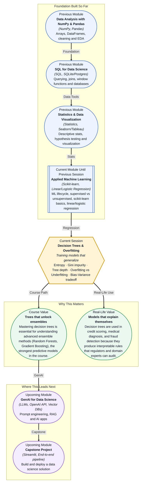

# Pre-read: Decision Trees & Overfitting

## Context of This Session in the Course

Imagine you are a junior data scientist at a bank, tasked with building a model that automatically decides whether a loan applicant is high-risk or low-risk. Your manager hands you a dataset with thousands of past customers — income, credit score, debt-to-income ratio, employment length — and expects a clear, explainable rule set that the bank's compliance team can review. You could throw a neural network at the problem, but the compliance team needs to understand *why* a loan was denied.

So you try writing out a few if-then rules: *if income below $40k and credit score below 600, reject*. But real data is messy — what about the applicant with a low credit score but a high income and a short employment history? Hand-written rules quickly collapse under edge cases, becoming a tangled mess of overlapping conditions that neither generalise to new applicants nor satisfy the auditors. You need a system that *learns* these decision rules automatically from data, while still keeping them transparent enough for a human to read.

That is where **Decision Trees** become essential — they are the rare machine learning model that combines algorithmic learning with human-readable logic, and learning to use them well means confronting the central tension of all predictive modelling: **overfitting**.

What if you could build a model whose every decision could be traced back to a specific rule — and then show a non-technical stakeholder exactly how that rule works, in plain English? Imagine sitting in a loan committee meeting and pulling up a tree diagram on the screen: "If debt-to-income ratio exceeds 0.43 and months since last delinquency is less than 3, the model flags this applicant — and here is why that rule makes sense from our historical data." After this session, you will know not only how to grow such a tree, but how to prune it so that its rules are both accurate and trustworthy.

At its core, a decision tree is exactly what it sounds like: a series of yes/no questions arranged in a tree structure. Each question splits the data into two groups, and each split aims to create *purer* subgroups — groups where the majority belong to a single class. The algorithm chooses the best question at each step by measuring impurity using either **Entropy** (borrowed from information theory) or **Gini impurity** (a simpler, faster alternative). Think of it like the game of *20 Questions*: each answer narrows the possibilities until you have enough certainty to make a prediction.

But here is the twist: a tree that asks too many questions will memorise the noise in your training data rather than the signal. That is **overfitting** — when the model performs exceptionally well on data it has seen but fails on new, unseen examples. The counterpart is **underfitting**, when the tree is too shallow to capture even the obvious patterns. This tug-of-war between complexity and generalisation is the **Bias-Variance tradeoff**, and **tree depth** is the primary lever you will use to control it. In this session, you will explore how these concepts play out in practice, learning to grow trees that are just detailed enough — and no more.

In the **previous session** (Logistic Regression), you learned how to draw a decision boundary between two classes using the sigmoid function. That model still relies on a linear boundary — a straight line (or hyperplane) that separates groups in the feature space. Decision trees take a fundamentally different approach: instead of drawing one smooth boundary, they carve the feature space into rectangular regions using a hierarchy of yes/no questions. Where logistic regression produces a single clean cut across the entire dataset, a decision tree creates many local boundaries that adapt to the shape of the data. This gives trees vastly more flexibility — and vastly more risk of overfitting. The probability outputs and decision thresholds you learned in logistic regression now set the stage for understanding how trees make their own predictions, one split at a time.

In this pre-read, you will discover:
- How to **understand** the logic behind Entropy and Gini impurity as splitting criteria
- How to **recognise** the signs of overfitting and underfitting in a tree model
- How to **connect** tree depth and pruning to the Bias-Variance tradeoff
- How to **apply** decision trees to classification problems using scikit-learn

---

## Why a Tree Would Rather Be Impure Than Wrong

A decision tree's job is to ask questions that separate the classes as cleanly as possible. But what does "cleanly" actually mean? Imagine a box of 100 marbles — 50 red, 50 blue. If you split the box into two smaller boxes, the ideal result is one box with all 50 red marbles and another with all 50 blue marbles. That split is *pure* — each subgroup contains only one class. In practice, real splits are rarely this clean. You might end up with one box containing 45 red and 5 blue, and the other with 5 red and 45 blue. That is still a good split — each subgroup is *mostly* pure.

This is where **Entropy** and **Gini impurity** come in. Both are mathematical formulas that assign a score to a potential split: the lower the score, the purer the resulting groups. Entropy is inspired by information theory — it measures the amount of "surprise" in a distribution. Gini impurity is a slightly simpler approximation that asks: "If I randomly picked two items from a group, how likely would they be from different classes?" Scikit-learn's `DecisionTreeClassifier` supports both criteria, and they often produce very similar trees. The real insight is not in memorising the formulas, but in understanding that every split the tree makes is a deliberate attempt to reduce uncertainty — and that the tree will keep splitting until you tell it to stop.

## The Hidden Danger of a Perfectly Accurate Tree

Here is a deceptively simple scenario: you train a decision tree on your loan application dataset, and it achieves **100% accuracy** on the training data. Should you celebrate? Absolutely not. A tree that perfectly classifies every training example has likely memorised the noise, outliers, and peculiarities of that specific dataset — including the one applicant who was denied because their income was $39,847.23 and it was a Tuesday. When this tree meets new applicants, it will fail spectacularly because it learned the training data by heart instead of learning the general patterns.

This phenomenon is **overfitting**, and it is the single most important risk to manage when working with decision trees. The primary control you have is **tree depth** — the maximum number of consecutive questions the tree is allowed to ask before making a prediction. A shallow tree (depth 2 or 3) might underfit, missing important patterns. A deep tree (depth 20 or more) will almost certainly overfit. The art of training a decision tree lies in finding the *minimum depth that captures the real structure* in your data without chasing noise. Techniques like **pruning** (removing branches that add little predictive power) and setting a **minimum samples per leaf** are practical ways to enforce this discipline. In scikit-learn, parameters like `max_depth`, `min_samples_split`, and `ccp_alpha` (cost-complexity pruning) give you fine-grained control over this tradeoff.

## Where Decision Trees Appear in Real Life

Decision trees are everywhere in industry, precisely because they are transparent enough for non-experts to understand and audit. In **banking and finance**, credit scoring models are often built on decision trees — regulators require lenders to explain why a loan was denied, and a tree provides a clear, rule-based justification that holds up in compliance reviews. In **healthcare**, trees are used for preliminary diagnosis: a patient's symptoms, lab results, and demographic data can be fed into a tree that suggests likely conditions, which doctors can then verify or override. The tree's transparency matters here — a black-box model that recommends a treatment without explanation would be unacceptable in a clinical setting. In **fraud detection**, trees help flag suspicious transactions by learning the patterns that distinguish legitimate purchases from fraudulent ones. E-commerce platforms use them to decide whether a transaction should be approved, flagged for manual review, or blocked outright. Even in **manufacturing and quality control**, decision trees are used to diagnose equipment failures: sensor readings are fed into a tree that isolates the root cause of a defect, enabling maintenance teams to act quickly. The common thread across all these use cases is that decision trees are chosen not because they are the most powerful model available, but because they strike a practical balance between predictive accuracy and interpretability — a tradeoff that becomes critical when real people and real money are on the line.

## What's Next

After this session, you will be able to:

- Train a decision tree classifier using scikit-learn and visualise its decision boundaries
- Explain the difference between Entropy and Gini impurity and when each is preferred
- Diagnose overfitting by comparing training and validation accuracy across different tree depths
- Apply cost-complexity pruning to remove unnecessary branches from a trained tree
- Articulate the Bias-Variance tradeoff in plain language using decision trees as a concrete example
- Choose appropriate `max_depth`, `min_samples_split`, and `min_samples_leaf` values for a given dataset

You do not need to memorise the impurity formulas right now. The goal is to internalise a single, powerful idea: **a model that learns everything learns nothing useful.**

## Interesting Questions for the Live Session

- If a decision tree achieves perfect training accuracy but poor test accuracy, which of the two impurity measures (Entropy vs Gini) is more likely to blame, or is the issue entirely about tree depth?
- Can you construct a small dataset where increasing tree depth *decreases* both training and test accuracy simultaneously?
- Why might a decision tree trained on 10 features produce a completely different tree structure than one trained on the same 10 features plus one irrelevant random feature?
- In a regression task, what would a "decision stump" (a tree of depth 1) look like, and how does it relate to the threshold you would pick for a single-feature logistic regression?

By the end of this session, decision trees should feel less like a mysterious algorithm and more like a transparent decision-making partner: **a tree you can explain is a model you can trust.**
</parameter>
