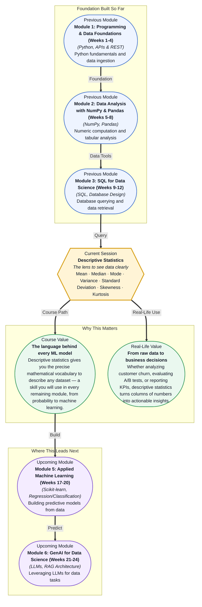

# Pre-read: Descriptive Statistics

## Context of This Session in the Course

Your manager slides a laptop across the table — a CSV of 12,000 customer transactions from the past quarter. "Give me the headline," they say. You open the file and see a wall of numbers: prices, quantities, dates, regions. Some rows show \$15 purchases, others \$2,000. A handful are over \$10,000. Where do you even begin?

Scanning every row is hopeless. Reporting just the total feels like cheating. The average might be \$187, but that single number hides the story — maybe most purchases are under \$50 and a few outliers are pulling the average up. The moment you try to communicate what is really happening, you realise that raw data, on its own, is stubbornly silent. It needs a translator.

That translator is **descriptive statistics** — a precise set of mathematical tools designed to summarise any dataset into a handful of meaningful numbers. Instead of drowning in 12,000 rows, you learn to describe the entire dataset with measures of centre, spread, and shape. This is where **Mean, Median, Mode, Variance, Standard Deviation, Skewness, and Kurtosis** become essential.

What if you were the data lead for a hospital network reviewing patient readmission rates across six facilities? Your CEO wants to know: which hospital has the most consistent outcomes? Is there a facility where the average hides an alarming spread — a few excellent results masking many poor ones? You need to compare not just the averages but the variability and the shape of each hospital's distribution. Without a statistical vocabulary, you would be making judgements on gut feeling. With descriptive statistics, you can point to the exact numbers that reveal whether a hospital is reliably good or just lucky on average. This session gives you that vocabulary.

Descriptive statistics is the grammar of data science. Every dataset you will ever encounter can be described by three families of measures: **central tendency** tells you where the data clusters (mean, median, mode); **dispersion** tells you how spread out the data is (variance, standard deviation); and **shape** tells you whether the data leans left or right and how sharply it peaks (skewness, kurtosis). Think of it as the difference between describing a room by its centre point versus describing its full dimensions — one is a location, the other is a complete picture. In this session, you will explore each of these measures, understand when to use which, and learn to read the story a dataset is trying to tell you through these seven numbers.

In the **previous session**, you completed Module 3's case study on e-commerce analysis — joining SQL tables, aggregating key business metrics, and generating reports from a real transactional database. You learned how to ask a database for numbers: total revenue, average order value, customer counts by segment. But SQL aggregation gives you raw output; it does not tell you whether that average is trustworthy, whether the data is wildly inconsistent, or whether the underlying distribution is lopsided. That is exactly where descriptive statistics begins — taking the aggregates you already know how to compute and layering on the mathematical rigour to interpret them correctly.

In this pre-read, you will discover:

- How to **recognise** which measure of central tendency — mean, median, or mode — best represents your specific dataset
- How to **interpret** variance and standard deviation as the language of spread and consistency
- How to **discover** the hidden shape of your data using skewness and kurtosis
- How to **apply** all of these measures together to detect anomalies, compare groups, and communicate findings with precision

---

## Why the Average Can Be Misleading

Imagine three teams in the same company. Team A has salaries (\$40k, \$42k, \$41k, \$43k, \$39k). Team B has (\$35k, \$40k, \$45k, \$50k, \$30k). Team C has (\$38k, \$40k, \$42k, \$45k, \$200k). All three have a **mean** (average) salary around \$41,000 — but those three teams could not be more different. Team A is tightly clustered, Team B is spread across a wide range, and Team C has a single executive inflating the whole picture.

This is the classic trap of relying on the mean alone. The **median** — the middle value when all numbers are sorted — handles outliers gracefully. For Team C, the median is \$42k, far more representative than the mean of \$73k. The **mode**, the most frequently occurring value, is useful when your data is categorical or when you care about the most common case, like the most frequently purchased product size. The lesson is simple: the "average" is not a single concept. Choosing the wrong one leads to genuinely wrong conclusions, whether you are setting salaries, pricing products, or evaluating student performance.

## How Spread Tells a Deeper Story

Knowing the centre of your data is only half the picture. Two datasets can have the same mean yet behave completely differently. **Variance** measures how far each data point deviates from the mean, squared so that positive and negative deviations do not cancel each other out. **Standard deviation** takes that number and brings it back to the original unit by taking the square root — making it directly interpretable. If customer spending has a mean of \$100 and a standard deviation of \$15, you know roughly two-thirds of your customers spend between \$85 and \$115. If the standard deviation is \$50, your customer base is much more erratic.

**Skewness** tells you whether the tail of your distribution leans left (negative skew) or right (positive skew). Income data, for example, is almost always positively skewed — a small number of very high earners pull the mean above the median. **Kurtosis** tells you how sharp the peak is and how heavy the tails are — crucial for risk analysis. High kurtosis means more extreme outliers than a normal distribution would predict, which matters enormously in fields like finance or fraud detection where rare events carry the highest stakes.

## Where Descriptive Statistics Appears in Real Life

In **finance and investing**, portfolio managers use standard deviation to quantify risk — a fund with higher volatility has a wider spread of returns and is considered riskier, regardless of its average return. Hedge funds track kurtosis specifically because they care about tail risk: a portfolio that looks stable most of the time but occasionally crashes catastrophically has high kurtosis, and standard metrics like the mean and variance will miss that danger. In **healthcare and pharmaceuticals**, clinical trial results are reported using means, medians, and confidence intervals built on standard deviations. A drug that shows a modest average improvement but with enormous variance across patients might not be reliable enough for approval, while a drug with a smaller average effect but very low variance could be the safer choice. In **e-commerce and retail**, companies segment their customer base using descriptive statistics — the average order value tells one story, but the combination of median (less sensitive to VIP bulk orders) and standard deviation (how consistent customer spending is) determines everything from inventory planning to loyalty programme design. In **manufacturing and quality control**, standard deviation is the foundation of Six Sigma methodology: processes are rated by how many standard deviations fit within specification limits. A machine producing parts with low variance is a trusted machine; one with high variance produces waste. In **sports analytics**, teams evaluate player consistency through the lens of standard deviation and skewness — a basketball player who scores 25 points per game but with high variance might disappear in playoff games, while a player with lower average but tighter consistency might be more valuable under pressure.

## What's Next

After this session, you will be able to:

- Compute the mean, median, and mode of any dataset and justify which measure to use
- Calculate variance and standard deviation to quantify the spread and consistency of data
- Interpret skewness and kurtosis to describe the shape and tail behaviour of a distribution
- Detect outliers and anomalies by comparing a dataset's centre, spread, and shape against expected norms
- Summarise a complete dataset in a handful of statistical measures and communicate what each number means to a non-technical stakeholder

You do not need to memorise formulas right now — understanding what each measure reveals and when to use it is the primary goal. The goal is to stop seeing data as a wall of numbers and start seeing it as a landscape that can be mapped with seven precise coordinates: **describe first, decide second**.

## Interesting Questions for the Live Session

- If the mean and median of a dataset are very different, which one should you report to a business stakeholder — and how would you explain the discrepancy?
- Can a dataset have zero variance and still be useful, or is it a sign that something is wrong with your data collection?
- Why might a machine learning model perform worse on a dataset with high kurtosis, even if the mean and variance look normal?
- If you are comparing two products and Product A has a higher average rating but higher variance than Product B, which product would you recommend to a risk-averse customer — and how would you quantify your reasoning?

By the end of this session, descriptive statistics should feel less like abstract formulas and more like a practical diagnostic toolkit: **seven numbers that make any dataset speak clearly**.
