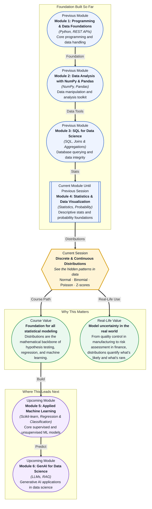

# Pre-read: Discrete & Continuous Distributions

## Context of This Session in the Course

A quality engineer at a food packaging plant pulls 200 cereal boxes off the production line and weighs each one. The label says 500 grams, but the scale reads everything from 488 to 517. Some boxes are underfilled — risking customer complaints and regulatory fines — while others are overfilled, quietly bleeding profit. The engineer needs to decide: is this process out of control, or is this just normal variation?

The intuitive approach is to check each box individually. But that is impossible when millions roll off the line every day. You might look at the average — 500.2 grams — and feel relieved, yet that single number hides a crucial truth: 8% of boxes fall below 490 grams. The average tells you the centre but says nothing about the spread, the extremes, or the likelihood of a bad box. Raw numbers, without a model of how they behave, leave you guessing at the most basic business question: "How much risk are we actually taking?"

That is where probability distributions enter the picture. They take a chaotic column of numbers and reveal a predictable shape — a curve that tells you, at a glance, the likelihood of every possible outcome. The normal distribution, the binomial distribution, the Poisson distribution — these are not abstract formulas. They are lenses that bring order to randomness. That is where **Discrete & Continuous Distributions** becomes essential.

---

**What if** you were asked to set the quality thresholds for a smartphone manufacturer shipping 10 million units a year? The CEO wants to know: "How many devices will fail within the first year, and how much should we budget for replacements?" You cannot test every phone — that would destroy your inventory. But you can sample a few thousand, observe the failure pattern, and fit a distribution to the data. With that distribution, you can predict the failure rate across the entire 10 million units, calculate warranty reserves, and even identify whether failures cluster in specific production batches before they become a headline. The difference between guessing and knowing — between a recall crisis and a confident business decision — is whether you understand the shape of the data. This session gives you that power.

---

A **probability distribution** is a mathematical description of how values spread across possible outcomes. Think of it as the "fingerprint" of a process: every dataset has a distinctive shape that reveals how its values are arranged. A classroom's test scores tend to cluster around the average and taper off toward the extremes — that familiar bell shape is the **Normal distribution**, defined by its **mean** (centre) and **standard deviation** (spread). It is the most widely used distribution in statistics because so many natural and human processes follow it: heights, measurement errors, blood pressure readings, and yes, box-filling machines.

But not all data is symmetric and continuous. Some questions have only two answers — yes or no, success or failure, churn or retain. The **Binomial distribution** models exactly this: the number of successes in a fixed number of independent trials. If you show an ad to 1,000 users and each has a 2% chance of clicking, the Binomial distribution tells you the probability of getting exactly 15 clicks, or 30 clicks, or 0 clicks. It respects the discrete, binary nature of the event. Meanwhile, the **Poisson distribution** handles a different kind of question: how many times does a rare event occur over a fixed interval? How many support tickets arrive per hour? How many defects appear per square metre of fabric? Unlike the Normal, which is continuous, Poisson counts occurrences — and it works beautifully when events are independent and happen at a constant average rate.

Then there is the **Z-score**, a tool that works across all distributions. A Z-score tells you how many standard deviations a data point lies from the mean. A Z-score of +2 means the value is two standard deviations above average — unusual, but not impossible. A Z-score of +4 means something extraordinary happened. Z-scores are the universal translator of distributions: they let you compare a score from a Normal distribution against a value from a Binomial or Poisson by putting everything on the same scale.

---

In the **previous session**, you explored probability foundations — basic probability, conditional probability, and Bayes theorem. You learned how to calculate the likelihood of an event given prior knowledge. That was the grammar of uncertainty: the rules for combining probabilities. This session builds directly on that grammar by giving you the vocabulary — the specific distribution shapes that real-world data actually follows. Without the Bayes theorem, you can calculate conditional probabilities for any two events. With distributions, you can take that same conditional reasoning and apply it to entire populations, answering questions like "Given that this factory's fill weights follow a Normal distribution with mean 500 and standard deviation 4, what is the probability that a random box weighs less than 490 grams?" The jump is from abstract rules to applied models.

---

In this pre-read, you will discover:

- How to **recognise** the signature shape of a dataset and why shape matters more than any single summary number
- How to **apply** the Normal, Binomial, and Poisson distributions to model different types of real-world data
- How to **interpret** Z-scores as a universal language for comparing values across any distribution
- How to **connect** distribution models to business decisions like quality control, risk assessment, and anomaly detection

---

## Why Every Dataset Has a Signature Shape

You look at a spreadsheet of 10,000 numbers — customer wait times, website load speeds, or transaction amounts. Your instinct might be to compute the average and move on. But the average is a dangerous simplification. Two datasets can have the same average yet look completely different: one might be tightly clustered around the mean, while the other is wildly spread out with extreme outliers. That difference — the shape — determines every decision you make downstream.

The Normal distribution, with its symmetric bell curve, arises when values are influenced by many small, independent factors. A person's height is shaped by genetics, nutrition, environment, and dozens of other small contributors — none dominates, so the results pile up in the middle. The same goes for measurement errors in a scientific instrument or the sum of many tiny random effects in a manufacturing process. When you see a bell-shaped histogram, you know the data is well-behaved: the mean and median are nearly identical, most values fall within two or three standard deviations, and extreme values are exponentially rare.

The shape is not just a description — it is a prediction engine. Once you identify that a process follows a Normal distribution, you can estimate probabilities without collecting more data. You know that roughly 68% of values fall within one standard deviation of the mean, 95% within two, and 99.7% within three. This is the **empirical rule**, and it is the reason the Normal distribution is so powerful: with just two numbers — the mean and the standard deviation — you can reconstruct the behaviour of the entire system.

## How the Normal, Binomial, and Poisson Distributions Answer Different Questions

The Normal distribution answers "how much" questions — how much does a box weigh, how tall is a person, how fast does a page load. It is continuous, meaning the values can be any real number, and it is symmetric, meaning deviations above and below the mean are equally likely. But many real-world problems do not fit this mould.

The **Binomial distribution** answers "how many out of" questions. Out of 100 visitors to your website, how many make a purchase? Out of 500 patients given a new drug, how many show improvement? The Binomial has two parameters: **n** (number of trials) and **p** (probability of success on each trial). Crucially, it assumes each trial is independent — one customer's purchase decision does not influence another's. This makes it ideal for scenarios like A/B testing, where you show two versions of a webpage and count how many users convert under each variant.

The **Poisson distribution** answers "how often" questions — how many support calls arrive in an hour, how many defects appear in a kilometre of fibre-optic cable, how many cars pass a toll booth in a minute. It has a single parameter, **lambda** (the average rate), and it models rare events that occur independently over time or space. Unlike the Binomial, which caps at n successes, the Poisson has no upper bound — in theory, an infinite number of cars could pass a toll booth in an hour, though the probability of extreme values drops rapidly.

Knowing which distribution to apply is itself a skill. If data is continuous, symmetric, and unbounded in both directions, reach for the Normal. If you are counting successes in a fixed number of trials, reach for the Binomial. If you are counting rare events over a continuous interval, reach for the Poisson. And when you need to compare a single value from any of these distributions against its peers, you standardise it into a **Z-score** — the common currency of all distributions.

## Where Distributions Appear in Real Life

Walk into any modern manufacturing facility, and you will find distributions at the heart of **quality control**. The diameter of a piston ring, the viscosity of a batch of paint, the weight of a cereal box — each is measured against a target value, and each follows a Normal distribution around that target. Engineers use control charts powered by distribution theory to detect when a process drifts out of spec. A single measurement with a Z-score above 3 triggers an alert — not panic, but an investigation. The distribution tells you that such a value is rare under normal operation, so something may have changed in the machine.

In **marketing and product analytics**, the Binomial distribution underpins every conversion funnel. A team launches a new onboarding flow and wants to know whether the 4.8% conversion rate they observed in a sample of 500 users is genuinely better than the old flow's 4.2%. The Binomial distribution gives them the probability of observing a result this extreme if the underlying rate were still 4.2%. That is the logic of statistical significance — and it starts with recognising that each user is a Bernoulli trial, and the aggregate follows a Binomial.

In **operations and customer support**, the Poisson distribution drives staffing decisions. A call centre manager knows that calls arrive at an average rate of 120 per hour. Using the Poisson model, she can calculate the probability of receiving more than 150 calls in an hour and decide how many agents to schedule during peak times. If the rate changes throughout the day — higher in the morning, lower in the afternoon — she segments the data into intervals and applies Poisson to each segment separately.

In **finance**, distributions are used to model portfolio returns and assess risk. Asset returns are often approximated by a Normal distribution (though real-world returns have "fatter tails" — rare extreme events happen more often than the Normal predicts). Value-at-Risk (VaR), a standard risk metric, is essentially a percentile of the return distribution. A Z-score tells a trader how many standard deviations a daily loss is from the mean return, flagging positions that need attention.

In **healthcare**, growth charts for children are built from Normal distributions of height and weight by age. A paediatrician plots a child's measurement and computes a Z-score relative to the population. A Z-score of -2 for weight-for-age triggers a nutritional assessment. The same logic applies to lab results: a patient's cholesterol level gets compared against population distributions to determine whether it falls in a concerning range. Distributions turn a single measurement into a meaningful signal by showing where it sits relative to the expected shape of the data.

---

## What's Next

After this session, you will be able to:

- Identify whether a real-world dataset is best modelled by a Normal, Binomial, or Poisson distribution based on its characteristics
- Calculate Z-scores and interpret what a specific value reveals about its position within a distribution
- Use the Normal distribution's empirical rule to estimate probabilities and set confidence thresholds without additional calculations
- Model success/failure counts using the Binomial distribution and predict outcomes for a given number of trials
- Apply the Poisson distribution to predict the probability of a rare event occurring over a fixed time or space interval

You do not need to memorise probability density function formulas right now. The goal is to see data as shapes — and let those shapes guide every analytical decision you make.

---

## Interesting Questions for the Live Session

- If real-world data almost never follows a perfect Normal distribution, why do we still use it as a reference point across virtually every field?
- A Binomial model assumes independent trials — but in a real ad campaign, a user who clicks once might be more likely to click again. At what point does the model break, and what would you use instead?
- The Poisson distribution assumes a constant average rate — but what happens during a lunch rush at a restaurant or a flash sale on an e-commerce site? How would you handle a rate that changes over time?
- A Z-score of 2.5 tells you a data point is 2.5 standard deviations above the mean — but in a sample of only 20 data points, is that truly unusual? How does sample size change your confidence in what a Z-score means?

By the end of this session, distributions should feel less like abstract equations and more like a practical lens for seeing order in randomness: **Data does not have to be unpredictable — it just follows a pattern you have not named yet.**
