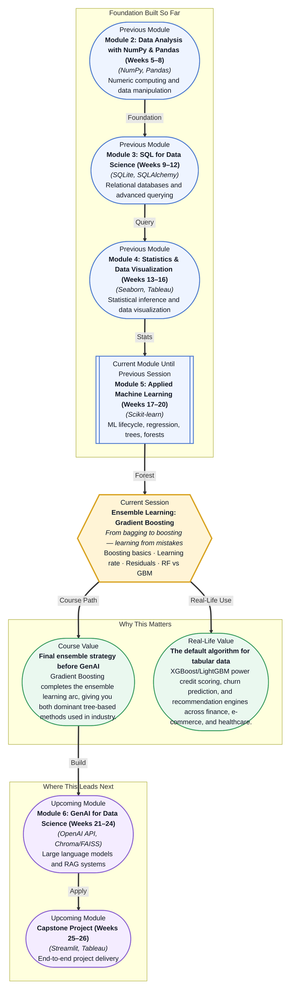

# Pre-read: Ensemble Learning: Gradient Boosting

## Context of This Session in the Course

You have just trained a Random Forest model on a customer churn dataset. Accuracy hits 82% — respectable, but your competitor just published 89% using the same data. You check your feature engineering, your hyperparameters, even your train-test split. Everything looks right. What did they do differently?

The answer is not a better Random Forest — it is a completely different way of thinking about ensemble learning. Random Forests build many independent trees and average their votes, relying on the wisdom of the crowd. But independent voters make the same mistakes together. What if, instead of building trees in parallel, you built them one after another, each new tree focusing exclusively on the errors the previous trees got wrong? That shift — from parallel independence to sequential correction — is the heart of gradient boosting. Where bagging reduces variance, boosting reduces bias by turning every mistake into a lesson for the next model. That is where **Gradient Boosting** becomes essential.

What if you could build a model that automatically turns its own mistakes into a training signal for the next version of itself — then repeats this process hundreds of times, each iteration shaving off more error until your predictions are among the best possible for tabular data? Imagine being handed a dataset with thousands of rows and dozens of features, and knowing that by the end of the day you can train a model that outperforms 90% of approaches — not because of deep learning, but because you understand how to sequence weak learners into an unstoppable chain. That is the capability gradient boosting puts in your hands.

A Gradient Boosting model starts with a simple, naive prediction — typically the mean of the target variable. It then looks at the difference between that prediction and the actual value. That difference is called a **residual**, and it represents the error the model is making. A new shallow decision tree is trained specifically to predict those residuals. The model then updates itself by adding this new tree's predictions (scaled by a **learning rate**) to the previous prediction, producing a slightly better result. This process repeats — each round, a new tree is trained on the residuals of all previous trees combined.

Think of it like learning a musical piece. Your first attempt is rough — full of wrong notes. You do not scrap everything and start from scratch. Instead, you identify the specific passages you missed, and you practise only those. Each practice session targets your previous mistakes. Over time, your performance converges to mastery. Gradient Boosting does exactly this: at every step, the model practises exactly what it got wrong before.

In this session, you will explore the mechanism behind this sequential correction — how **residuals** serve as the training signal, how the **learning rate** controls how aggressively the model learns from each mistake, and how this approach compares to Random Forests. You will also see why the **learning rate** is the single most important hyperparameter in any boosting library and how it interacts with the number of trees to prevent overfitting.

In the **previous session**, you explored Random Forests and bagging — building many trees independently on bootstrapped samples and averaging their predictions to reduce variance. You learned that the strength of Random Forests comes from decorrelating the trees so their errors cancel out. Gradient Boosting approaches the ensemble problem from the opposite direction. Instead of parallel trees, it builds trees sequentially, each one compensating for the weaknesses of its predecessors. Where Random Forests ask "how can we make many good models that agree?", gradient boosting asks "how can we make one excellent model that learns from every mistake?" The Random Forest intuition you already have — bias-variance tradeoff, tree depth, feature importance — becomes the foundation on which boosting builds its iterative mastery.

In this pre-read, you will discover:
- How to **understand** the difference between bagging (parallel) and boosting (sequential) ensemble strategies
- How to **learn** why residuals are the training signal that drives boosting forward
- How to **apply** the learning rate as the primary control knob for bias-variance balance
- How to **connect** the strengths of Random Forests and Gradient Boosting to choose the right tool for a given dataset

---

## Why Sequential Learning Beats Parallel — The Residual Story

When Random Forests make a prediction, they average the outputs of hundreds of independent trees. This averaging reduces variance — the predictions become stable because individual tree errors cancel out. But if every tree systematically misses the same pattern (bias), averaging does nothing to fix it. All the trees are underfitting the same region of the data.

Gradient Boosting attacks this problem directly. After the first tree makes its predictions, you compute the **residuals** — the actual value minus the predicted value. A positive residual means the model under-predicted; a negative one means it over-predicted. The next tree is trained to predict these residuals. When you add its output to the first tree's output, the combined prediction moves closer to the true value. Repeat this a hundred times, and you have a model that has iteratively squeezed error out of every prediction region.

This is why boosting often outperforms bagging on structured data. Random Forests excel when you have enough data for each tree to see a representative sample. But when the signal is subtle or the data is moderately sized, boosting's ability to focus on difficult examples gives it a sharp edge. The price is training time — sequential training cannot be parallelised, which is why XGBoost and LightGBM invest heavily in computational optimisations to make each iteration faster.

## The Learning Rate — Your Most Important Hyperparameter

If you add every new tree's full residual correction to the model, you would converge extremely fast — but you would also overfit aggressively. The model would memorise the training data, including its noise, and generalise poorly. This is where the **learning rate** (often called `eta` or `shrinkage`) enters.

The learning rate scales down each tree's contribution. Instead of adding the full residual prediction, you multiply it by a small number — typically between 0.01 and 0.3. This forces the model to take many small, cautious steps toward the correct prediction rather than one large leap. The consequence is that you need more trees (more iterations), but each tree adds a tiny, verified improvement.

There is a direct tradeoff: a low learning rate requires more trees but produces a more generalisable model. A high learning rate converges quickly but risks overfitting. Grid search over learning rate and `n_estimators` (number of trees) is the most impactful hyperparameter tuning you will do for any boosting library. The rule of thumb is: lower the learning rate until performance on a validation set stops improving, then increase the number of trees to match.

## Where Gradient Boosting Appears in Real Life

Gradient Boosting in its modern implementations — **XGBoost**, **LightGBM**, and **CatBoost** — dominates structured (tabular) data competitions. On Kaggle, more than half of winning solutions in tabular-data competitions use some form of gradient boosting. But competition wins are just the public face of a technology that runs quietly behind some of the most important decisions in industry.

In **banking and finance**, credit scoring models use gradient boosting to evaluate loan applications. The model learns a sequence of decision rules that capture subtle interactions — someone under 30 with a short credit history but a high salary may be treated differently than someone over 50 with the same salary. Boosting picks up these non-linear relationships that logistic regression would miss. **Fraud detection systems** rely on boosting for the same reason: fraudulent transactions are rare (imbalanced data) and their patterns shift constantly. Boosting models updated sequentially can track emerging fraud patterns faster than batch-trained models.

In **e-commerce and retail**, product recommendation and customer churn prediction pipelines almost always start with a gradient boosting model. The sequential nature means the model naturally handles mixed data types — categorical features like product category alongside numerical ones like price and ratings — without heavy preprocessing. **Healthcare** applications use boosting for patient readmission risk and diagnosis support, where interpretability alongside accuracy is critical (SHAP values are natively supported by XGBoost and LightGBM). In **insurance**, claim amount prediction and risk segmentation are standard boosting use cases. Across these industries, the same pattern emerges: whenever you have a structured dataset with hundreds of features, mixed data types, and a clear prediction target, gradient boosting is the first algorithm most data scientists reach for.

## What's Next

After this session, you will be able to:
- Distinguish between bagging and boosting ensemble strategies and explain when each is preferred
- Train a gradient boosting model using Scikit-learn's `GradientBoostingClassifier` or `GradientBoostingRegressor`
- Interpret the role of residuals as the error signal that drives sequential tree construction
- Tune the learning rate and number of estimators to control the bias-variance tradeoff
- Compare Random Forest and Gradient Boosting performance on the same dataset and explain the differences

You do not need to master the calculus behind gradient descent or implement boosting from scratch right now. The goal is to see ensemble learning not as a bag of tricks but as a coherent strategy: **weak learners, sequenced wisely, become unstoppable.**

## Interesting Questions for the Live Session

- If boosting trains trees on residuals, what happens when a residual becomes zero or negative — does the model undo its previous work?
- Why does a very low learning rate combined with many trees still outperform a high learning rate with few trees, even when both produce the same training error?
- In what scenario would you still choose a Random Forest over a Gradient Boosting model, despite boosting's generally superior accuracy?
- Gradient Boosting uses shallow trees (depth 3–6), while Random Forests use deeper trees. Why does the optimal tree depth differ so significantly between the two methods?

By the end of this session, gradient boosting should feel less like a complex black-box algorithm and more like an iterative conversation between the model and its errors: **each mistake becomes the curriculum for the next lesson.**
