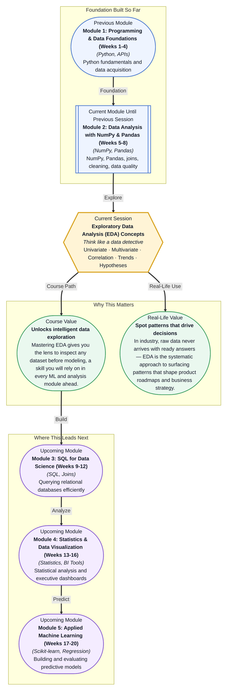

# Pre-read: Exploratory Data Analysis (EDA) Concepts

## Context of This Session in the Course

You have just been handed a CSV of customer transactions, support tickets, and session logs for the last six months. The business leader wants one answer: *which behaviours actually predict churn?* You open the file and see forty columns — some are numbers, some are categories, some are dates — and thousands of rows staring back at you. The natural instinct is to jump straight into a model, but without understanding the shape and soul of this data, any prediction you build will rest on assumptions you have not yet tested.

The naive approach is to scan a few rows, compute a couple of averages, and declare you know the data. That is precisely where most analysis goes wrong — because columns interact in ways that averages hide, trends get buried under noise, and the most important patterns only reveal themselves when you look from the right angle. The pressure to produce insights quickly makes it tempting to skip the messy work of exploration. But skipping it is also the fastest route to misleading conclusions.

That is where **Exploratory Data Analysis (EDA)** becomes essential. EDA is not a single plot or a single number — it is a disciplined, questioning mindset that helps you systematically surface patterns, anomalies, and relationships before committing to any model or conclusion.

What if you could look at any unfamiliar dataset — customer churn logs, sensor readings, financial transactions, or survey responses — and within minutes know which columns matter, which relationships are worth pursuing, and which hypotheses are worth testing? What if you could walk into a stakeholder meeting with a clear, data-driven story about what is happening and why, before a single machine learning model has been trained? That is the capability this session builds. EDA is the bridge between raw data and informed decision-making, and after this session, you will have a repeatable mental model for crossing that bridge with confidence.

At its core, **Exploratory Data Analysis (EDA)** is a philosophy of inquiry first and a collection of techniques second. Think of it like a detective arriving at a crime scene. Before forming any theory, the detective walks the entire room, notes every detail — the open window, the cold coffee, the muddy footprint — and lets the evidence guide the investigation. Similarly, EDA asks you to resist the urge to jump to conclusions and instead spend time with the data on its own terms. You begin by examining variables in isolation — **univariate analysis** — to understand the distribution, central tendency, and spread of each column. Does this feature have outliers? Is it skewed? Are there missing chunks? Each answer eliminates one wrong path and points toward the next question.

Only after understanding each variable individually do you shift to **multivariate analysis**, where you ask how variables behave together. Does revenue rise when support tickets fall? Do certain customer segments cluster around specific usage patterns? This is where **correlation analysis** becomes your guide — a numerical measure of how two variables move together. But numbers alone are not enough. You also train your eye to spot **trends** over time or across groups, and you use every insight you gather to **form hypotheses** worth testing formally later. Each of these techniques — univariate inspection, correlation matrices, trend spotting, hypothesis formation — functions as a different lens on the same data, and the real skill is knowing which lens to apply at which moment.

In the **previous session**, you built a repeatable **Data Cleaning Workflow** — detecting missing values, removing duplicates, catching outliers, and running consistency checks. That gave you a trustworthy dataset. But a clean dataset is not yet an understood dataset. Cleaning removed the noise; EDA gives you the signal. The inspector mindset you developed — the habit of checking assumptions before trusting your data — now evolves into an explorer mindset. Instead of asking *is this data clean enough?* you now ask *what is this data telling me?* The Pandas inspection commands you used for validation become the same commands you will now use for discovery: `describe()`, `groupby()`, `value_counts()`, and `corr()`.

In this pre-read, you will discover:
- How to **apply** univariate and multivariate analysis to inspect datasets from multiple angles
- How to **interpret** correlation matrices to detect relationships between variables
- How to **recognise** meaningful trends that separate signal from noise
- How to **build** actionable hypotheses from your exploratory findings

---

## Why One Variable at a Time Is Not Enough

Imagine a doctor checking your pulse but ignoring your blood pressure and temperature. The pulse might look normal, but that single reading cannot reveal whether you have an infection or a heart condition. The same limitation applies to data. **Univariate analysis** — examining one variable at a time — gives you essential information: the average transaction value, the distribution of customer ages, the frequency of support tickets. You can spot outliers, detect skewness, and understand the range of each column. But a single variable never tells a complete story.

Consider a dataset where customer satisfaction scores average 7.5 out of 10. That sounds healthy. But when you introduce a second variable — say, subscription tier — you discover that premium users average 9.2 while free-tier users average 4.8. This is the power of **multivariate analysis**: it reveals how variables condition each other. Patterns that are invisible when you look at one column suddenly snap into focus when you slice by another. The mental shift is from *what is the value?* to *how does this value change when I consider something else?* This session will teach you to move fluidly between these two perspectives, because both are essential — univariate analysis establishes baselines, and multivariate analysis uncovers the relationships that matter.

## How Correlation Reveals Hidden Connections

**Correlation** is a statistical measure that quantifies how two variables move in relation to each other. A positive correlation means they rise and fall together — more hours studied, higher exam scores. A negative correlation means one goes up as the other goes down — more years on a subscription, fewer support tickets. The correlation coefficient ranges from -1 to 1, where values near zero indicate no linear relationship. But correlation is both powerful and dangerous. It is powerful because a single number can instantly flag relationships worth investigating: advertising spend and revenue, page load time and bounce rate, delivery delay and customer satisfaction. It is dangerous because correlation does not imply causation, and a strong coefficient can seduce you into false conclusions.

The skill you build here is not just computing `df.corr()` and printing a heatmap. It is learning to interpret correlation in context. A correlation of 0.8 between ice cream sales and drowning incidents does not mean ice cream causes drowning — both are driven by a hidden third variable, summer heat. **EDA protects you from these traps** because it trains you to form multiple competing hypotheses before accepting any single explanation. When you see a strong correlation, the next question is always: *what else could explain this?* That questioning instinct is what separates a thoughtful analyst from a naive one.

## Where EDA Appears in Real Life

EDA is the first thing a data scientist does in nearly every professional context, often before writing a single line of model code. In **e-commerce**, analysts use EDA to understand purchase funnels — plotting conversion rates across traffic sources, examining basket sizes by device type, and spotting seasonal demand patterns that inform inventory planning. In **healthcare**, researchers explore patient data to find risk factors: do certain vitals cluster with readmission rates? Is there a demographic skew in treatment outcomes? A quick multivariate breakdown can surface disparities that change clinical practice. In **finance**, quantitative analysts inspect transaction data for anomalies — unusual trade volumes, correlated asset movements, regime changes in volatility — before building trading signals. In **marketing**, EDA reveals which campaign channels drive genuine engagement versus vanity metrics, often by cross-tabulating click-through rates against customer segments. And in **operations**, engineers explore sensor logs from manufacturing equipment to identify the leading indicators of failure — temperature spikes that precede breakdowns, vibration patterns that correlate with wear. Across every industry, the pattern is the same: the data never arrives with its story written. EDA is how you uncover it.

## What's Next

After this session, you will be able to:
- Compute descriptive statistics and distributions for individual variables using Pandas
- Apply groupby and pivot-table logic to compare how variables behave across different segments
- Generate and interpret a correlation matrix for any numeric dataset
- Identify outliers, trends, and non-obvious relationships through visual and numerical exploration
- Formulate testable hypotheses that translate exploratory findings into concrete next steps
- Decide when a pattern is worth pursuing and when it is likely random noise

You do not need to master every plotting library or statistical test right now. The goal is to develop a questioning mindset — one that sees raw data not as answers, but as clues waiting to be connected.

## Interesting Questions for the Live Session

- If you find a strong correlation between two variables, what additional evidence would you need before claiming one causes the other?
- When might a multivariate analysis reveal a pattern that univariate analysis completely misses, and can you think of a real example?
- How would you decide whether a visible trend in your data is meaningful signal or just random noise amplified by a small sample?
- What is the risk of forming hypotheses *after* looking at the data, and how would you protect yourself from confirmation bias?

By the end of this session, EDA should feel less like a step on a checklist and more like a mindset: **Every dataset tells a story — your job is to ask the right questions before you build the model.**
