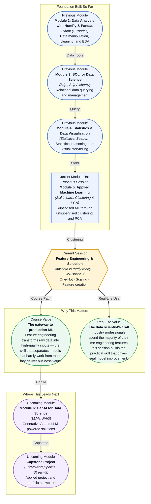

# Pre-read: Feature Engineering & Selection

## Context of This Session in the Course

You pull a fresh dataset into your notebook. The columns look promising: customer IDs, contract types, monthly charges, tenure in months, and a churn label. You run your first model — the one you built in the previous session — and it returns an accuracy that feels disappointing. You check your code. No bugs. You check for missing values. None. The problem is not the model; the problem is that you fed it raw data. "Month-to-Month" is stored as a string, not a number. The "tenure" column runs from 1 to 72 while "total charges" runs from 20 to nearly 10,000 — your model's gradient descent treats a \$100 difference as far more important than a 12-month tenure difference, simply because of the raw numeric scale. And the signup dates? The model skips them entirely.

Worse, even if you manually map each contract type to a number — say 0 for Month-to-Month, 1 for One Year, 2 for Two Year — you have just injected a relationship that does not exist in reality. You told the model that "Two Year" is twice as different from "Month-to-Month" as "One Year" is. With dates, converting January 15, 2025 to the integer 20250115 might sort chronologically, but the model has no idea that January 15 is only one day after January 14 — the numeric gap means nothing meaningful. Your model is not failing because it is weak. It is failing because the data has not been translated into the language algorithms understand.

That is where **Feature Engineering & Selection** becomes essential. Instead of forcing raw data into your model and hoping for the best, you learn to transform categorical labels, scale numeric features, and create entirely new predictive signals from timestamps and text — giving your model inputs that actually reflect the patterns you want it to learn.

What if you could take any unstructured dataset — customer surveys with star ratings, product descriptions with free text, transaction logs with timestamps — and know exactly how to convert every column into a feature that your model can digest optimally? What if you could extract the day-of-week from a purchase date, compute the average time between support requests from a timestamp column, and encode department names without implying that Department 3 is somehow "more" than Department 1? And what if you could then step back and say with confidence: of these fifty new features, these ten are the ones that actually drive performance? This session gives you that power.

A **feature** is any measurable input variable that your model uses to make a prediction — and it is not the same thing as the raw data you start with. Think of it like a chef preparing ingredients: you never serve a potato straight from the ground. You wash it, peel it, chop it into uniform pieces, and decide whether to roast, boil, or fry depending on the dish you are making. Feature engineering is that preparation step. The raw column is the potato; the engineered feature is the roasted cube ready for the pan. **One-hot encoding** converts categorical labels like "Month-to-Month" into binary indicator columns — one per category — without implying any ordinal relationship between them. **Feature scaling** addresses the dominance problem: **Min-Max scaling** compresses values into a fixed [0, 1] range, while **Standard scaling** transforms them into z-scores with a mean of 0 and a standard deviation of 1, handling outliers more gracefully. **Feature creation** from dates and text turns unstructured information into predictive signals: extracting the day of week from a timestamp, computing customer tenure from a signup date, or counting the number of words in a support ticket description. And once you have built these features, **feature selection** helps you identify which ones actually improve your model, keeping your input space lean and your training efficient.

In the **previous session**, you explored unsupervised learning with K-Means clustering and PCA, discovering how algorithms can identify hidden structure in unlabelled data. You saw firsthand that the quality of your clusters depends entirely on the distances between data points — and those distances are computed from the features you provide. You also encountered the importance of feature scaling in Session 18.3, where K-Nearest Neighbors made it clear that features on different scales produce distorted distance calculations. Feature engineering is the skill that sits upstream of every algorithm you have studied so far — linear regression, decision trees, KNN, random forests, gradient boosting, and clustering — because no model can learn from data it cannot parse. Each of those sessions assumed your data was ready. This session teaches you how to make it ready.

In this pre-read, you will discover:

- How to **apply** one-hot encoding to convert categorical variables into numeric features without introducing false ordinal relationships
- How to **choose** between Min-Max scaling and Standard scaling depending on your data distribution and the presence of outliers
- How to **create** predictive features from raw date columns and free-text fields using extraction and transformation techniques
- How to **recognise** when a feature adds value versus when it adds noise, using simple correlation and variance-based selection

---

## Why a Category Like "Medium" Is Not a Number — And How One-Hot Encoding Fixes This

Imagine you have a column called "Customer Satisfaction" with values "Low", "Medium", and "High". Your first instinct might be to map them to 0, 1, and 2. That is called **label encoding**, and it seems harmless — until you consider what the model actually learns. A linear model or distance-based algorithm will interpret the gap between "High" and "Medium" (2 − 1 = 1) as exactly the same as the gap between "Medium" and "Low" (1 − 0 = 1). It will also assume that "High" (2) is twice as "much" as "Medium" (1). Unless your categories have a genuine, evenly-spaced ordinal relationship — which satisfaction levels rarely do — label encoding leaks false information into your model.

**One-hot encoding** solves this by creating a separate binary column for each unique category. For "Low", "Medium", "High", you get three columns: `is_Low`, `is_Medium`, and `is_High`, each containing a 0 or 1. A row with satisfaction "High" has a 1 in the `is_High` column and 0 in the other two. The model now treats "Low", "Medium", and "High" as three distinct, equally spaced categories in a 3-dimensional space — no ordinal assumptions, no false arithmetic. The tradeoff is dimensionality: if your column has 50 unique categories (like a "Department" column in a large organisation), you create 50 new binary columns. This can slow down training and dilute signal, which is why you may need to group rare categories into an "Other" bucket or use alternative strategies like target encoding for high-cardinality features.

## The Scale Trap: When Larger Numbers Hijack Your Model

**Feature scaling** addresses a different problem: what happens when your features live on completely different numerical scales. Age (18–90), annual income (20,000–200,000), and credit score (300–850) are all numeric and all potentially useful for predicting loan default. But if you feed them raw into a logistic regression or KNN model, the income column will dominate the gradient updates purely because its values are thousands of times larger than age. The model will effectively ignore age and credit score, not because they are less predictive, but because they are numerically smaller.

**Min-Max scaling** rescales every value to a fixed range, typically [0, 1], using the formula (x − min) / (max − min). It is intuitive and guarantees bounded output — perfect when you know your data's exact bounds and have no outliers. **Standard scaling** (also called Z-score normalisation) transforms values using (x − mean) / standard deviation, producing a distribution with mean 0 and variance 1. It is more robust to outliers because it uses the standard deviation rather than the min and max. If your income column has a single billionaire with an income of \$50 million, Min-Max scaling would squeeze the remaining 99.9% of values into a tiny sliver near 0, while Standard scaling would still give the billionaire a large Z-score but keep the rest of the distribution reasonably spread. In practice, Standard scaling is the safer default, but Min-Max is preferred when you need bounded outputs or when your algorithm (like neural networks with sigmoid activation) expects inputs in a specific range.

## Where Feature Engineering Appears in Real Life

In **e-commerce**, every major recommendation system relies on feature engineering from behavioural data. Purchase timestamps become recency, frequency, and monetary value (RFM) features; product category names become one-hot encoded vectors; and product descriptions become TF-IDF features that capture the semantic similarity between items. A recommendation model is only as good as the features that describe both the user and the product — and those features are almost never found in raw transaction logs.

In **healthcare**, patient records contain a mix of diagnosis codes (categorical with hundreds of possible values), visit dates (excellent raw material for time-since-last-visit features), and free-text clinical notes. Feature engineering transforms unstructured clinical notes into structured features like word counts, symptom mentions, and medication frequencies. Scaling is critical here because a blood pressure reading (80–200) and a cholesterol level (100–300) sit on different ranges; an unscaled model might treat a small change in cholesterol as equivalent to a large change in blood pressure.

In **finance**, credit scoring models derive their power from engineered features built from transaction histories. A single transaction date can be transformed into features like days since last transaction, average transaction amount over the past 30 days, number of transactions on weekends, and the standard deviation of transaction amounts in the past week. Merchant category codes are one-hot encoded, and the resulting feature matrix can contain hundreds of columns — which then requires feature selection to keep only the most predictive signals and avoid overfitting.

In **customer support analytics**, raw ticket data contains timestamps (creation date, resolution date), priority labels (Critical, High, Medium, Low), and free-text descriptions. By extracting the hour of day when a ticket was created, the number of words in the description, and the time delta between creation and resolution, you can build features that predict escalation risk. Priority labels are one-hot encoded, and the resulting model helps routing systems assign urgent tickets before they become complaints.

In **HR analytics**, employee data includes department names, job titles, hire dates, and promotion histories. Tenure is computed from the hire date; department names are one-hot encoded; job titles may be grouped into job families to reduce cardinality. These features feed models for predicting attrition, performance, or flight risk — and the quality of those predictions depends almost entirely on whether the right features were created from the raw HR records.

## What's Next

After this session, you will be able to:

- Apply one-hot encoding to transform categorical columns into binary feature columns using pandas `get_dummies()` or scikit-learn's `OneHotEncoder`
- Scale numeric features with `MinMaxScaler` and `StandardScaler`, selecting the appropriate method based on your data's distribution and the presence of outliers
- Extract temporal features from date columns — day of week, month, quarter, hours since a reference date — to surface cyclical and trend patterns
- Engineer text features using `CountVectorizer` and `TfidfVectorizer` to convert raw text into numeric word-frequency representations
- Select the most impactful features using correlation analysis, variance thresholds, and simple filter-based methods to keep your feature matrix lean

You do not need to memorise every encoding strategy or scaling formula right now. The goal is to see raw data not as something to accept, but as something to shape: **data is the clay, and feature engineering is the wheel.**

## Interesting Questions for the Live Session

- If a one-hot encoded column has a category that appears in only 0.1% of rows, would you keep it, group it into "Other", or drop it — and how does your answer change depending on whether the model is linear or tree-based?
- You have a date column with ten years of daily timestamps. What features would you extract from it for a model predicting customer churn, and which ones do you suspect would be most important?
- Standard scaling assumes your data is roughly normally distributed. What happens if you apply it to a heavily skewed feature like "transaction amount" where 90% of values are under \$50 and 10% range up to \$10,000?
- You build 200 engineered features for a dataset with 5,000 rows. What are the risks of overfitting, and what techniques would you use to determine which features are genuinely predictive versus just noisy?

By the end of this session, feature engineering should feel less like a technical chore and more like the craft that separates good models from great ones: **the difference between feeding a model data and teaching it to see.**
