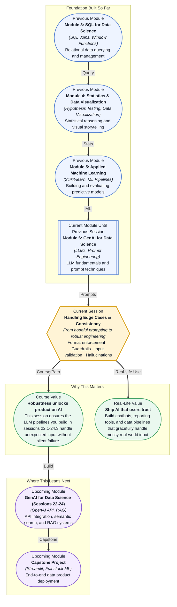

# Pre-read: Handling Edge Cases & Consistency

## Context of This Session in the Course

Your prompt-engineered LLM pipeline has been running in production for two weeks, dutifully converting customer support tickets into structured JSON — severity level, product category, suggested action. Then a user submits a ticket in all caps. Another writes entirely in emoji. A third pastes a block of base64-encoded text. The once-reliable pipeline starts returning malformed JSON, hallucinating product categories that do not exist, and — in one alarming case — echoing back parts of your system prompt in the response. The output that was clean enough for demo day is now a liability.

The natural reaction is to add more examples to your prompt — "and here is what a ticket in French looks like, and here is one with typos, and here is one that contains a URL." But this quickly becomes a game of whack-a-mole. Patch one edge case and two more surface. Without a deliberate system for validating what goes into the model and verifying what comes out, you are debugging symptoms instead of designing for robustness. The real problem is not a weak prompt — it is a pipeline that has no input validation, no output guardrails, and no mechanism to detect when the model has drifted from factual generation into confident hallucination.

That is where **Handling Edge Cases & Consistency** becomes essential.

What if you could design an LLM application that gracefully handles any input — malformed text, adversarial prompts, ambiguous queries, and even model hallucinations — and consistently returns structured, trustworthy output? Imagine deploying a customer-facing chatbot that never reveals its system prompt, never crashes on weird punctuation, and flags its own uncertainty before the user notices. This session gives you the mental model and the tactical toolkit to build systems that behave predictably when the world refuses to behave predictably.

The central challenge of deploying LLMs in production is that a model trained to predict the next token has no inbuilt concept of "correct" or "safe." It will generate a plausible-looking answer whether it knows the facts or not. This is where **format enforcement**, **guardrails**, **input validation**, and **hallucination handling** become the four pillars of reliable LLM engineering. Think of it like airport security: before a passenger ever reaches the gate, their identity is checked (input validation), their luggage passes through screening (guardrails), only ticketed passengers enter the secure zone (format enforcement), and security personnel monitor for suspicious behaviour in real time (hallucination detection). Without any one of these layers, the system is vulnerable. In this session, you will explore practical techniques for each layer — constraining model output to a strict schema, sanitizing user input before it reaches the prompt, detecting when the model is fabricating information, and building reproducible tests that catch regressions before your users do.

In the **previous session**, you mastered prompt engineering — designing system prompts, using zero-shot and few-shot examples, composing chain-of-thought reasoning, and controlling output temperature. You learned how to coax a model into giving you the answer you want. This session completes that picture: coaxing is not enough. Even the best-crafted prompt will break when confronted with adversarial input, ambiguous phrasing, or a model that is statistically uncertain. The prompting skills you built are the engine; the edge-case discipline you will learn now is the steering wheel, the brakes, and the airbags.

In this pre-read, you will discover:

- How to **apply** format enforcement to guarantee structured, parseable LLM outputs every time
- How to **build** guardrails that catch invalid inputs and unexpected model behaviour before they reach users
- How to **recognise** hallucinations and implement detection strategies that filter them out
- How to **connect** input validation, output verification, and prompt testing into a single repeatable robustness pipeline

---

## Why Format Enforcement Is Not Optional

An LLM without output constraints is like a junior analyst who talks confidently but sometimes hands you a CSV that is actually a paragraph of prose. Every downstream process — database insertion, dashboard rendering, API response — depends on a predictable structure. **Format enforcement** means telling the model, in unambiguous terms, exactly what shape its response must take. This can be as simple as "respond only with valid JSON" or as rigorous as providing a Pydantic schema and instructing the model to fill it field by field.

The subtlety is that models interpret format instructions approximately, not perfectly. The same prompt that produces clean JSON 90% of the time may occasionally insert a trailing comma, wrap keys in single quotes, or add explanatory text outside the JSON block. These failures look minor but crash automated pipelines. Real-world format enforcement combines prompt-level instructions with post-processing validation — parsing the output, catching parse errors, and retrying with a corrected prompt when the schema is violated. The goal is not to hope the model complies, but to build a contract that the model either satisfies or triggers a fallback.

## Guardrails — Designing Safety Nets for Your LLM

**Guardrails** are validation layers that sit between the user, the model, and the consumer of the model's output. On the input side, they sanitize prompts before they reach the LLM — stripping injection attempts, rejecting out-of-scope topics, and normalising text to reduce ambiguity. On the output side, they check that the response meets quality criteria: does it contain forbidden phrases? Is it within the expected length? Does it contradict known facts from a trusted knowledge base?

The most practical mental model for guardrails is the **trust-but-verify** pattern. Trust the model to generate a plausible response, but verify every claim that matters. If your application extracts product names from support tickets, a guardrail might cross-reference each extracted name against your actual product catalogue and flag any that do not exist — catching a hallucinated "Platinum Subscription Tier" before it enters your analytics database. If the model is asked to summarise a financial document, a guardrail might check that all numbers in the summary actually appear in the source text. These checks are simple to implement in Python, and they transform an LLM from a black box into a verifiable component of your data pipeline.

## Where Edge Case Handling Appears in Real Life

In **customer support automation**, companies like Intercom and Zendesk process millions of tickets through LLM pipelines that categorise issues, extract entities, and draft replies. Every day, these pipelines encounter messages in languages the model was not explicitly told to expect, customers who paste raw HTML, and users who deliberately test boundaries with injection attempts. Input validation and format enforcement are not theoretical — they are the difference between a reliable triage system and one that silently corrupts your support database.

In **healthcare**, LLMs are used to extract structured data from clinical notes — converting a radiologist's narrative into a table of findings, measurements, and recommendations. A hallucinated lung nodule size or a misattributed diagnosis could have legal and medical consequences. Guardrails that validate extracted values against expected ranges and cross-reference medications against known formularies turn an otherwise risky application into a defensible decision-support tool.

In **financial services**, analysts use LLM-powered systems to summarise earnings call transcripts and extract key metrics. If the model hallucinates a revenue figure or misattributes a quote, the downstream investment decision could be wrong. Firms build multi-layer guardrails: first, extract numbers and compare them against the original transcript; second, flag any metric that deviates from analyst consensus by more than a threshold; third, require human review for all summary outputs before they reach a trading desk.

In **legal technology**, LLMs review contract clauses across thousands of documents, flagging non-standard language or missing provisions. A hallucinated clause — one that the model asserts exists but the document does not contain — could send a legal team on a wild goose chase. Format enforcement ensures every extracted clause is accompanied by the exact source text and line number, so a human reviewer can verify each extraction in seconds rather than hours.

In **education technology**, LLM-powered tutoring systems must handle students who ask off-topic questions, attempt to extract the system prompt, or submit intentionally confusing input. Input guardrails detect and redirect these cases, while output guardrails ensure the model never reveals internal instructions or provides answers to assessments it was not designed to support.

## What's Next

After this session, you will be able to:

- Enforce structured output formats using JSON schema validation and post-processing parsers
- Detect and mitigate hallucinations with cross-referencing guardrails and confidence checks
- Design input validation pipelines that sanitize user prompts before they reach the model
- Build guardrails that prevent prompt injection, topic hijacking, and out-of-scope queries
- Test prompt versions systematically to catch format regressions before deployment
- Create a repeatable robustness checklist for every LLM-powered feature you ship

You do not need to anticipate every possible failure mode right now. The goal is to shift your mindset from hoping a prompt works to systematically constraining it: **the most reliable LLM application is the one that knows what it is not allowed to do.**

## Interesting Questions for the Live Session

- How do you distinguish between a model "hallucinating" and simply being confidently wrong — and does that distinction matter when deciding how to engineer around it?
- If you enforce a strict JSON output format, what happens when the model cannot naturally express its answer within that structure — does it fabricate data to fill the schema?
- Input validation can catch obvious injection attempts, but what kinds of subtle adversarial inputs would still slip through, and how would you design guardrails for those blind spots?
- When does over-engineering robustness actually harm your application — adding latency, complexity, and false rejections for edge cases that almost never occur in practice?

By the end of this session, handling edge cases should feel less like defensive coding and more like a systematic design discipline: **robust LLM applications are built on deliberate constraints, not hopeful prompts.**
