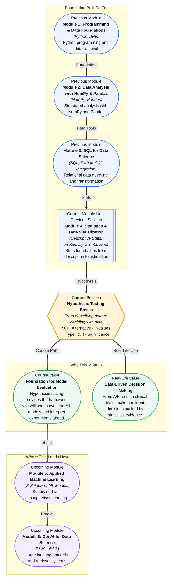

# Pre-read: Hypothesis Testing Basics

## Context of This Session in the Course

You are a data analyst at an e-commerce company. Your team just redesigned the checkout page — larger buttons, fewer form fields, a progress bar that actually works. The product manager wants to know: did the new design genuinely increase purchases, or was the jump in sales just random Tuesday traffic? You have last month's transaction data sitting in a CSV, and your first instinct is to compare the average order values.

But averages can be deceptive. Maybe the old design had a handful of big-ticket orders that pulled its average up. Maybe the new page happened to get more visitors from a high-spending region during a payday weekend. Without a formal framework, you are left guessing — and guessing can cost a company millions if a bad design ships or a good one gets rolled back prematurely. Intuition, no matter how sharp, is not enough when the stakes involve real users and real revenue.

That is where **Hypothesis Testing** becomes essential: a structured, repeatable method for deciding whether an observed difference is real or just a mirage created by randomness. Instead of asking "did it go up?", you ask "is the increase larger than what random chance would produce?" — and you let the data answer with a measurable degree of confidence.

What if you could walk into any meeting — a product review, a marketing strategy session, a clinical trial readout — and state with quantified confidence whether a result matters? Imagine your manager asks, "Did the new feature actually improve engagement?" and instead of shrugging, you run a hypothesis test, produce a p-value, and declare your conclusion with a known error rate. What if you could design experiments before shipping them, calculating exactly how many users you need to detect a meaningful effect? That is the capability this session gives you: the power to replace guesswork with statistical evidence.

At its heart, hypothesis testing is a courtroom for data. You start with a **null hypothesis (H₀)** — the default assumption that nothing has changed, that the new checkout page is no different from the old one. Against this, you pit the **alternative hypothesis (H₁)** — the claim you want to prove, that the new page actually increased purchases. Your data is the witness; the **p-value** is the strength of the evidence. Think of a p-value as a lie detector test for randomness. A low p-value (say, 0.01) means: "If the null hypothesis were true, there is only a 1% chance we would see data this extreme." When that number drops below your chosen **significance level (α)** — typically 0.05 — you reject H₀ and accept that your result is statistically significant. But no test is perfect. You might reject a true null hypothesis (**Type I error** — a false positive) or fail to reject a false one (**Type II error** — a false negative). In this session, you will learn to set up null and alternative hypotheses for real problems, interpret p-values without falling into common traps, choose an appropriate significance level, and understand the trade-off between Type I and Type II errors — all skills you will use the moment you run your first A/B test or evaluate a machine learning model.

In the **previous session**, you explored sampling and estimation — how to draw a representative subset from a population and calculate confidence intervals around a sample statistic. You learned that any estimate carries uncertainty, captured by the standard error and the confidence interval. Hypothesis testing takes that uncertainty quantification one step further: instead of describing a range of plausible values, it asks whether a specific claim about the population falls inside or outside that range. If your confidence interval for the average order value excludes the null-hypothesised value, you already have the intuition for a significant result. The tools from that session — sampling distributions, the Central Limit Theorem, standard error — become the engine that powers every test you will run today.

In this pre-read, you will discover:

- How to **build** null and alternative hypotheses — the backbone of any data-driven test
- How to **interpret** p-values and understand what they reveal about your evidence
- How to **recognise** Type I and Type II errors and weigh their real-world consequences
- How to **apply** significance levels to make principled, repeatable decisions from data

---

## Why the Null Hypothesis Is Not Optional

Every statistical test begins with a bet against yourself. The **null hypothesis** represents the conservative, boring position: nothing interesting is happening. The new checkout page performs the same as the old one. The drug has no effect. The marketing campaign did not change conversion rates. This might feel frustrating — you built the new design, you want it to win — but the null exists for a reason. It forces the data to prove itself.

Think of it like a criminal trial. The defendant is presumed innocent (null hypothesis). The prosecution must produce evidence strong enough to overcome that presumption (beyond a reasonable doubt). If the evidence is weak, the verdict is "not guilty" — not because innocence is proven, but because the case was not made. In statistics, when you fail to reject the null, you are not saying H₀ is true; you are saying the data did not provide enough evidence to declare H₁. This asymmetry is deliberate and protects you from seeing patterns that are not there.

The real art lies in choosing your **significance level (α)** — the threshold for how much evidence you demand. In most scientific and business settings, α = 0.05 is the convention, but it is not a law of nature. If the cost of a false positive is enormous (approving a dangerous drug, deploying a buggy feature to millions of users), you might set α = 0.01. If the cost of a false negative is worse (failing to detect a life-saving treatment), you might accept α = 0.10. The significance level is a business decision disguised as a statistical one.

## The p-Value: What It Actually Means

The **p-value** is the most celebrated and most misunderstood number in statistics. It is not the probability that the null hypothesis is true. It is not the probability that you made a mistake. It is not a measure of effect size — it tells you nothing about how big the difference is. Here is the precise definition: the p-value is the probability, assuming the null hypothesis is true, of observing data at least as extreme as what you collected.

Picture a courtroom where the defendant is actually innocent. The p-value answers: "If this person were innocent, how likely is it that we would see evidence this damning?" If that likelihood is tiny, you convict. But a tiny p-value does not mean the defendant is guilty — it means the evidence is hard to explain under innocence. Similarly, a p-value of 0.03 does not mean there is a 3% chance the null is true; it means that if the null were true, data this extreme would occur only 3% of the time. That subtle difference matters enormously when you communicate results to stakeholders. A product manager who hears "there is a 3% chance the old design is better" is making a different decision than one who hears "if the old design were truly better, we would see data this extreme only 3% of the time." The first statement overstates what the test can prove; the second is defensible.

This is also why running many tests is dangerous. If you test 20 features at α = 0.05, probability says one will appear significant purely by chance — a false positive. This is the **multiple comparisons problem**, and it is why real-world experimenters adjust their thresholds or use corrections like the Bonferroni method before declaring victory.

## Where Hypothesis Testing Appears in Real Life

Hypothesis testing is not a classroom exercise — it is the engine behind thousands of decisions made every day. In e-commerce and technology, every A/B test is a hypothesis test in disguise. A product team at a streaming service wants to know whether a new recommendation algorithm increases watch time. They formulate a null hypothesis (the new algorithm makes no difference), run the experiment, compute a p-value, and decide whether to roll out the change. Companies like Netflix, Amazon, and Google run thousands of such tests annually, and getting the statistical reasoning wrong can mean shipping a feature that actually hurts engagement. In healthcare and pharmaceuticals, hypothesis testing is non-negotiable. A clinical trial for a new drug compares the treatment group against a placebo. The null hypothesis says the drug has no effect. A p-value below a pre-registered threshold (often α = 0.05 or even 0.01 for critical trials) determines whether the drug moves to the next phase. Regulators like the FDA scrutinise not just the p-value but also the study design, power analysis, and error rate controls before approving a treatment. In marketing and advertising, hypothesis tests determine whether a campaign actually lifted brand awareness or purchase intent above what seasonal trends would predict. In manufacturing, quality control teams test whether a new production process reduces defect rates below an acceptable threshold. In finance, quantitative analysts test whether a trading strategy generates returns that are statistically distinguishable from random noise. Across all these domains, the core question is the same: is the pattern you see real, or is it just randomness wearing a convincing disguise?

## What's Next

After this session, you will be able to:

- Formulate null and alternative hypotheses for any business or research question
- Interpret p-values and determine statistical significance against a chosen alpha level
- Distinguish between Type I and Type II errors and assess their relative costs in context
- Select an appropriate significance level based on the consequences of each error type
- Apply the hypothesis testing framework to evaluate the results of an A/B test
- Communicate "statistical significance" and its limitations to non-technical stakeholders

You do not need to memorise every formula or probability table right now — the calculations will become natural as you apply them in practice. The goal is to develop a single powerful instinct: before you declare a result real, make randomness prove its innocence.

## Interesting Questions for the Live Session

- If a p-value of 0.04 is statistically significant at α = 0.05, why do many statisticians argue against using a fixed significance threshold in every context?
- In what real-world scenario would you knowingly accept a higher chance of a Type I error in order to reduce the risk of a Type II error?
- Can a result be statistically significant yet practically meaningless? What would that look like in a business setting?
- If you run 20 independent hypothesis tests and one returns p < 0.05, how should you interpret that result, and what would you do differently next time?

By the end of this session, hypothesis testing should feel less like abstract statistical theory and more like a practical decision-making framework: **a structured way to let data, not intuition, have the final word.**
