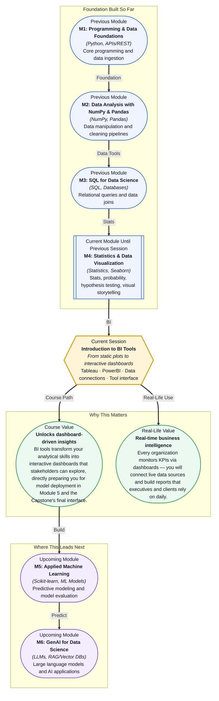

# Pre-read: Introduction to BI Tools

## Context of This Session in the Course

Your team has just delivered a deep analytical report on customer churn — thirty pages of statistical tests, correlation matrices, and beautifully crafted Seaborn plots. You present it to the head of product, expecting enthusiasm. Instead, you get a polite nod and the question: "Can you show me this for last quarter? And can I filter by region myself?" The PDF you prepared cannot do any of that. The insights are correct, but they are locked inside static images that your stakeholder cannot interact with.

This is the fundamental gap that analysts face every day: you can discover profound patterns in data, but if your audience cannot explore those patterns on their own terms, the impact is severely diluted. Handing someone a static chart is like handing them a photograph of a machine and asking them to understand how it works — they see the surface, but they cannot turn the dials or pull the levers. The business world does not just want analysis; it wants accessible, self-service intelligence that answers follow-up questions without requiring another meeting.

That is where **Business Intelligence (BI) tools** become essential. BI platforms like Tableau and PowerBI are the industry standard for transforming raw analytical work into live, interactive dashboards that put the power of data exploration directly into the hands of decision-makers. This session marks your transition from being someone who *finds* insights to someone who *enables* insights across an entire organization.

What if you walked into your next internship or job interview and, instead of showing a static notebook, you pulled up a live dashboard that lets the interviewer filter sales by region, drill down into product categories, and watch key metrics update in real time? What if you could take the same dataset you analysed in Pandas and, within an hour, have a polished executive dashboard that answers the five most common business questions about that data — without writing a single line of Python? This is not a distant skill reserved for dedicated dashboard developers. It is exactly what this session puts within your reach. The barrier between data analysis and data-driven decision-making is about to get a lot thinner.

At its core, a **Business Intelligence (BI) tool** is a software platform designed to connect to data sources, process queries, and present results through interactive visualisations that non-technical users can explore. Think of it as the difference between handing someone a printed map versus giving them Google Maps. The printed map (your static Seaborn chart) contains all the information, but the interactive map (a BI dashboard) lets them zoom, pan, search, and filter in real time. Tableau and PowerBI are the two dominant players in this space, each offering a drag-and-drop interface that removes the need to code every visualisation from scratch. In this session, you will get a guided tour of both platforms — how to connect them to live data sources, how to navigate their interfaces, and how to think about dashboard design from the perspective of a stakeholder who needs answers in seconds, not hours.

In the **previous session**, you explored **Advanced Seaborn & Interactive Plots**, where you built facet grids, pair plots, and learned the principles of interactive visualisation using Python. That session gave you fine-grained control over every visual element through code — you could customise colours, adjust axes, and layer statistical annotations with precision. Now, BI tools take that same visual intuition and wrap it in a layer of accessibility and speed. Instead of writing `sns.FacetGrid(...)` and tweaking parameters line by line, you will drag a field onto a shelf and see the chart render instantly. The visual thinking you developed — choosing the right chart type, understanding visual hierarchy, removing clutter — transfers directly. What changes is the delivery mechanism: from code-driven exploration to interface-driven empowerment.

In this pre-read, you will discover:
- How to **recognise** the difference between BI tools and traditional plotting libraries, and when each is appropriate.
- How to **connect** a BI tool to various data sources like CSV files, Excel spreadsheets, and live databases.
- How to **interpret** the core interface components of Tableau and PowerBI — Dimensions, Measures, Shelves, and the Canvas.
- How to **apply** a dashboard-thinking mindset that prioritises stakeholder questions over data exploration.

---

## Why Move Beyond Static Charts?

Every chart you have created so far — from histograms in Matplotlib to faceted grids in Seaborn — has been a *static artefact*. Once rendered, it captures a single view of the data at a single moment. If your manager asks "what does this look like for the European region only?", you must go back to your notebook, filter the data, regenerate the chart, and share a new image. This back-and-forth is not just slow; it creates a bottleneck where every data question funnels through you.

BI tools break this bottleneck by introducing **interactivity at the consumer level**. A Tableau dashboard allows the viewer to apply filters, highlight categories, drill down into subgroups, and even change the chart type — all without touching the underlying code. This shifts your role from "chart maker" to "dashboard architect." Instead of anticipating every possible question and pre-generating thirty charts, you build one dashboard with the right filters, parameters, and interactions, and let your stakeholders explore. The skill you are learning here is not just about clicking buttons; it is about designing an analytical experience that anticipates how people think about data.

The mental model shift is subtle but profound. In Seaborn, you ask "what visualisation tells this story?" In a BI tool, you ask "what exploration paths should my audience have?" The same data literacy you have built — understanding distributions, correlations, and aggregations — becomes the foundation for designing dashboards that are both truthful and useful.

## How BI Tools Connect to Live Data

A BI tool is only as powerful as its data connections. Tableau and PowerBI both support a wide range of **data sources**: flat files (CSV, Excel), cloud databases (Snowflake, BigQuery), SQL servers, and even web APIs. The connection process is designed to be visual — you select your source, preview the tables, and define relationships between them using a drag-and-drop interface rather than writing JOIN clauses manually.

One critical concept you will encounter is the difference between **Live** and **Extract** connections. A live connection queries the source database every time someone interacts with a dashboard, ensuring the data is always current. This is ideal for operational dashboards that monitor real-time metrics. An extract, on the other hand, takes a snapshot of the data into the BI tool's own engine (Hyper for Tableau, VertiPaq for PowerBI), which dramatically speeds up interactions but introduces a delay between data updates. Choosing between them involves trade-offs between freshness and performance — a decision you will need to make based on the use case.

During this session, you will connect to a sample dataset, inspect its schema within the tool, and see how the BI tool automatically classifies each field as a **Dimension** (categorical, descriptive data like "Region" or "Product Category") or a **Measure** (numeric, aggregatable data like "Sales" or "Profit"). This classification is the BI equivalent of understanding whether a column in Pandas is `object` or `int64` — it determines what you can do with that field on the canvas.

## Where BI Dashboards Appear in Real Life

The skills you are about to learn are not confined to one industry — they are the lingua franca of data-driven organisations everywhere. In **retail and e-commerce**, BI dashboards track inventory turnover, sales by region, and customer lifetime value, giving category managers the ability to drill into underperforming products without waiting for a report from the analytics team. **Healthcare systems** use PowerBI dashboards to monitor patient wait times, bed occupancy rates, and treatment outcomes across departments, enabling hospital administrators to allocate resources in real time. In **financial services**, Tableau is used to build risk exposure dashboards that let portfolio managers filter by asset class, geography, and credit rating — slices of data that would require a new SQL query for every permutation. **Marketing teams** across every sector rely on BI tools to visualise campaign performance, funnel conversion rates, and cohort retention curves, connecting directly to Google Analytics or Salesforce data. Even **supply chain and logistics** companies build dashboards that map shipment delays, warehouse capacity, and carrier performance on interactive maps, combining geographic data with time-series trends. In every case, the pattern is the same: a single person who understands both the data and the tool builds an interface that multiplies their analytical impact across the entire organisation.

## What's Next

After this session, you will be able to:

- Navigate the Tableau and PowerBI interfaces with confidence, identifying the key panels and their roles.
- Connect a BI tool to a CSV file, an Excel spreadsheet, and a live database, and inspect the imported schema.
- Drag fields onto the Columns and Rows shelves to build a basic visualisation in under sixty seconds.
- Apply filters at the worksheet and dashboard level to let stakeholders explore data interactively.
- Distinguish between Dimensions and Measures and explain why this classification matters for aggregation.
- Recognise the strengths and trade-offs of Tableau versus PowerBI for a given business scenario.

You do not need to memorise every button or menu option right now. The goal is to shift your mental model from *programming every visual* to *designing every exploration* — a change in perspective that will serve you across every data role you ever hold.

## Interesting Questions for the Live Session

- What happens to a dashboard when the underlying database schema changes — say, a column is renamed or a new table is added — and how do Tableau and PowerBI handle this differently?
- If you have a dataset with ten million rows, what factors determine whether you should use a live connection or an extract, and what trade-offs are you accepting with each choice?
- How does the concept of "level of detail" in a BI tool compare to a `groupby()` in Pandas, and when might the BI tool's implicit aggregations lead you to a wrong conclusion?
- Why would an organisation choose to invest in both Tableau and PowerBI instead of standardising on one, and what complementary strengths might justify the added complexity?

By the end of this session, BI tools should feel less like a separate software category and more like a natural extension of the visual thinking you have already built: **from static insight to shared discovery**.
