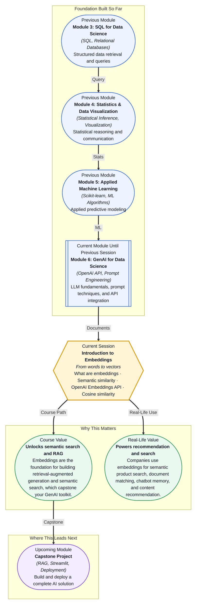

# Pre-read: Introduction to Embeddings

## Context of This Session in the Course

Imagine you are building a search bar for a library of ten thousand research papers. A user types "machine learning for climate modeling" — and your system needs to find the most relevant documents, even if none of them contain those exact words. A naive keyword search would miss papers titled "Neural network approaches to atmospheric prediction" because they share zero overlapping terms with the query. The user leaves frustrated, and the system feels brittle.

The deeper problem is that computers treat words as strings of characters — they see "car" and "automobile" as completely unrelated sequences. Humans, on the other hand, instantly recognise the semantic relationship between the two. Bridging this gap between symbolic text and conceptual meaning has been one of the hardest problems in natural language processing. Simple solutions like synonym dictionaries or rule-based matching fall apart at scale; they cannot capture context, tone, or the subtle ways meaning shifts between domains.

That is where **embeddings** become essential. Embeddings are a technique that converts words, sentences, or entire documents into lists of numbers — vectors — such that similar meanings produce similar vectors. Suddenly, "car" and "automobile" sit close together in this numeric space, and "car" and "banana" sit far apart. This session introduces the concept of embeddings, how to generate them using the OpenAI API, and how to measure semantic similarity with **cosine similarity**.

What if you were asked to build a system that could take a single customer support ticket — "My account was charged twice for the same order" — and instantly surface the five most similar resolved tickets from a database of a million past cases, without anyone manually tagging or categorising them? What if that same system could also cluster tickets by theme, detect emerging issues before they escalate, and even power a chatbot that knows which answer to retrieve based on meaning, not keywords? This is the kind of capability embeddings unlock. By the end of this session, you will understand the core mechanism that makes all of this possible.

At its heart, an **embedding** is a mathematical translation — a mapping from the world of language into the world of geometry. Imagine each word or sentence as a point in a high-dimensional space, typically with hundreds of dimensions. The position of each point is not random; it is learned by a neural network that has been trained on billions of sentences to encode meaning into proximity. Words that appear in similar contexts — "doctor" and "surgeon", "run" and "sprint" — end up as neighbours in this space. Think of it like a city map where every concept has an address, and the distance between addresses reflects how related the concepts are. The tool you will use to generate these addresses is the **OpenAI Embeddings API**, which accepts text and returns a vector of floating-point numbers. To compare two vectors and decide how semantically close they are, you will use **cosine similarity** — a simple formula that measures the angle between two vectors, giving 1.0 for identical meaning, 0 for unrelated meanings, and negative values for opposing meanings.

In the **previous session**, you automated document workflows — using LLMs to extract themes, summarise support tickets, and process unstructured knowledge bases. You learned how to turn raw text into structured insights by invoking models through the OpenAI API. Embeddings are the natural next step: where before you asked an LLM to *understand* a piece of text each time you sent it, embeddings let you *encode* that understanding once and compare thousands or millions of texts in milliseconds. The API patterns you already know — authentication, endpoint calls, handling responses — carry over directly. The new mental model is this: instead of asking a model to generate an answer, you are asking it to generate a coordinate so you can measure distances yourself.

In this pre-read, you will discover:

- How to **understand** the core idea of converting text into numerical vectors
- How to **learn** what semantic similarity means and how to measure it
- How to **recognise** the role of embeddings in search, classification, and recommendation
- How to **connect** the OpenAI Embeddings API to a real data science workflow

---

## What Exactly Is an Embedding, and Why Should You Care?

An embedding is a list of numbers — typically a few hundred to a few thousand — that represents a piece of text in a way that preserves meaning. The critical insight is that these numbers are not arbitrary; they are learned by a model that has been trained on vast amounts of text to place semantically similar items close together in vector space. If you take the embedding for "kitten" and the embedding for "cat", their vectors will point in roughly the same direction. The embedding for "toaster" will point somewhere else entirely.

What makes this powerful is that you can feed any text — a word, a sentence, a paragraph, an entire document — into an embedding model and get a fixed-size vector out. This means you can store millions of these vectors in a database and then, given a new query, compute which stored vectors are closest to it. You are no longer matching keywords; you are matching meaning. The **OpenAI Embeddings API** gives you access to production-grade embedding models with a single API call, returning a vector for any input text you provide.

## How Do You Measure Meaning Between Texts?

Having vectors is only half the story; you also need a way to compare them. The standard tool for this is **cosine similarity**. Imagine two arrows starting from the same point. If they point in exactly the same direction, the angle between them is zero degrees, and cosine similarity is 1. If they are perpendicular, the similarity is 0. If they point in opposite directions, it is -1. For embeddings, cosine similarity close to 1 means the texts are semantically similar, near 0 means unrelated, and negative values are rare because most real-world embeddings live in a single "positive" region of the space.

Cosine similarity has a practical advantage over other distance metrics like Euclidean distance: it focuses on the *direction* of the vector rather than its *magnitude*. Two documents about the same topic, where one is three times as long, will produce vectors of very different lengths — but they will still point in similar directions. Cosine similarity captures this alignment, making it the default choice for embedding comparison. When you use the OpenAI Embeddings API, the returned vectors are already normalised, so cosine similarity is equivalent to a simple dot product — fast to compute even across thousands of candidates.

## Where Embeddings Appear in Real Life

Embeddings are not a theoretical curiosity; they are the engine behind some of the most widely used AI systems today. **Search engines** like Google and Bing have moved from keyword matching to embedding-based semantic search, understanding that "how to fix a leaky tap" and "plumber for dripping faucet" are the same question. **E-commerce platforms** like Amazon use embeddings to power "customers who bought this also bought" recommendations — not by tracking purchase co-occurrence alone, but by embedding product descriptions and measuring similarity between them. **Chatbots** and virtual assistants store conversation histories as embeddings, allowing them to retrieve relevant past interactions by meaning rather than by exact phrase matching. In **healthcare**, embeddings are used to match patient symptoms to clinical trial criteria across unstructured medical records, dramatically speeding up recruitment. In **finance**, firms embed news articles and earnings reports to detect which events are likely to move a stock, grouping them by semantic theme rather than ticker symbol alone. Across every industry, the pattern is the same: if you have text and you need to find, compare, or organise it, embeddings are the infrastructure that makes it possible.

## What's Next

After this session, you will be able to:

- Generate embeddings for any text using the OpenAI Embeddings API with a single API call
- Measure semantic similarity between texts using cosine similarity
- Build a basic nearest-neighbour search over a collection of embedded documents
- Explain how embeddings enable downstream tasks like clustering, classification, and retrieval

You do not need to memorise the linear algebra behind cosine similarity right now — knowing how to apply it is what matters at this stage. The goal is not to master the math of embeddings on day one, but to see every piece of text as a point in a universe of meaning — and know how to navigate it.

## Interesting Questions for the Live Session

- If two sentences have opposite meanings but share most of the same words, how would you expect their embeddings to differ — and can cosine similarity alone detect the opposition?
- Why might using cosine similarity on non-normalised vectors give misleading results when comparing documents of vastly different lengths?
- If you embedded every word in a dictionary and averaged them to get a sentence embedding, what semantic information would you lose compared to using a dedicated sentence embedding model?
- How would you design an evaluation to decide whether an embedding model is actually capturing semantic meaning rather than surface-level word overlap?

By the end of this session, embeddings should feel less like a black-box math trick and more like a practical tool for teaching machines meaning: **If you can describe it with language, you can find it with embeddings.**
