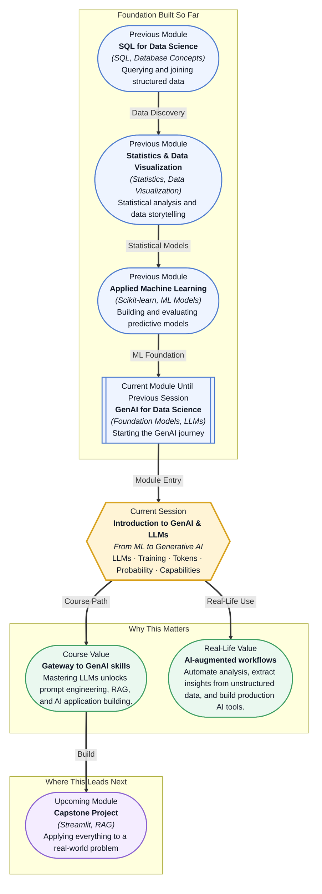

# Pre-read: Introduction to GenAI & LLMs

## Context of This Session in the Course

You just spent months learning to build predictive models — training classifiers, tuning hyperparameters, and evaluating performance with precision and recall. Now imagine your manager walks over and says, "I need you to build a system that answers questions from our internal knowledge base. It should understand natural language, pull the right information, and write a coherent response — all without a traditional supervised dataset." The tools you mastered (scikit-learn pipelines, grid search, feature engineering) were built for structured, tabular data. This is something else entirely.

The intuitive approach — treat it as a classification or retrieval problem — breaks down quickly. You could try a keyword search, but language is ambiguous. You could train a custom model, but you lack labelled data and the problem space is too open-ended. The tension is real: your organisation has terabytes of text data (support tickets, product docs, meeting transcripts) sitting in databases, and you know there is insight buried there, but none of your existing tools know how to read.

That is where **large language models** become essential. These are not just another algorithm in your toolkit — they represent a fundamentally new capability: a model that can understand, generate, and manipulate human language with fluency that was science fiction five years ago. This session will give you the mental model to make sense of them.

What if you could take a messy folder of hundreds of customer support emails and, with a single Python script, produce a structured report summarising the top five recurring issues, the sentiment trend over the quarter, and a draft response for each category — all in under a minute? What if you could feed an LLM the transcript of a client meeting and have it extract action items, assign owners, and format them into a Jira ticket, without any manual data entry? These are not hypothetical futures; data scientists at companies like Stripe, Notion, and Intercom are building exactly these workflows today. The key that unlocks them is understanding how LLMs actually work — their strengths, their quirks, and their very real limits. This session gives you that foundation.

A **large language model (LLM)** is a neural network trained to predict the next word — or more precisely, the next **token** — in a sequence of text. Tokens are the atomic units an LLM processes; they can be as short as a single character or as long as a word, depending on the tokenizer used. The model does not "understand" language the way a human does. Instead, it learns enormous patterns of co-occurrence from hundreds of billions of words: it knows that after "The capital of France is" the next token is very likely "Paris." Every output a modern LLM produces is the result of this statistical machinery operating at massive scale. Think of it like a chess engine: a chess engine does not "want" to win — it evaluates positions and selects the move with the highest probability of a favourable outcome. An LLM does not "want" to answer your question — it evaluates sequences and selects the continuation with the highest probability based on patterns in its training data. In this session, you will explore what exactly LLMs are, how they are trained through phases like pretraining and fine-tuning, why tokens and probability are the foundational concepts behind every response, and what current models can and cannot do.

In the **previous session**, you worked through model debugging and error analysis — detecting data leakage, handling imbalanced datasets with SMOTE and class weights, and systematically diagnosing why a trained model underperforms. That debugging mindset, the habit of questioning your model's outputs instead of trusting them blindly, transfers directly into working with LLMs. The difference is that instead of inspecting a confusion matrix or a learning curve, you will be inspecting prompts and token probabilities. Instead of worrying about overfitting, you will worry about hallucinations. The underlying principle is the same: a model is a tool with known failure modes, and a skilled practitioner knows how to recognise and mitigate them.

In this pre-read, you will discover:

- Understand what LLMs are and how they differ fundamentally from traditional supervised ML models
- Learn how tokens and probability enable LLMs to generate coherent text through next-token prediction
- Discover the two main phases of LLM training — pretraining and fine-tuning — and why both matter
- Recognise the key capabilities and limitations that govern where LLMs can be trusted

---

## How Does an LLM Actually "Understand" Language?

The single most important insight about large language models is this: they do not understand language the way you do. When you read "The cat sat on the mat," you visualise a cat, a mat, and a spatial relationship. An LLM sees a sequence of token IDs — integers like `[976, 4532, 89, 561, 8, 976, 4560]` — and computes which token is most probable at each position. The model's "knowledge" is entirely encoded in the statistical relationships between tokens it observed during training.

This distinction matters because it explains both the power and the brittleness of LLMs. The power comes from scale: models like GPT-4 and Llama 3 are trained on trillions of tokens, so the co-occurrence patterns they capture are extraordinarily rich. When you ask "Write a Python function that calculates the Fibonacci sequence," the model does not know what a Fibonacci sequence is — but it has seen the phrase written thousands of times in its training data, so it can reproduce a correct implementation with high probability. The brittleness means that small changes in input phrasing can produce very different outputs, and the model can confidently assert false information if the most probable next token happens to be wrong. This is not a bug; it is a direct consequence of what the model is: a next-token predictor with a billion-parameter pattern matcher.

## What Goes Into Training an LLM?

Training a modern LLM happens in two distinct phases. In **pretraining**, a model is exposed to an enormous corpus of text — the entire public internet, books, academic papers, and code repositories — and learns to predict the next token. This phase is immensely expensive: training a 70-billion-parameter model like Llama 3 can cost tens of millions of dollars in compute and take months. The result is a "base model" that is fluent in language but not particularly useful for following instructions — it can complete a sentence, but it cannot reliably answer a question.

The second phase, **fine-tuning**, transforms the base model into an assistant. Using a much smaller dataset of high-quality instruction-response pairs (often curated by humans), the model is trained to follow directions, stay on topic, and refuse harmful requests. A critical technique here is **reinforcement learning from human feedback (RLHF)**, where human raters rank the model's responses, and those preferences are used to further align the model's behaviour. This two-stage process explains why an LLM can write a convincing email but also why it might confidently fabricate a citation — the pretraining phase taught it to produce fluent text, not to be truthful. Fluency and factual accuracy are separate optimisation targets, and only the fine-tuning phase attempts to bridge them.

## Where LLMs Are Changing Data Science

LLMs are already reshaping the day-to-day work of data science across multiple industries. In **customer support analytics**, teams feed thousands of support tickets into an LLM pipeline that automatically classifies the issue type, extracts the product version mentioned, and drafts a suggested reply — reducing triage time from hours to minutes. In **healthcare**, researchers use LLMs to extract structured data from unstructured clinical notes: a radiologist's report about a lung nodule can be parsed into a structured table of attributes (size, location, morphology, recommendation) without a human reading each note. In **legal technology**, firms deploy LLMs to review contract clauses across thousands of documents, flagging non-standard language or missing provisions that would take a junior associate weeks to find manually. In **financial services**, analysts use LLM-powered summarisation to ingest earnings call transcripts, analyst reports, and news articles, producing daily briefs that synthesise hundreds of pages into a few paragraphs. And in **software engineering**, tools like GitHub Copilot and Cursor put LLM code generation directly into the IDE — data scientists use them to write boilerplate, generate visualisation code, and even scaffold entire ML pipelines from a natural language description.

In every case, the same pattern applies: LLMs excel at tasks that involve pattern completion and fluent text generation, but they require human oversight for tasks that demand factual precision, numerical reasoning, or multi-step logical deduction. Understanding this pattern — where LLMs shine and where they stumble — is the core skill this module will build.

## What's Next

After this session, you will be able to:

- Explain what a large language model is and how next-token prediction drives its behaviour
- Differentiate between tokens, tokenisation, and the role of probability in LLM outputs
- Describe the pretraining and fine-tuning pipeline that turns raw text into a useful assistant
- Identify appropriate use cases for LLMs in data science workflows — and spot inappropriate ones
- Recognise common failure modes including hallucination, recency bias, and sensitivity to prompt phrasing
- Evaluate whether an LLM-based solution is the right tool for a given analytical problem

You do not need to memorise architecture diagrams or training hyperparameters right now. The goal is to build an accurate mental model of what an LLM is and is not — so that every time you use one, you know where its confidence comes from and where its blind spots live.

## Interesting Questions for the Live Session

- If an LLM generates incorrect information, is it a "mistake" in the same way a human makes one, and what does that distinction imply for how we should evaluate its outputs?
- Tokens are neither whole words nor individual characters — so what are they, and how does the choice of tokeniser affect what a model can and cannot handle?
- If an LLM is "just" predicting the next most likely token, how can it produce creative or genuinely novel responses that were not in its training data?
- When would you choose a smaller fine-tuned model over a massive general-purpose LLM for a data science task, given that the smaller model will score lower on standard benchmarks?

By the end of this session, LLMs should feel less like magic and more like a predictable engineering system: **a next-token prediction engine that can be directed, evaluated, and constrained with the right mental models.**
