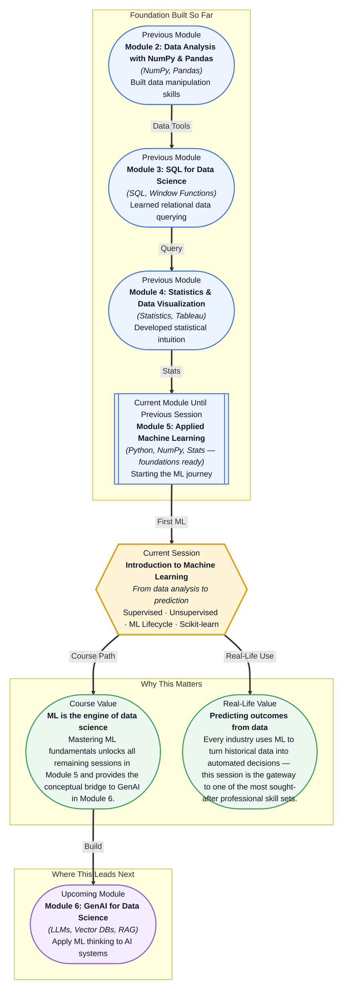

# Pre-read: Introduction to Machine Learning

## Context of This Session in the Course

You have been asked to help a regional hospital predict which patients admitted with chest pain are at risk of a cardiac event within 30 days. The hospital has years of electronic health records — age, blood pressure, cholesterol levels, smoking status, ECG readings — thousands of rows of data. Your job is not just to describe what happened in the past, but to build a system that looks at a new patient's data and makes a reliable prediction.

The intuitive approach — writing manual rules like "if age > 60 and cholesterol > 240, flag as high risk" — quickly collapses under complexity. Patients present with different combinations of risk factors; some have high cholesterol but are young and active, while others are older yet have excellent vitals. A rule-based system either becomes a tangled mess of hundreds of conditions or misses too many edge cases entirely. The problem demands a different kind of thinking: instead of hand-coding rules, you teach a program to discover patterns from data itself. That is where **machine learning** becomes essential.

What if you could write a single Python script that, given a dataset of customer behaviour, automatically learns to predict which users will churn next month — no manual rule-writing required? What if the same mental model let you switch from predicting churn to forecasting sales to detecting fraudulent transactions, simply by changing the dataset and the algorithm? The techniques you will encounter in this session — supervised learning, the ML lifecycle, regression versus classification — are the reusable building blocks that make this possible.

At its heart, **machine learning** is the practice of teaching computers to learn from experience — specifically, from data. Instead of giving a program explicit instructions for every situation, you provide it with examples and let it infer the underlying patterns. The two broad families of this approach are **supervised learning**, where the data comes with answers (like labelled emails marked "spam" or "not spam"), and **unsupervised learning**, where you ask the algorithm to find hidden structure in data without any labels (like grouping customers by purchasing behaviour). Think of supervised learning as a student solving practice problems with an answer key: each example teaches the student something, and over time they learn to solve unseen problems correctly. Unsupervised learning is like giving that same student a pile of puzzle pieces with no picture on the box — they must figure out how the pieces fit together on their own. Both approaches follow a structured **ML lifecycle**: define the problem, prepare the data, train a model, evaluate it, and deploy it. This session will also introduce you to the two major flavours of supervised learning: **regression**, which predicts continuous values (like house prices), and **classification**, which predicts discrete categories (like "dog" or "cat"). You will get hands-on with **Scikit-learn**, the most widely used Python library for machine learning, and learn how its consistent API makes building and testing models remarkably straightforward.

In the **previous session**, you completed Module 4 with a case study on executive reporting, where you synthesised statistics and data visualisation into a final dashboard. That session demanded that you interpret data, identify key insights, and present findings clearly — skills that required a solid grasp of descriptive statistics, probability, and hypothesis testing. Those statistical foundations — particularly your understanding of variance, distributions, and correlation — are precisely what make machine learning possible: every ML algorithm is, at bottom, a statistical model trying to capture signal from noise.

In this pre-read, you will discover:
- How to **distinguish** between supervised and unsupervised learning and choose the right approach for a problem.
- How to **describe** the stages of the ML lifecycle, from problem definition to model deployment.
- How to **recognise** when a prediction task calls for regression versus classification.
- How to **build** your first predictive model using Scikit-learn's consistent API.

---

## How Do You Teach a Machine to Learn from Examples?

Supervised learning sounds almost magical until you realise it mirrors how humans learn from feedback. Imagine showing a child pictures of apples and oranges and saying "apple" or "orange" each time — after enough examples, the child can identify a new fruit correctly. A supervised learning algorithm does the same, except the "seeing" happens through numerical features. The key insight is that the algorithm does not understand the world — it finds mathematical patterns in numbers. For a housing price model, the features might be square footage, number of bedrooms, and location; for a spam detector, they might be word frequencies and email metadata. The algorithm adjusts internal parameters until its predictions match the training data as closely as possible, guided by a **loss function** that measures how wrong it is. The trade-off, and the reason ML is an art not just a science, is the **bias-variance tradeoff** — a model that memorises the training data perfectly will fail on new data, while one that oversimplifies will miss important patterns. The goal is a balanced model that generalises well, and the ML lifecycle is designed to help you find that balance.

## Why the ML Lifecycle Is Not Just "Train and Deploy"

Many newcomers imagine machine learning as a one-step process: feed data to an algorithm, get a model, deploy it. In practice, the **ML lifecycle** is a loop with distinct phases, and the most important work often happens before a single line of model code is written. It begins with **problem definition**: are you trying to predict a category (classification) or a number (regression)? What does success look like? Then comes **data preparation** — cleaning, handling missing values, feature engineering — which can consume 60–80% of a project's time. Only then do you train a model, evaluate it using metrics appropriate to your problem type, and iterate based on what you learn. The discipline of following a structured lifecycle separates a one-off experiment from a production-ready system. It forces you to ask hard questions early — "Is my data representative?", "What does a good prediction look like?", "How will I know if my model degrades over time?" — that ultimately save weeks of rework and build the rigour that distinguishes professional data scientists from casual notebook users.

## Where Machine Learning Appears in Real Life

Machine learning is not an abstract academic exercise — it powers systems you interact with daily. In **healthcare**, ML models analyse medical images to detect tumours, predict patient readmission risks, and recommend personalised treatment plans. **Financial services** use classification models to flag fraudulent transactions in real time and regression models to forecast stock prices or credit risk. **E-commerce and media** platforms like Amazon, Netflix, and Spotify rely on ML for recommendation systems — a blend of classification (will this user like this item?) and regression (how much will they engage?). In **manufacturing**, sensor data feeds predictive maintenance models that forecast equipment failure before it happens, saving millions in downtime. Even **agriculture** has embraced ML: satellite imagery and weather data train models that predict crop yields and optimise irrigation. Every one of these applications, despite their diversity, follows the same fundamental pattern you will learn in this session: define the problem, prepare the data, choose a supervised or unsupervised approach, train, evaluate, and iterate. The industry changes the data and the stakes; the process stays the same.

## What's Next

After this session, you will be able to:

- Distinguish between supervised and unsupervised learning problems and decide which approach fits a given scenario.
- Walk through each phase of the ML lifecycle and identify what happens in each stage.
- Explain the difference between regression and classification tasks with concrete examples.
- Write a basic Scikit-learn script that loads data, splits it, trains a classifier, and makes predictions.
- Interpret a model's output and recognise when predictions are unreliable.
- Frame a real-world business question as a machine learning problem.

You do not need to memorise every algorithm right now. The goal is to shift your mental model from writing rules to learning from data — the algorithms come next.

## Interesting Questions for the Live Session

- If a model achieves 99% accuracy on your test set, should you deploy it to production without hesitation? What hidden assumptions might break in the real world?
- Can a single dataset be used for both supervised and unsupervised learning? What would that look like in practice?
- The ML lifecycle seems to have a clear sequence — but how do you know when to go back to an earlier phase rather than push forward?
- Regression and classification are often presented as separate tools, but many real problems sit in between — for example, predicting a probability is a regression output used for a classification decision. Where do you draw the line?

By the end of this session, machine learning should feel less like a black box of algorithms and more like a structured way of thinking: **from data to decisions, one lifecycle phase at a time.**
