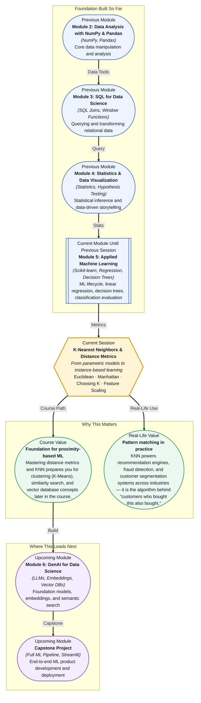

# Pre-read: K-Nearest Neighbors & Distance Metrics

## Context of This Session in the Course

You are building a recommendation engine for an online bookstore. A customer just bought a data science handbook, and you need to suggest three more books they will love. You do not have user reviews, no purchase history beyond the current cart, and no time to train a deep learning model. What you do have is a catalogue of thousands of books, each tagged with genres, page counts, publication year, and price. Your instinct might be to recommend bestsellers — but that ignores the fact that a customer buying a technical handbook is unlikely to be interested in the latest celebrity memoir. The naive approach collapses because it treats every customer as interchangeable. The problem demands a different kind of thinking: instead of building a complex model, what if you simply looked at the books most similar to the one already in the cart? That is where **K-Nearest Neighbors** becomes essential.

The intuitive solution — recommend whatever is popular — works only if every customer has identical taste, which they do not. You could try hand-crafting rules: if the book is in the "Data Science" category, recommend other data science titles. But categories are coarse, and a book about Python for finance and a book about Python for game development share a category yet serve entirely different audiences. The deeper the rules grow, the more brittle the system becomes. What you need is a mathematical measure of similarity that operates directly on the numerical features of each book — a way to let the data itself decide which books are close neighbors.

K-Nearest Neighbors solves this with a disarmingly simple idea: store every training example, and when a new query arrives, look at the K most similar examples and let them vote. No training phase, no parameters to learn — just raw proximity in numeric space. This is **instance-based learning**, and it flips the traditional machine learning workflow on its head: instead of spending hours training a model and milliseconds making predictions, KNN spends milliseconds doing nothing during training and all the work during prediction. The cost is memory and computation at query time, but the benefit is a model that adapts immediately as new data arrives.

What if you could build a fraud detection system by simply asking: "Is this transaction similar to known legitimate transactions or known fraudulent ones?" What if the same approach let you diagnose diseases by comparing a patient's symptoms to the most similar historical cases, or recommend movies by finding viewers whose taste profile matches yours? You already use this mental model instinctively in daily life — when you ask a friend with similar taste for a restaurant recommendation, you are running KNN with K equals 1. This session gives you the mathematical tools to make that intuition precise, programmable, and scalable to thousands of dimensions.

At its core, **K-Nearest Neighbors (KNN)** is a **lazy learning** algorithm — it does not build an explicit model during training. Instead, it memorises the entire training dataset and defers computation until a prediction is requested. When a new data point arrives, KNN identifies the K most similar points from the training set using a **distance metric** and returns their majority vote (for classification) or average (for regression). Think of KNN as a democratic voting system: every neighbor gets a voice, and the result is determined by proximity. The two most important distance metrics are **Euclidean distance**, the straight-line distance between two points in space (like measuring with a ruler), and **Manhattan distance**, the sum of absolute differences along each axis (like navigating a city grid where you can only travel along streets). Choosing between them depends on your data — Euclidean works well when all dimensions measure comparable phenomena, while Manhattan is more robust when features have different units or when the data is high-dimensional. You will also explore **choosing K**, the number of neighbors, which acts as a smoothing parameter: a small K captures fine-grained local patterns but risks overfitting to noise, while a large K produces stable predictions but may wash out meaningful variation. And critically, you will learn why **feature scaling** is non-negotiable for distance-based algorithms — a feature measured in thousands (like salary) will dominate a feature measured in tenths (like years of education) unless all values are normalised to a common range.

In the **previous session**, you learned how to evaluate classification models using the confusion matrix, precision, recall, F1-score, and ROC-AUC curves. Those metrics gave you a language to answer the question "Is my model any good?" and a framework for comparing models on more than just raw accuracy. Now, with KNN, you will encounter an algorithm that challenges the training-heavy assumptions of those earlier models. Unlike linear regression, which learns coefficients during training, or decision trees, which grow splits — KNN does no training at all. It memorises the data and defers computation to prediction time. This inversion means your evaluation toolkit becomes even more essential: the same F1-score you mastered now depends directly on your choice of K and distance metric, transforming model evaluation from a post-hoc check into an active guide for hyperparameter tuning.

In this pre-read, you will discover:
- How to **understand** the mechanics of instance-based learning and why KNN defers computation to prediction time.
- How to **apply** Euclidean and Manhattan distance metrics and decide which one fits your data.
- How to **choose** the optimal value of K using validation and understand the bias-variance tradeoff it controls.
- How to **recognise** why feature scaling is critical for every distance-based algorithm.

---

## Why the Right Distance Metric Changes Everything

The difference between Euclidean and Manhattan distance is not a mathematical curiosity — it changes which points your model considers "similar." Imagine two points in a 2D plane: point A at (0, 0) and point B at (3, 4). The Euclidean distance is 5 (the hypotenuse of a 3-4-5 triangle). The Manhattan distance is 7 (3 units right plus 4 units up). Now imagine a third point C at (0, 7). Euclidean distance from A: 7. Manhattan distance from A: 7. Notice that from A, B and C have the same Manhattan distance (7) but very different Euclidean distances (5 vs 7). This means Manhattan distance treats diagonal movement as "more costly" relative to straight-line movement, which matters when your features represent quantities that should not trade off against each other. For example, in a housing dataset with features like "number of bedrooms" and "square footage," Manhattan distance preserves the independence of each feature — it does not allow a shortage of bedrooms to be compensated by extra square footage in the same way Euclidean distance does. The choice of distance metric is therefore a statement about the structure of your data: Manhattan is often preferred in high-dimensional spaces because it avoids the exaggerating effect of the **curse of dimensionality**, where Euclidean distances between any two points converge as dimensions increase.

## How Choosing K and Scaling Features Work Together

The parameter K controls the bias-variance tradeoff in KNN, and it cannot be understood in isolation from feature scaling. A small K, such as 1 or 3, produces a highly flexible decision boundary that hugs the training data — low bias but high variance, meaning the model will change sharply if you add or remove a single training point. A large K, such as 20 or 50, smooths the decision boundary, reducing variance but increasing bias — the model may miss local patterns that are real but subtle. Choosing K is therefore a search for the sweet spot where the model captures genuine structure without memorising noise, and the standard technique is to evaluate performance across a range of K values using cross-validation or a held-out validation set. However, no amount of tuning will rescue KNN if your features are on wildly different scales. Imagine a dataset where one feature ranges from 0 to 1 (normalised test score) and another ranges from 0 to 100,000 (annual income). The distance calculation will be entirely dominated by income — the test score becomes practically invisible to the algorithm. **Feature scaling** methods like **Standardisation** (subtracting the mean and dividing by the standard deviation) or **Min-Max scaling** (squeezing all values into a [0, 1] range) ensure each feature contributes proportionally to the distance calculation. In practice, feature scaling is not optional for KNN; it is a prerequisite that determines whether your model learns signal or noise.

## Where K-Nearest Neighbors Appears in Real Life

KNN is one of the most widely deployed algorithms in industry precisely because it is simple, interpretable, and requires no training infrastructure. In **e-commerce**, KNN powers recommendation engines at companies like Amazon and eBay: the "customers who bought this also bought" feature is essentially a KNN query over purchase history vectors, where similarity is measured by co-purchase patterns. In **finance**, fraud detection systems compare each new transaction against its K nearest neighbors in a feature space of transaction amount, location, time of day, and merchant category — a transaction that falls far from its neighbors is flagged as anomalous. In **healthcare**, KNN enables diagnostic support systems that match a new patient's symptoms and test results against the most similar historical cases in a hospital's database, helping clinicians identify rare conditions they might otherwise overlook. **Telecommunications** companies use KNN for customer churn prediction: by measuring how similar a current subscriber is to customers who have already churned, they can proactively offer retention incentives. Even **image recognition** applications, from handwriting digit detection on postal envelopes to facial recognition in photo libraries, often use KNN as a baseline or fallback classifier because it performs competitively with minimal setup. Across every one of these domains, the pattern is the same: store examples, define a similarity measure, and let the nearest neighbors vote.

## What's Next

After this session, you will be able to:
- Compute Euclidean and Manhattan distances between data points and explain when each is appropriate.
- Implement a KNN classifier using Scikit-learn and tune the K parameter using validation.
- Apply feature scaling (Standardisation and Min-Max scaling) to prepare data for distance-based algorithms.
- Explain the bias-variance tradeoff in the context of choosing K and interpret validation curves.
- Evaluate a KNN model's performance using classification metrics and diagnose poor results.
- Recognise when instance-based learning is the right tool versus a parametric model.

You do not need to memorise every distance metric formula right now. The goal is to understand that sometimes the most powerful prediction is simply the wisdom of the nearest crowd: **show me your neighbors, and I will tell you who you are.**

## Interesting Questions for the Live Session

- If KNN requires no training, why does it sometimes take longer to make a single prediction than a deep neural network? What does this reveal about the difference between training cost and inference cost?
- In a dataset with 100 features, does Euclidean distance still capture meaningful similarity, or does the curse of dimensionality make all points appear equally distant?
- What happens if you set K equal to the size of the entire training set? What kind of model does KNN degenerate into, and when might that actually be useful?
- Should you use KNN for a dataset where new training data arrives every minute, or would it become impractical? How would you design a system to keep the model current without rebuilding from scratch every time?

By the end of this session, K-Nearest Neighbors should feel less like a simple algorithm you learned and more like a universal mental model for similarity-based reasoning: **the nearest answer is often the right answer.**
