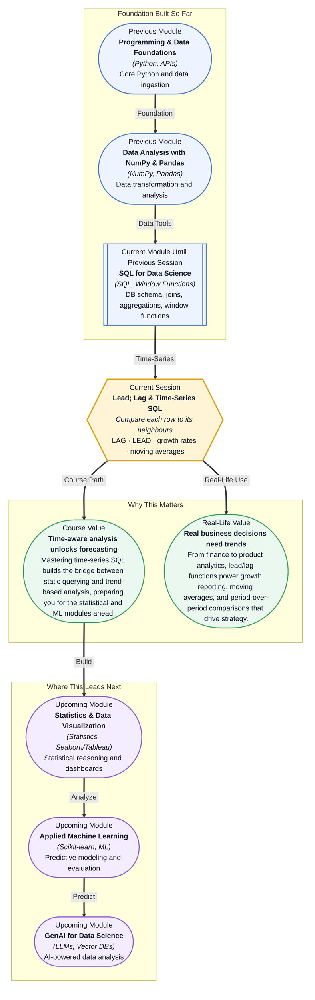

# Pre-read: Lead; Lag & Time-Series SQL

## Context of This Session in the Course

Your manager slides into your DMs on a Friday afternoon — can you pull last month's revenue and compare it to the same month last year? The data is in a single table, thousands of rows, one row per transaction. You know you can sum it, group it, even join it. But to compare a row to the row that came before it — the previous month's total — your usual toolkit hits a wall.

You could export to a spreadsheet and manually subtract one row from another. But that breaks the moment the data refreshes. You could write a self-join, but it balloons into messy, hard-to-read SQL. The deeper issue is that your mental model of tables treats every row as an independent fact. Time-series analysis demands the opposite: every row is meaningful only in relation to its neighbours. Without a way to look backwards and forwards across rows, you are stuck with static snapshots.

That is where **Lead, Lag & Time-Series SQL** becomes essential.

What if you could write a single SQL query that not only shows you last month's revenue but also calculates the month-over-month growth rate, a 3-month moving average, and flags every month where revenue dropped compared to the prior period — all without leaving your database? That is the power of lead/lag functions and time-series SQL. After this session, you will reach for `LAG()` and `LEAD()` the same way you reach for `GROUP BY`: as a natural, instinctive part of your analytical toolkit.

Most SQL you have written so far treats rows as independent units — each row answers its own question. **Window functions** like `LAG()` and `LEAD()` change that. They let a row reach out and reference the row before it or after it, based on a defined ordering. Think of it like standing in a queue and being able to ask the person ahead of you and behind you what they are holding. The queue (the **ordering**) matters, and the partition (the **group** your row belongs to) defines who you consider part of your queue versus a different queue entirely.

A good analogy is a movie film strip. Each frame (row) makes sense on its own, but the story only emerges when you compare a frame to the one that came before. `LAG()` is like looking at the previous frame; `LEAD()` is like peeking at the next one. A **moving average** is like smudging your eyes to blur several consecutive frames into a single impression — smoothing out the jitter to see the trend.

In this session, you will explore how to compare current vs previous rows using `LAG()` and `LEAD()`, calculate period-over-period **growth rates**, and build **moving averages** directly in SQL. These three techniques form the backbone of time-series analysis in any database — from Postgres to BigQuery to Snowflake.

In the **previous session**, you were introduced to window functions through `ROW_NUMBER()`, `RANK()`, `DENSE_RANK()`, and running totals using the `OVER` clause. That session taught you how to assign positions and cumulative values across ordered partitions — a mental model that treated the row as part of a sequence. Now, `LAG()` and `LEAD()` extend that sequence thinking one step further: instead of just numbering rows in order, you will learn to directly reference the values of neighbouring rows. If window functions were about assigning rank, lead/lag is about asking your neighbour a question. The `OVER` clause that governed partitioning and ordering in the previous session is the exact same clause you will use here — making the transition feel less like learning a new feature and more like the natural next rung on a ladder.

In this pre-read, you will discover:
- How to **compare** a row with the row before or after it using `LAG()` and `LEAD()`.
- How to **calculate** growth rates between periods directly in SQL.
- How to **build** moving averages that smooth out short-term fluctuations.
- How to **apply** time-series SQL to real business reporting scenarios.

---

## Why Comparing Rows Requires a New SQL Mindset

Every query you have written until now treated rows as isolated facts. `SELECT` retrieves them, `WHERE` filters them, `GROUP BY` buckets them — but none of these operations allow one row to peek at another. When you need to answer "how did this month compare to last month?", you are not asking about a single row. You are asking about a relationship between two rows. That is a fundamentally different kind of question, and it demands a fundamentally different tool.

Your first instinct might be a **self-join**: join the table to itself on a shifted date column. It works, but it quickly becomes unwieldy — especially when you need to look back multiple periods or compare across different partitions. Self-joins also force you to duplicate logic and make your query harder to read and maintain. `LAG()` and `LEAD()` solve this with a single function call inside a `SELECT` statement. You specify which column to look at, how many rows to look back or forward, and what to do if no row exists (a `NULL` or a default value). The `OVER` clause, which you already know from the previous session, handles ordering and partitioning. The result is code that says exactly what you mean: "give me the previous row's value."

The real insight here is that this shift — from row-level thinking to sequence-level thinking — is not just a SQL trick. It is the foundation of any analysis that cares about change. Whether you are tracking inventory levels, user signups, or sensor readings, the question is always the same: how does this point compare to the points around it?

## How Growth Rates Reveal the Story Behind the Numbers

A single data point tells you almost nothing. Revenue was $120,000 in March. Is that good? Without context — February's revenue, last March's revenue, a rolling average — the number floats in isolation. Growth rates turn raw numbers into a narrative. A 15% month-over-month increase tells you something is working. A 3-month declining average tells you something is broken. Calculating these in SQL using `LAG()` is surprisingly elegant: you fetch the previous period's value with `LAG()`, subtract it from the current value, divide by the previous value, and multiply by 100. A single expression gives you a percentage change.

**Moving averages** take this one step further by smoothing out noise. A daily revenue chart might spike on payday and dip on Sundays, making it hard to see the real trend. A 7-day moving average averages each day with the six days before it, producing a cleaner curve that reveals the underlying direction. In SQL, you combine `LAG()` with a window frame — `ROWS BETWEEN 6 PRECEDING AND CURRENT ROW` — or use an `AVG()` window function over a sliding frame. The technique is the same across every major database, and once you learn it, you will see opportunities to apply it everywhere.

The key mental model is this: growth rates give you the immediate change, while moving averages give you the trajectory. Together, they transform a table of numbers into a story of momentum, decline, and recovery.

## Where Time-Series SQL Appears in Real Life

Time-series SQL is not an academic exercise — it is the engine behind some of the most common analytical workflows in the industry. In **e-commerce and retail**, lead/lag queries power revenue trend reports, same-store sales comparisons, and inventory turnover analysis. A product manager pulling a weekly sales report uses `LAG()` to calculate week-over-week growth without waiting for a BI tool to load. In **finance**, moving averages are the bread and butter of technical analysis — a 50-day moving average of a stock price is a `LAG()`-based window function running across thousands of rows of trading data.

**Marketing teams** rely on period-over-period comparisons to measure campaign effectiveness. Did the email blast outperform last month's? Was the drop in clicks a seasonal pattern or a real decline? A single SQL query with `LAG()` answers both questions. In **product analytics**, user engagement metrics like daily active users (DAU) are meaningless without a comparison to the prior day or week — product leads use lead/lag to spot unusual drops before they become trends. Even in **operations and supply chain**, monitoring inventory levels, shipping times, and defect rates depends on comparing current metrics to historical baselines. Every one of these use cases traces back to the same three functions: `LAG()`, `LEAD()`, and moving averages over window frames.

## What's Next

After this session, you will be able to:
- Compare a row's value to the previous row using `LAG()` with a custom offset.
- Peek ahead at future rows using `LEAD()` to compute forward-looking metrics.
- Calculate month-over-month and quarter-over-quarter growth rates in a single query.
- Build a moving average that smooths noisy data to reveal underlying trends.
- Combine window frame clauses with `LAG()` and `LEAD()` for rolling computations.
- Apply time-series patterns to real-world datasets like sales or user activity logs.

You do not need to memorise every window function variant right now. The goal is to shift from seeing tables as static collections to seeing them as sequences — and to realise that SQL already has the words for that shift.

## Interesting Questions for the Live Session

- What happens to `LAG()` when there is no previous row — how does SQL handle the boundary, and how would you design around it?
- If you needed a 7-day moving average but your data has missing days, would `LAG()` with a fixed offset still work, or do you need a different strategy?
- When would you choose a moving average over a simple period-over-period comparison, and what information does each approach conceal?
- How does the `ORDER BY` direction in your `OVER` clause change the meaning of `LAG()` versus `LEAD()` — could you swap one for the other with a clever ordering trick?

By the end of this session, time-series SQL should feel less like a niche feature and more like a fundamental lens for understanding change: **every value has a before and after — and now you have the words to ask about both.**
