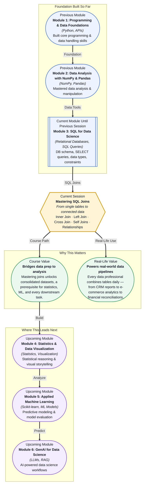

# Pre-read: Mastering SQL Joins

## Context of This Session in the Course

You have been asked to generate a report showing which customers made purchases in the last quarter, along with their total spend, the product categories they bought from, and their shipping addresses. The data is all there — customer profiles in one CSV, orders in another, product details in a third, and shipping logs in a fourth. But no single file has everything you need. The naive approach is to copy and paste columns across spreadsheets, manually aligning rows by matching customer IDs. It works for ten customers, but for ten thousand it collapses into a tangle of mismatched rows, duplicate entries, and lost data. You spend more time reconciling the mess than analysing the results. That is where mastering **SQL joins** becomes essential. Joins are the mechanism that lets you combine related tables in a single query, automatically matching rows by a shared key — whether it is a customer ID, an order number, or a date — and returning a unified dataset ready for analysis.

What if you could walk into any data-driven organisation on day one and, when handed a relational database with a dozen tables, write a single query that produces exactly the business insight requested — customer lifetime value, inventory turnover, or regional sales breakdown? That capability begins with understanding how tables relate to each other and how to use the right join to connect them. This session gives you that power.

At its core, a **SQL join** is a way to combine rows from two or more tables based on a related column between them. Think of it like a zip fastener: each row on one side finds its matching row on the other side, and the two snap together into a single, richer row. The column that drives this matching is called the **key** — typically a **primary key** (a unique identifier in one table) linked to a **foreign key** (a reference to that identifier in another table). Understanding the types of relationships between tables — **one-to-one**, **one-to-many (1:N)**, and **many-to-many (N:N)** — determines which join you use and what results you get. You will explore **Inner Join**, **Left Join**, **Cross Join**, and **Self Joins**, each solving a specific matching problem. By the end of this session, you will not just write joins — you will see every dataset as a web of interconnected tables waiting to be woven together.

In the **previous session**, you learned about **data types and constraints** — how databases enforce that a column only contains integers, dates, or text, and how rules like `NOT NULL`, `UNIQUE`, and `DEFAULT` protect data integrity. That foundation matters here because joins depend on clean, consistent keys. If a customer ID column in one table stores integers but the matching column in another stores strings, the join will silently fail or produce empty results. Understanding constraints helps you anticipate and fix these mismatches before your query runs.

In this pre-read, you will discover:
- How to **connect** tables using Inner Join to find matching records across datasets.
- How to **apply** Left Join to preserve all rows from one table while bringing in matched data from another.
- How to **recognise** the difference between one-to-many and many-to-many relationships and choose the right join strategy.
- How to **build** a mental model of Self Joins and Cross Joins for advanced analytical queries.

---

## Why Understanding Table Relationships Changes Everything

When you look at a database of a dozen tables, it is tempting to treat each table as an isolated island. But databases are designed as webs of relationships. A **one-to-many (1:N)** relationship means a single row in one table can link to many rows in another — for example, one customer can place many orders. A **many-to-many (N:N)** relationship means rows in both tables can link to multiple rows on the other side — a single product can appear in many orders, and a single order can contain many products. These relationship shapes determine which join you use and whether your query returns every row you expect or leaves critical data behind. Failing to match the relationship to the right join is the most common source of errors in SQL queries. If you use an Inner Join on a 1:N relationship, you get one row per match, which means a customer with three orders appears three times — not wrong, but often surprising. If you need the customer row even when no orders exist, you reach for a **Left Join**. If you need to pair every row in one table with every row in another — say, to generate a full grid of products and warehouse locations — a **Cross Join** is your tool.

## Inner vs. Left Join — Choosing What You Want to Keep

The most common question a new SQL practitioner faces is: do I want only the records that match in both tables, or all records from one table regardless of a match? An **Inner Join** returns rows only where the join key exists in both tables — it is the intersection of two datasets. A **Left Join** returns every row from the left table, and fills in values from the right table where a match exists, inserting `NULL` where it does not. The difference is subtle in syntax — just one keyword — but profound in outcome. Imagine an orders table and a payments table. An Inner Join gives you only orders that have been paid — useful for a revenue report. A Left Join gives you every order, including unpaid ones — essential for tracking outstanding receivables. Choosing the wrong join could overstate revenue or hide customers who have not yet paid. **Self Joins** take this further by joining a table to itself. This is invaluable when rows reference other rows in the same table — for example, an employees table where a manager column points to another employee's ID. Finding an employee's manager, a product's parent category, or a chain of dependencies all require a Self Join. It is the same logic as a regular join, but the mental shift is recognising that one table can play two roles simultaneously.

## Where SQL Joins Appear in Real Life

SQL joins are the workhorses of data integration across nearly every industry. In **e-commerce**, joins power recommendation engines by linking customer profiles to browsing history, purchase records, and product categories — building the complete picture that drives personalised suggestions. In **financial services**, joins reconcile transactions across accounts, linking deposits, withdrawals, and fees to produce accurate daily balances and detect anomalies. **Healthcare** uses joins to connect patient demographics, diagnoses, prescriptions, and lab results into a unified electronic health record, enabling clinicians to see the full patient story instead of fragmented data points. In **logistics and supply chain**, joins combine inventory tables, shipment tracking, warehouse locations, and supplier records to answer questions like which products are low in stock at which warehouses and which suppliers can replenish them fastest. **Marketing teams** join campaign data with customer acquisition tables to measure which channels drive the highest-value customers and where to invest next quarter's budget. Every one of these scenarios depends on the same core skill: the ability to take related tables and fuse them into a single, queryable dataset using joins.

## What's Next

After this session, you will be able to:
- Write an Inner Join query to combine two tables on a shared key and retrieve only matching records.
- Use a Left Join to preserve all rows from one table while enriching them with data from another.
- Construct a Self Join to query hierarchical relationships within a single table.
- Explain the difference between one-to-many and many-to-many relationships and choose the correct join approach.
- Apply a Cross Join to generate combination grids for analysis or data preparation.

You do not need to memorise every join syntax tonight. The goal is to see every table not as an isolated spreadsheet, but as part of a connected story — and to know exactly which join turns that story into data.

## Interesting Questions for the Live Session

- What happens when you join two tables that both contain duplicate keys? Does the query break, or do you get unintended row multiplication? How would you detect and handle that scenario?
- If you use a Left Join and the right table has multiple matches for a single left row, which value does SQL keep? What happens to the extra rows?
- Could a Cross Join ever be useful in a business context, or is it always a mistake that signals missing join conditions?
- When would you choose a Self Join over creating a separate lookup table? What are the tradeoffs between these two design approaches?

By the end of this session, joining tables should feel less like memorising syntax and more like having the right tool for every connection problem: **the join is not a command — it is a question you ask your data.**
