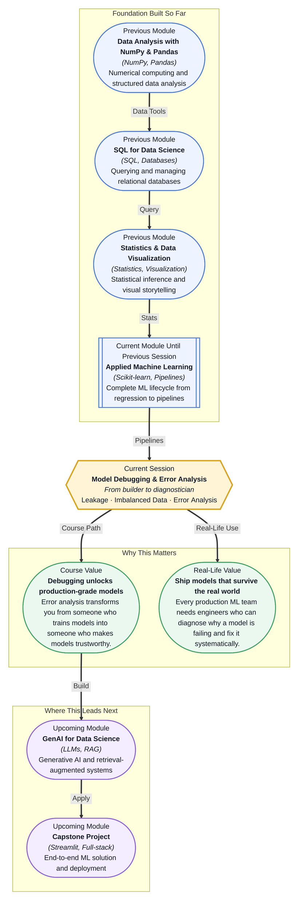

# Pre-read: Model Debugging & Error Analysis

## Context of This Session in the Course

Your model reports 97% accuracy. The stakeholder smiles, nods, and asks a single question: "How does it perform on the minority class — the actual fraud cases?" You run a classification report and watch the number: precision for fraud is 12%. Your model is almost useless for the very cases the business cares about most. The model was built, it trained, it predicted — but it never actually solved the problem.

This is the moment every data scientist faces sooner or later. The first model almost never works in the real world. Maybe it looks great on paper — high accuracy, clean metrics — but when you dig into where it fails, you discover hidden problems. The training data leaked information from the future. One class dominates so completely that the model learned to ignore the other. The errors cluster in patterns you did not anticipate. The naive approach — build once, declare victory — leads to models that fail silently and expensively.

That is where **Model Debugging & Error Analysis** becomes essential. This session is not about building another model. It is about developing the diagnostic mindset that separates beginners from professionals: the ability to look at a trained model, identify what is broken, and know exactly which lever to pull.

**What if** you could take any trained model — no matter how messy the data or how complex the problem — and systematically diagnose every failure mode within minutes? Imagine joining a fraud detection team and being handed a model that misses 80% of fraudulent transactions. Your manager expects you to improve it, not by guessing, but by following a repeatable diagnostic framework. You check for data leakage and discover that a `transaction_date` column was accidentally included in training, allowing the model to cheat. You examine the class distribution and realize fraudulent transactions make up only 0.1% of the data, so you apply **SMOTE** to generate synthetic examples of the minority class. You perform error analysis and find that most false negatives occur on transactions above a certain amount, so you adjust your threshold accordingly. The session you are about to attend gives you this diagnostic toolkit.

At its core, **model debugging** is the disciplined practice of investigating why a model behaves the way it does after training. It assumes nothing — not your accuracy score, not your loss curve, not your gut feeling. The first concept you need is **data leakage**, which occurs when information from outside the training set accidentally flows into the model, creating an illusion of performance that collapses in production. A classic example is scaling your entire dataset (train and test together) before splitting — the test set has secretly influenced the training process. The second concept is **class imbalance**, where one category dramatically outnumbers another, causing the model to become lazy and predict only the majority class. The phrase "97% accuracy on fraud detection" is often a sign of this problem. The third is **error analysis**, the systematic breakdown of where and why your model makes mistakes. Think of model debugging like a doctor diagnosing a patient. A beginner looks at the patient and says "fever, prescribe paracetamol." An expert runs tests, isolates the root cause, and prescribes a targeted treatment. In this session, you will explore **SMOTE** (Synthetic Minority Oversampling Technique) for generating realistic synthetic samples of underrepresented classes, **class weights** to penalize mistakes on the minority class more heavily, and structured error analysis workflows to categorize mistakes by type, segment, and severity.

In the **previous session**, you built robust ML pipelines using Scikit-learn's `Pipeline` class combined with cross-validation and hyperparameter tuning via `GridSearchCV`. You learned how to chain preprocessing steps (scaling, encoding) with model training into a single reusable object, and how to search for the best combination of parameters without leaking data between folds. That foundation is what makes this session possible. Pipelines ensure that when you debug a model, you are debugging the entire workflow — not an ad-hoc sequence of steps that might introduce leakage or inconsistent preprocessing. Without a robust pipeline, your diagnostic efforts are built on shifting sand. With it, every change you make is traceable, repeatable, and safe to test.

In this pre-read, you will discover:

- How to **recognise** the three most common failure modes in trained models: data leakage, class imbalance, and systematic error patterns.
- How to **apply** SMOTE and class weights to handle imbalanced datasets without distorting real-world distributions.
- How to **build** an error analysis workflow that categorises mistakes by type, feature segment, and business impact.
- How to **connect** debugging skills to production ML, where model performance depends as much on diagnosis as on architecture.

---

## Why Your High-Accuracy Model Might Be a Fraud

Imagine training a model to predict hospital readmission within 30 days. Your dataset includes columns like `age`, `diagnosis`, `medication`, `length_of_stay`, and `discharge_date`. You preprocess the data, split it into train and test sets, train a classifier, and achieve 94% accuracy. You feel great — until the model is deployed and performs no better than random guessing. What happened?

The most likely culprit is **data leakage**, and it is eerily common. Leakage happens when your model has access to information during training that it would not have in the real world. In this case, `discharge_date` might seem like a harmless feature, but a patient who was readmitted necessarily had a discharge date before that readmission. The model learned a shortcut: if `discharge_date` exists, predict readmission. In production, every patient has a discharge date, so the shortcut collapses. The accuracy was never real — it was an artifact. Data leakage comes in many forms: using future information (like including `target` or target-derived features), scaling before splitting, or using `group`-sensitive data (like multiple rows per patient) without proper stratification. Detecting leakage requires you to question every feature: "Would this information be available at prediction time?" If the answer is ever "no," that feature is leaking.

## When the Minority Class Matters Most

Consider a credit card fraud dataset with 100,000 transactions. Only 500 are fraudulent — that is 0.5% of the data. A model that predicts "not fraud" for every single transaction achieves 99.5% accuracy. It is also completely useless. This is the paradox of **class imbalance**: standard accuracy becomes a misleading metric, and most models will optimize for the easy win (predicting the majority class) instead of the hard but valuable task (catching the minority class).

Two powerful techniques exist to counter this. **SMOTE** (Synthetic Minority Oversampling Technique) creates synthetic examples of the minority class by interpolating between existing minority instances. Instead of simply duplicating the 500 fraud cases, SMOTE generates new, realistic fraud examples that sit between real ones in feature space. This gives the model more minority-class signal without overfitting to exact copies. **Class weights** take a different approach: instead of changing the data, you change the loss function. You assign a higher penalty to misclassifying minority-class examples, effectively telling the model "getting this wrong costs 100 times more than getting the majority class wrong." Scikit-learn makes this trivial with the `class_weight='balanced'` parameter, which automatically adjusts weights inversely proportional to class frequencies. Neither technique is a magic bullet — SMOTE can introduce noise if the minority class is too sparse, and extreme class weights can make training unstable. The skill is knowing which tool fits the specific imbalance profile of your data.

## Where Model Debugging Appears in Real Life

Error analysis and debugging are not academic exercises — they are the daily reality of every production ML team. In **fraud detection**, a model that misses 1% of fraudulent transactions might still cost millions if that 1% represents high-value wire transfers. Teams segment errors by transaction amount, geographic region, and time of day to discover that false negatives cluster in international transactions, leading to a targeted feature engineering effort. In **healthcare diagnostics**, a model that screens medical images might have high overall accuracy but fail catastrophically on a specific demographic subgroup. Error analysis by age, gender, and imaging device reveals the blind spot, prompting the team to collect more representative training data. In **e-commerce recommendation systems**, click-through rate models often suffer from severe class imbalance — users click on less than 1% of recommended items. Debugging here involves inspecting whether the model is simply predicting "no click" for everyone, and applying SMOTE or class weights to surface genuinely useful recommendations. In **autonomous vehicle perception**, a pedestrian detection model with 99.9% accuracy is still dangerous if the 0.1% of misses occur at night in rainy conditions. Every hour of error analysis in these systems directly translates to lives saved. The common thread across all these industries is that model performance is not a single number — it is a distribution of successes and failures across different segments of your data. Error analysis gives you the map of that distribution.

## What's Next

After this session, you will be able to:

- Detect data leakage by auditing features against the question "would this be available at prediction time?"
- Apply SMOTE using `imbalanced-learn` to generate synthetic samples for imbalanced classification tasks.
- Configure class weights in Scikit-learn models using the `class_weight` parameter.
- Build a structured error analysis report that segments false positives and false negatives by feature ranges and business categories.
- Use confusion matrices and precision-recall curves to diagnose where your model adds value and where it does not.
- Decide whether to fix model errors through data changes, feature engineering, threshold tuning, or model selection.

You do not need to master every debugging technique in a single session. The goal is to shift your mental model from "I trained a model" to "I can diagnose why a model behaves the way it does" — **debugging is the skill that turns models into reliable instruments.**

## Interesting Questions for the Live Session

- If a feature is highly predictive during training but unavailable at inference time, is it always leakage, or could there be a proxy feature that safely captures the same signal?
- SMOTE creates synthetic minority samples by interpolating between real ones — what happens when the minority class is so small or so spread out that interpolation produces unrealistic examples?
- When you apply class weights, you are changing the loss function the model optimises — does this affect the model's calibration and probability estimates, and if so, how would you detect that?
- Error analysis often reveals that a model performs poorly on a specific segment — how do you decide whether to fix the segment by collecting more data, creating segment-specific features, or training a separate model for that segment?

By the end of this session, model debugging should feel less like a troubleshooting chore and more like a systematic investigation toolkit: **every error is a clue, not a failure.**
