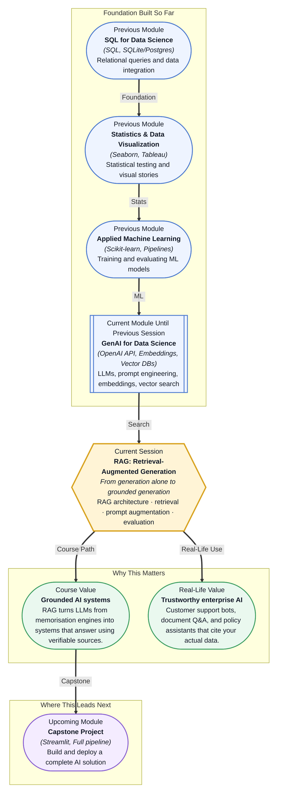

# Pre-read: RAG: Retrieval-Augmented Generation

## Context of This Session in the Course

You deploy a customer support chatbot that handles refund requests. On the first day, a user types: "I returned my laptop ten days ago. Where is my refund?" The chatbot responds with a polite, well-structured, and completely wrong answer — it quotes a refund policy from last year, before the company changed its return window from 30 days to 15. The customer is frustrated, your manager is concerned, and the chatbot has no idea it made a mistake.

The chatbot did its job well by one measure: it used a powerful language model that writes fluent English, explains concepts clearly, and even adapts its tone. But the model's training data stopped months ago, long before the policy change. The chatbot had no way of knowing the updated rule because it was answering purely from memory — like a student who memorised last year's textbook and refuses to check the new edition. The tension is that the model sounds confident regardless of whether its facts are current, and there is no built-in mechanism to verify what it says.

That is where **Retrieval-Augmented Generation** — or **RAG** — becomes essential.

What if you had to build an AI assistant for a hospital that answers questions about patient discharge procedures, insurance claim forms, medication guidelines, and doctor schedules — all from a library of 10,000 internal documents? You cannot retrain the model every time a document changes. You cannot expect the model to memorise every procedure. And you cannot allow the assistant to guess when a patient's health information is at stake. The only viable approach is to build a system that retrieves the right document before generating an answer — and that is exactly what RAG enables.

RAG combines two capabilities that you have already encountered separately in this course: **retrieval** and **generation**. Retrieval is the process of finding relevant information from a knowledge base — documents, FAQs, product manuals, or databases. Generation is what an LLM does: converting information into a coherent, natural-language response. Think of a RAG system as a researcher with an open-book exam. The researcher does not memorise every fact. Instead, they first look up relevant sources, read the most useful passages, and then write a response based on what they found. The book (the retrieval system) does not write the answer, but without it the researcher would have to rely on imperfect memory. Together, the researcher and the book outperform either alone. In this session, you will explore the full RAG architecture: how the **retrieval step** locates relevant document chunks, how retrieved content is used to **augment the prompt** given to the LLM, and how to **evaluate RAG quality** — measuring whether the system actually returns grounded, accurate answers.

In the **previous session**, you built a semantic search pipeline. You converted text into embeddings using the Embeddings API, stored those vectors in a database like Chroma or FAISS, and queried them by meaning instead of exact keyword matches. That pipeline gave you the ability to find relevant documents — but it did not yet produce an answer. RAG takes that retrieval capability and adds the generation step. Instead of stopping at a list of matching documents, the RAG system passes the retrieved chunks directly to an LLM as context, asking it to answer based only on that content. In other words, semantic search becomes the retriever, and the LLM becomes the generator. The two pieces you built separately now connect into a single grounded pipeline.

In this pre-read, you will discover:

- How to **understand** why LLM-only answers fail when knowledge is outdated, domain-specific, or private.
- How to **learn** the end-to-end RAG workflow: query, retrieval, context assembly, and grounded generation.
- How to **apply** prompt augmentation techniques that feed retrieved documents into an LLM reliably.
- How to **recognise** the key factors that determine RAG quality, from retrieval accuracy to hallucination reduction.

---

## How the RAG Architecture Connects Retrieval and Generation

A RAG system follows a deceptively simple sequence: a user submits a question, the system searches a knowledge base for the most relevant text chunks, those chunks are inserted into a prompt alongside the original question, and the LLM generates an answer using only that context. The architecture has three components: the **retriever**, the **augmenter**, and the **generator**. The retriever takes the user's query and returns the top-K most semantically similar documents from a vector database. The augmenter constructs a prompt that includes those documents along with an instruction like "Answer the question based only on the provided context." The generator — any LLM — reads the augmented prompt and produces a response.

The critical design choice is how these three pieces interact. If the retriever returns irrelevant chunks, the generator will produce a poor answer, no matter how powerful the model is. If the augmenter stuffs too many chunks into the prompt, the model may lose focus on the most relevant information. And if the generator ignores the context and falls back on its training data, the entire RAG pipeline fails its purpose. Each piece must be tuned and tested as part of the whole system, not treated as an isolated component.

## Why Retrieval Quality Determines Answer Quality

The quality of a RAG system is bounded by the quality of its retrieval step. No matter how good the LLM is, it cannot produce a correct grounded answer if the retrieved context is wrong, irrelevant, or missing. This makes retrieval evaluation a first-class concern in any RAG pipeline. Two metrics matter most: **precision** — are the retrieved chunks actually relevant to the query? — and **recall** — did the retriever find all the chunks needed to answer the question? A retriever that scores high on precision but low on recall will give the LLM accurate but incomplete context, leading to answers that are correct but miss important details.

Several factors influence retrieval quality. The **chunking strategy** determines how documents are split into searchable pieces: chunks that are too small lose surrounding context, while chunks that are too large dilute the relevant signal with irrelevant text. The **embedding model** used to convert chunks into vectors affects what counts as "semantically similar" — different embedding models capture different notions of relevance. The **top-K parameter** controls how many chunks are passed to the generator: too few risks missing information, too many risks overwhelming the LLM with noise. Each of these knobs must be tuned against a specific domain, which is why evaluating RAG quality is not a one-time task but an ongoing discipline of testing retrieval against real user queries.

## Where RAG Appears in Real Life

RAG is not a research experiment — it is the architecture behind many of the AI products you interact with daily. **Enterprise knowledge assistants** like Glean and Coveo use RAG to let employees ask questions about internal policies, HR benefits, and project documentation using natural language, retrieving answers from the company's own document stores rather than the open internet. **Customer support platforms** such as Intercom's Fin and Zendesk's AI agents use RAG to ground chatbot responses in the support articles and product manuals that the company maintains, ensuring that a customer asking about a refund policy gets the current policy, not a generic guess. **Legal document review** systems apply RAG to contract analysis: a lawyer queries "find all clauses related to data breach liability" and the system retrieves the relevant sections from thousands of pages, then generates a summary with citations. **Healthcare information systems** use RAG to answer clinical questions from medical literature and hospital protocols, where an incorrect answer could have serious consequences. **Educational technology platforms** deploy RAG to power tutoring assistants that answer student questions based on the specific textbook and curriculum materials assigned to the course, not on general internet knowledge. In every case, the pattern is the same: the system retrieves proprietary or up-to-date information, augments the LLM's prompt with it, and generates an answer that is grounded, verifiable, and specific to the user's context.

## What's Next

After this session, you will be able to:

- Explain the three-component RAG architecture: retriever, augmenter, and generator.
- Implement a retrieval step that queries a vector database for semantically relevant document chunks.
- Construct an augmented prompt that provides retrieved context to an LLM with clear grounding instructions.
- Evaluate RAG quality by measuring whether the LLM's answer is factually supported by the retrieved context.
- Diagnose common failure modes: irrelevant retrieval, context overload, and the LLM ignoring provided context.
- Choose appropriate chunking strategies and top-K values for a given knowledge base and query domain.

You do not need to build a production-grade RAG pipeline with all its optimisations right now. The goal is to understand RAG as the bridge between stored knowledge and generated answers: **retrieve first, then generate.**

## Interesting Questions for the Live Session

- If the retriever returns the right document but the LLM still produces a wrong answer, where does the failure lie, and how would you isolate which component to fix?
- What happens when a user asks a question whose answer requires synthesising information across multiple retrieved chunks — does the LLM combine them correctly, or does it cherry-pick one and ignore the rest?
- Can a RAG system ever fully eliminate hallucination, or does it only shift the risk from the generator to the retriever — and if so, how do you evaluate the retriever's failures?
- How do you decide between giving the LLM more context (higher top-K) to be thorough versus less context to force focus — and what metric would guide that trade-off?

By the end of this session, RAG should feel less like a buzzword and more like a practical design pattern: **search for evidence, provide context, then generate a grounded answer.**
