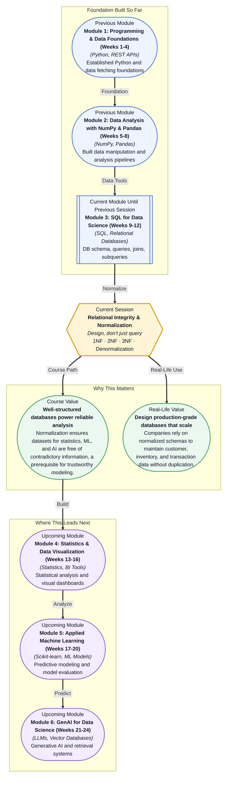

# Pre-read: Relational Integrity & Normalization

## Context of This Session in the Course

Picture this: you have just been handed a spreadsheet containing your company's entire customer database — 50,000 rows, one per transaction. The same customer's name, email, and phone number appear in dozens of rows, slightly misspelled each time. When your manager asks, "How many unique customers do we have?" you realise that no one can answer with confidence.

This is not just a spreadsheet problem. Every time data is stored redundantly — the same customer address repeated across a hundred orders, the same product description scattered across multiple tables — the database becomes harder to trust. Updates take longer, inconsistencies creep in, and queries return contradictory results. The intuitive approach of "just add another column" makes things worse, not better.

The solution lies not in smarter queries but in smarter design — a set of principles that tell you exactly how to structure your tables so that each fact is stored once, in one place, with no room for contradiction. That is where **Relational Integrity & Normalization** becomes essential.

What if you were asked to design the database for a rapidly growing e-commerce platform handling millions of transactions, thousands of products, and hundreds of thousands of customers across multiple countries? One wrong table design could cascade into duplicate records, conflicting inventory counts, and invoices that charge the wrong prices. After this session, you will look at any dataset and know precisely how to break it into clean, efficient tables that stay consistent even as the business scales.

At its core, **normalization** is the process of organising a relational database to reduce data redundancy and improve data integrity. It works by progressively decomposing tables into smaller, more focused tables, following a set of rules called **normal forms**. The first three — **1NF**, **2NF**, and **3NF** — form the foundation of almost every well-designed production database.

Think of it like organising a cluttered wardrobe. 1NF says: "Do not stuff multiple items into one drawer compartment — give each item its own slot." 2NF says: "If you have a drawer for socks-and-footwear-combinations, split it into a sock drawer and a shoe rack." 3NF says: "If your shoe rack also stores shoe polish, move the polish to its own shelf." Each step removes a specific kind of dependency, leaving you with a cleaner, easier-to-maintain system.

In this session, you will explore the three normal forms in depth, understand the concrete benefits of a normalized schema — faster updates, smaller storage, fewer anomalies — and also learn when it makes sense to **denormalize** for performance, a critical trade-off that separates textbook knowledge from real-world engineering.

In the **previous session**, Set Operations & Subqueries, you learned how to combine and filter data across multiple tables using UNION, INTERSECT, and nested SELECT statements — powerful tools for retrieving exactly the information you need. But those tools are only as good as the structure they operate on. A poorly designed table forces you to write convoluted queries to work around duplicate or missing data. Normalization solves this at the source: by ensuring your tables are designed so that joins and subqueries return clean, unambiguous results without extra effort.

In this pre-read, you will discover:
- How to **recognise** data redundancy and the anomalies it causes in real databases.
- How to **apply** 1NF, 2NF, and 3NF to eliminate duplicate data and ensure consistency.
- How to **interpret** the performance trade-offs between a fully normalized schema and a denormalized one.
- How to **build** the mental model to look at any table and instinctively identify where normalization is needed.

---

## Why a Single Table Is Almost Never the Answer

When you first design a database, the natural instinct is to put everything into one wide table — every fact about a customer, every order, every product detail, all in the same row. This violates **First Normal Form (1NF)**, which requires that each column contains atomic, indivisible values and that each row is unique. A table that stores multiple phone numbers in a single cell, or repeats the same customer name across many order rows, is not in 1NF.

The consequence is immediate: you cannot reliably query for "all orders by this customer" without parsing strings, and updating a customer's address means finding and modifying dozens of rows instead of one. The fix is straightforward — split repeating groups into separate rows or separate tables — but it requires seeing the structure before the data. This section will train you to spot 1NF violations the moment you open a spreadsheet or inspect a database table.

## The Hidden Dependencies That Break Your Data

Even after you achieve 1NF, subtle problems remain. **Second Normal Form (2NF)** addresses the issue of partial dependencies — when a table has a composite primary key and some columns depend only on part of that key, not the whole thing. Imagine an order-details table keyed on (OrderID, ProductID), but storing ProductName in the same table. The product name depends only on ProductID, not on the entire order, so it gets repeated for every order that includes that product. Splitting products into their own table eliminates this redundancy.

**Third Normal Form (3NF)** goes one step further, removing transitive dependencies — when a non-key column depends on another non-key column rather than directly on the primary key. For example, if an Employees table stores DepartmentID and DepartmentHead, the department head's name depends on the department, not on the employee. Storing it in the employee table means updating the department head forces an update of every employee row. Moving department details to a Departments table keeps your data clean and your updates fast. These two normal forms, together, eliminate the vast majority of redundancy in relational databases.

## Where Normalization Appears in Real Life

Healthcare systems — handling patient records, prescriptions, appointments, and billing — are textbook examples of normalized design. A patient's name and date of birth are stored once in a Patients table, while each visit, diagnosis, and prescription links back via foreign keys. This ensures that changing an address updates exactly one row, and a doctor can see a patient's entire history without sifting through duplicated entries.

E-commerce platforms apply normalization to separate products, inventory, orders, and customers into distinct tables, enabling features like "show all orders for this customer" and "update product price across all pending orders" with a single UPDATE. Financial services — banking, insurance, and trading — rely on normalized schemas for audit trails and regulatory compliance, where every transaction must trace back to unambiguous, non-redundant master records.

Even data warehouses, which often denormalize for query speed, begin their ETL pipelines with normalized source data. Understanding when to denormalize — for example, creating a flattened orders table that pre-joins customer and product details to avoid expensive joins at query time — is itself a mark of engineering maturity. The goal is never maximal normalization; it is the right level of normalization for your use case.

## What's Next

After this session, you will be able to:

- Identify 1NF, 2NF, and 3NF violations in any relational table by inspecting its functional dependencies.
- Design a normalized schema from scratch that eliminates data redundancy and update anomalies.
- Decompose a wide spreadsheet into multiple related tables using foreign keys and lookup tables.
- Evaluate when denormalization improves read performance without compromising data integrity.
- Apply normalization thinking to non-database contexts like spreadsheet design and data pipeline architecture.

You do not need to memorise every normal form number right now. The goal is to see a table and instinctively ask: "Is this table well-designed, or is it storing information it shouldn't?"

## Interesting Questions for the Live Session

- If a table satisfies 3NF, what kinds of data redundancy could still exist, and how would you detect them?
- When would you deliberately choose a 1NF or 2NF design over full 3NF in a production application?
- How does the choice of a primary key — natural vs. surrogate — affect your ability to achieve 2NF and 3NF?
- In a data warehouse serving analytics dashboards, is normalization always the right starting point, or does the answer change with scale?

By the end of this session, database design should feel less like a set of abstract rules and more like a practical skill you can apply daily: **Great schema design is preventive maintenance for your data.**
