# Pre-read: Sampling & Estimation

## Context of This Session in the Course

```mermaid
%%{init: {"flowchart": {"nodeSpacing": 45, "rankSpacing": 65, "diagramPadding": 20}} }%%
flowchart TB
  subgraph Foundation["Foundation Built So Far"]
    P1(["Previous Module<br/><b>Module 1: Programming &amp; Data Foundations</b><br/><i>(Python, Data structures)</i><br/>Python fundamentals, data structures, and APIs"])
    P2(["Previous Module<br/><b>Module 2: Data Analysis with NumPy &amp; Pandas</b><br/><i>(NumPy, Pandas)</i><br/>Numeric computation and tabular data analysis"])
    P3(["Previous Module<br/><b>Module 3: SQL for Data Science</b><br/><i>(SQL, Database)</i><br/>Relational databases and advanced querying"])
    C1[["Current Module Until Previous Session<br/><b>Module 4: Statistics &amp; Data Visualization</b><br/><i>(Probability theory, Statistical distributions)</i><br/>Descriptive stats, probability, distributions"]]
  end

  CS{{"Current Session<br/><b>Sampling &amp; Estimation</b><br/><i>From describing data to inferring from it</i><br/>Sampling · CLT · Standard Error · Confidence Intervals"}}

  subgraph Value["Why This Matters"]
    CV(["Course Value<br/><b>Foundation for statistical inference</b><br/>Sampling and estimation give you the tools to quantify uncertainty — essential for evaluating model performance and conducting A/B tests in the ML and GenAI modules ahead."])
    RV(["Real-Life Value<br/><b>Making decisions from incomplete data</b><br/>Draw reliable conclusions with measurable confidence from limited data, whether estimating customer satisfaction, campaign lift, or manufacturing defect rates."])
  end

  subgraph Future["Where This Leads Next"]
    F1(["Upcoming Module<br/><b>Module 5: Applied Machine Learning</b><br/><i>(Scikit-learn, ML algorithms)</i><br/>Predictive modeling and machine learning"])
    F2(["Upcoming Module<br/><b>Module 6: GenAI for Data Science</b><br/><i>(LLMs, RAG)</i><br/>Generative AI and retrieval systems"])
    F3(["Upcoming Module<br/><b>Capstone Project</b><br/><i>(End-to-end pipeline, Dashboard)</i><br/>Real-world project applying all skills"])
  end

  P1 ==>|&nbsp;Foundation&nbsp;| P2
  P2 ==>|&nbsp;Data Tools&nbsp;| P3
  P3 ==>|&nbsp;Stats&nbsp;| C1
  C1 ==>|&nbsp;Sample&nbsp;| CS
  CS ==>|&nbsp;Course Path&nbsp;| CV
  CS ==>|&nbsp;Real-Life Use&nbsp;| RV
  CV ==>|&nbsp;Build&nbsp;| F1
  F1 ==>|&nbsp;Predict&nbsp;| F2
  F2 ==>|&nbsp;Apply&nbsp;| F3

  classDef previous fill:#eef4ff,stroke:#4f7ccf,color:#111827,stroke-width:2px;
  classDef current  fill:#fff4d6,stroke:#d9a321,color:#111827,stroke-width:3px;
  classDef value    fill:#eaf8ef,stroke:#3f9f63,color:#111827,stroke-width:2px;
  classDef future   fill:#f4ecff,stroke:#8a61d1,color:#111827,stroke-width:2px;

  class P1,P2,P3,C1 previous;
  class CS current;
  class CV,RV value;
  class F1,F2,F3 future;
  linkStyle default stroke-width:3px
```

Your manager drops 10,000 customer support tickets on your desk and asks: "What is the average satisfaction score?" You could read all 10,000 — but that would take days. Instead, you pull 200 tickets at random, calculate the average from those, and report back. It feels reasonable — but a nagging doubt stays with you.

The problem is that any 200 tickets could be unrepresentative. Maybe you accidentally grabbed mostly happy customers. Or mostly angry ones. Without a framework for understanding how much your sample average might differ from the true average, you are essentially guessing — and guessing with data is no better than guessing without it. You need a way to measure exactly how much trust to place in that single number.

This is where **Sampling & Estimation** becomes essential — the toolkit that lets you quantify exactly how much confidence to place in conclusions drawn from incomplete data.

What if you are the data scientist at a pharmaceutical company testing a new drug? You cannot give the drug to every patient in the world — you test it on a few hundred volunteers. Based on that sample, you must decide whether the drug works and how confident you are in that decision. Regulators, doctors, and patients will rely on your answer. This session gives you the statistical machinery to make that decision with integrity.

At its core, **Sampling & Estimation** is about learning to make peace with incomplete information. Every dataset you will ever work with is a sample — a slice of a larger reality that you cannot fully observe. The question is not whether your sample is perfect (it never is); it is whether you can measure and communicate the uncertainty in your conclusions. Think of it like tasting a spoonful of soup to judge the entire pot. If you stir thoroughly before tasting, one spoonful can tell you a great deal. **Sampling methods** are the stirring — the techniques for ensuring your sample fairly represents the whole. Once you have a good sample, the **Central Limit Theorem** becomes your superpower: it tells you that no matter how the original population is shaped, the distribution of sample averages will look like a normal bell curve, as long as your sample is large enough. This predictable shape is what allows you to calculate the **Standard Error** — a precise measure of how much your sample estimate is likely to vary — and then build **Confidence Intervals**, which give you a range of plausible values for the true population parameter.

In the **previous session**, you explored how data can be modelled using **Discrete & Continuous Distributions** — the Normal, Binomial, and Poisson distributions — and learned how Z-scores describe the probability of different outcomes. That understanding of distribution shapes is exactly what the Central Limit Theorem builds upon: it takes the distribution knowledge you just acquired and turns it into a practical engine for inference. Where before you were describing the shape of data you could see, now you will use that shape to make claims about data you cannot see.

In this pre-read, you will discover:
- How to **select** representative samples using different sampling methods
- How to **apply** the Central Limit Theorem to justify inference from any dataset
- How to **interpret** Standard Error as a measure of estimate reliability
- How to **build** Confidence Intervals to communicate uncertainty clearly

---

## Why a Single Sample Can Tell You About the Whole Population

The instinct to distrust a single sample is healthy — but it can also be paralyzing. If you need to estimate the average income of 100,000 customers, surveying everyone is impractical. The solution is not to give up on inference but to choose your sample deliberately. **Simple random sampling** — where every individual has an equal chance of being selected — is the gold standard, but it is not the only tool. **Stratified sampling** divides the population into subgroups (e.g., by region or age bracket) and samples each one proportionally, ensuring minority groups are represented. **Cluster sampling** randomly selects entire groups (e.g., all customers in five randomly chosen stores) when a full list of individuals is unavailable. Each method reduces a specific type of bias, and choosing the right one is a skill that separates mechanical analysis from thoughtful data science.

Once you have your sample, you need a way to quantify its reliability. The **Standard Error** is that measure: it tells you how much the sample mean is expected to vary if you repeated the sampling process many times. Crucially, the Standard Error shrinks as your sample grows — specifically, it decreases proportionally to the square root of the sample size. This means doubling your sample does not halve your uncertainty; it reduces it by only about 30%. Understanding this trade-off between sample size and precision is at the heart of practical estimation.

## How the Central Limit Theorem Makes Inference Possible

Here is the almost magical insight that powers modern statistics: no matter how skewed, lumpy, or irregular your population distribution is, if you take enough samples and calculate their averages, those averages will form a **normal distribution**. This is the **Central Limit Theorem**, and it is why the normal distribution appears everywhere in data science — not because data itself is usually normal, but because averages of data are. Even a highly skewed distribution like income data (where a few billionaires stretch the tail) will produce sample averages that follow a neat bell curve, as long as each sample contains enough observations.

The practical consequence is enormous. Because you know that sample means follow a normal distribution (for large enough samples), you can use the properties of the normal curve to calculate exactly how likely different outcomes are. A **Confidence Interval** is the direct application: it gives you a range around your sample estimate that you can be, say, 95% confident contains the true population parameter. If a political poll says 52% of voters support a candidate with a ±3% margin of error, that margin is a confidence interval built on the Central Limit Theorem. The width of that interval depends on your desired confidence level, your sample size, and the variability in your data — and understanding these levers is what turns a rough estimate into a defensible conclusion.

## Where Sampling and Estimation Appear in Real Life

Sampling and estimation are not classroom abstractions — they are used daily in industries that shape our world. In **public health and pharmaceuticals**, clinical trials use carefully designed samples to estimate whether a new treatment is effective, with confidence intervals determining whether results are considered statistically significant by regulators. In **market research and political polling**, organizations like Gallup and YouGov use stratified sampling to predict election outcomes and consumer behaviour from a few thousand respondents, reporting margins of error that are direct applications of standard error and confidence intervals. **E-commerce and technology companies** run A/B tests on product features — comparing a sample of users who see the new design against a control group — and rely on estimation techniques to determine whether observed differences are genuine or just random noise. In **manufacturing and quality control**, factories sample a small fraction of produced items to estimate defect rates across entire production runs, using confidence intervals to decide whether to adjust machinery. Even **financial services** use sampling techniques to estimate portfolio risk or audit transaction records, where examining every single transaction is infeasible. In every case, the core skill is the same: drawing robust conclusions from incomplete information and communicating the uncertainty honestly.

## What's Next

After this session, you will be able to:
- Choose the right sampling method for a given business problem and justify your choice
- Apply the Central Limit Theorem to justify using sample statistics to estimate population parameters
- Calculate and interpret the Standard Error of a sample mean
- Construct and explain Confidence Intervals for population estimates
- Quantify the uncertainty in any data-driven conclusion you present to stakeholders

You do not need to memorise every formula or derivation right now. The goal is to shift your mental model from "I have data, so I know the answer" to "I have data, so I know how confident I should be."

## Interesting Questions for the Live Session

- If you take 100 different samples from the same population and calculate 100 different confidence intervals, how many would you expect to contain the true population mean, and what does that reveal about the meaning of "95% confidence"?
- A marketing team reports that a campaign lifted sales by 5% with a confidence interval of ±4%. Would you launch this campaign nationwide, and what additional information would you need before deciding?
- The Central Limit Theorem works beautifully for means and sums — but what happens when you try to apply it to medians or variances? Can you use the same approach?
- Your sample of 30 observations produces a surprisingly narrow confidence interval. Should you feel confident or suspicious, and what factors besides sample size affect the width of a confidence interval?

By the end of this session, statistical inference should feel less like abstract theory and more like a practical superpower: **The art of knowing how much you do not know — and exactly how to measure it.**
