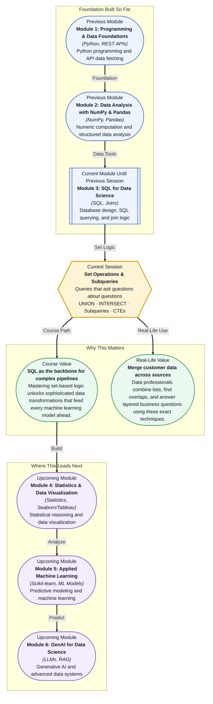

# Pre-read: Set Operations & Subqueries

## Context of This Session in the Course

You've just been handed customer data from three different acquisition channels — email signups, mobile app registrations, and partner referrals. Each source has its own table with slightly overlapping customer lists. Your manager wants one clean, deduplicated view of every unique customer, plus a separate list of customers who exist in both email and app channels but not in referrals. The data is sitting in a database, and you have fifteen minutes before the next stand-up.

The naïve approach — exporting each table to Excel and manually comparing rows — breaks the moment you have more than a few hundred records. Even in SQL, writing separate queries for each source and trying to stitch results together in application code leads to messy, error-prone scripts that are hard to audit and impossible to reuse. You need a way to let the database itself handle the comparison logic — to treat query results as mathematical sets that can be combined, intersected, and subtracted with a single statement. That is where **set operations and subqueries** become essential — SQL features that treat query results like mathematical sets, letting you union, intersect, and exclude records with surgical precision while keeping your code clean and maintainable.

What if you could ask your database questions like "Which products were purchased by premium users but never viewed by free users?" or "Show me the top 5% of customers by revenue along with their average order value in a single query"? These are not textbook hypotheticals — they are daily questions for data analysts at companies like Airbnb, Uber, and Spotify. Answering them requires layering logic: one query computes a threshold, another filters against it, a third combines the results. After this session, you will have the mental model and syntax to answer them without leaving SQL — no exports, no scripts, no manual stitching.

At their heart, **set operations** allow you to combine the results of two or more SQL queries as if they were mathematical sets. **UNION** stacks results vertically and removes duplicates; **UNION ALL** keeps everything including repeats. **INTERSECT** returns only records common to both queries, and **EXCEPT** returns records from the first query that do not appear in the second. Think of these like sorting playing cards: UNION ALL is combining two decks, UNION is removing duplicate cards, INTERSECT is finding cards that appear in both decks, and EXCEPT is finding cards unique to the first deck. **Subqueries** — queries nested inside other queries — work like asking a question within a question: "Find all customers whose purchase amount exceeds the average purchase amount." The inner query computes the average; the outer query uses that result as a filter. This session adds **Common Table Expressions (CTEs)** to your toolkit — a way to name a subquery and reference it multiple times, turning even deeply nested logic into something readable and maintainable. Together, these four tools transform SQL from a simple data retrieval language into a genuine analytical engine.

In the **previous session**, you learned how to horizontally combine tables using INNER JOIN, LEFT JOIN, and CROSS JOIN — pulling columns from related tables based on foreign key relationships. That skill let you build comprehensive datasets from normalized schemas. Now you are extending that combinatorial thinking vertically: instead of adding columns side-by-side, set operations let you add rows on top of each other and ask questions across entire query results. The JOIN mental model you built — understanding how tables relate through keys — is the perfect foundation for this next step. Where joins bridge tables horizontally, set operations and subqueries bridge queries vertically and recursively, giving you a complete vocabulary for combining data any way you need.

In this pre-read, you will discover:
- How to **apply** UNION, UNION ALL, INTERSECT, and EXCEPT to combine and compare query results
- How to **build** subqueries that filter, aggregate, and compute within a single SQL statement
- How to **understand** Common Table Expressions (CTEs) as reusable, readable alternatives to nested subqueries
- How to **recognise** when set operations or subqueries are the right tool for complex data retrieval

---

## Why UNION ALL Might Be What You Actually Want

Most students reach for UNION by default, assuming deduplication is always desirable. In practice, UNION ALL is often the correct choice — it is significantly faster because the database does not need to sort and scan for duplicates before returning results. Understanding when duplicates matter and when they do not is a hallmark of an experienced SQL practitioner. When appending monthly sales tables where each transaction already has a unique ID, for instance, UNION ALL preserves the natural grain of the data and runs in a fraction of the time its deduplicating counterpart would take.

The real insight here is that set operations force you to think about **data cardinality** — the uniqueness characteristics of your data. UNION says "I want distinct rows only," which implicitly makes a statement about what constitutes a duplicate across all selected columns. UNION ALL says "I trust my source data; give me everything." Choosing between them is not a syntax question — it is a question about your data's structure and the specific business question you are answering. Every experienced data professional has a story about a runaway UNION query that brought a production database to its knees, only to be rescued by a calm replacement with UNION ALL.

## Subqueries: Queries That Ask Questions About Questions

A **subquery** is simply a SQL query nested inside another query, but that simple definition undersells its conceptual leap. Subqueries let you perform multi-step analysis in a single statement: "Show me customers who spent more than the average spend of customers in the same region." Here, the inner query computes the regional average per group, and the outer query uses that dynamic threshold — no separate calculation, no manual copying of intermediate numbers, no risk of the threshold becoming stale. The database handles the entire pipeline in one pass.

The mental model shift is profound: instead of thinking of SQL as a linear retrieve-and-filter tool, you begin to see it as a **layered analytical language**. Each subquery becomes a building block, and CTEs take this further by letting you name those blocks explicitly. A CTE like `WITH regional_avg AS (SELECT region, AVG(spend) FROM customers GROUP BY region)` can then be referenced across multiple subsequent queries in the same statement, making your code modular and self-documenting — the same principle that makes functions valuable in Python. This shift from flat queries to layered logic is what separates someone who can write SQL from someone who can think in SQL.

## Where Set Operations and Subqueries Appear in Real Life

These techniques power some of the most common data workflows across nearly every industry. In **e-commerce**, analysts use EXCEPT to find products that were added to cart but never purchased, identifying checkout friction points that cost the business revenue — a single set operation replaces what would otherwise require exporting and comparing two separate lists. In **finance**, UNION ALL is the standard approach for combining daily transaction tables into monthly or quarterly reports, while subqueries power risk calculations like flagging accounts where the current balance exceeds three standard deviations from the account's historical mean. **Marketing teams** rely on INTERSECT to find high-value customer segments that overlap across campaigns — customers who both opened an email campaign and visited the corresponding landing page — enabling precise attribution and budget allocation. **Healthcare data engineers** use CTEs to build readable, auditable transformation pipelines for patient records, where each CTE represents one logical step — filter diagnoses codes, join to demographics, compute risk scores — making the entire pipeline reviewable by clinical stakeholders who do not write SQL. And in **product analytics**, subqueries enable cohort analysis — "Show me the retention rate of users who signed up in January, measured by their activity in February" — a nested pattern that appears in nearly every SaaS company's reporting stack and directly feeds dashboard metrics that executives rely on for strategic decisions.

## What's Next

After this session, you will be able to:

- Combine multiple query results using UNION and UNION ALL while managing duplicate records intentionally
- Identify common records across datasets with INTERSECT and exclude unwanted data with EXCEPT
- Write single-statement subqueries that filter, compute aggregates, and support multi-step analytical logic
- Break complex queries into readable, reusable blocks using Common Table Expressions (CTEs)
- Choose the right approach — set operation, subquery, or CTE — based on readability, performance, and the shape of your data

You do not need to memorise every syntax variation right now. The goal is to shift your mental model of SQL from a flat retrieval tool to a layered analytical language — where queries ask questions about questions, and your data answers back in one elegant statement.

## Interesting Questions for the Live Session

- If UNION removes duplicates by comparing every column, what happens when two tables have identical rows but different column names — and how would you handle that mismatch?
- When would you choose a correlated subquery over a JOIN, even though both can produce the same result set, and what are the performance implications of each?
- A CTE can be referenced multiple times in a query — does the database engine execute it once and cache the result, or does it run again on each reference?
- If INTERSECT and INNER JOIN can both find matching records, what distinguishes their output, and when would one be clearly preferable to the other?

By the end of this session, set operations and subqueries should feel less like obscure SQL syntax and more like a powerful analytical lens: **SQL is not just for retrieving data — it is for reasoning about it.**
