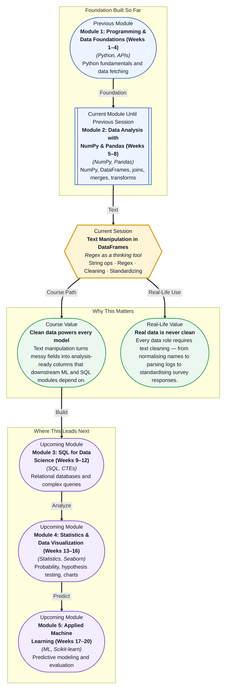

# Pre-read: Text Manipulation in DataFrames

## Context of This Session in the Course

You pull a CSV from a customer database and your first task is to extract state names from a "Location" column that reads like a game of Mad Libs: "New York, NY", " ny ", "new-york 10001", "NYC", and even "N.Y." all refer to the same place. Your manager wants a clean "State" column by end of day. This is not a hypothetical — it is the daily reality of anyone who works with real-world data, where the gap between "data" and "clean data" can be wider than the gap between raw and cooked.

Your first instinct is to write a stack of if-else statements. But within minutes you realise there are hundreds of unique substrings, inconsistent capitalisation, embedded numbers, and invisible whitespace characters. The naive approach does not scale — you need a systematic way to describe patterns in text, not hardcode every variation. You need the ability to say "find everything that looks like a state abbreviation" rather than listing all fifty possibilities.

That is where **string operations** combined with **regular expressions in Pandas** become essential.

What if you could take a column of messy, unstructured text — product descriptions with mixed case, embedded codes, and stray punctuation — and transform it into clean, standardised categories in a single pipeline? Imagine feeding a DataFrame of raw customer reviews and extracting sentiment labels, product names, and issue types with nothing but a few Pandas method calls. By the end of this session, you will have built that muscle.

The core idea is deceptively simple: every piece of text in a DataFrame is a **string** that you can inspect, slice, replace, and match against patterns. **String operations** in Pandas — accessed through the `.str` accessor — let you apply Python string methods like `.lower()`, `.strip()`, and `.contains()` to entire columns at once, without writing a single loop. Think of **regular expressions (regex)** as a search language for text patterns. Where a normal search asks "does this cell contain the word 'urgent'?", a regex can ask "does this cell start with a capital letter followed by exactly three digits and end with '.com'?" This is like upgrading from pointing at a map to using GPS coordinates — suddenly you describe locations instead of guessing. In this session, you will explore **cleaning categorical data** by collapsing inconsistent labels into uniform values, **standardising labels** so that "NY", "New York", and "new york" map to the same category, and using regex basics in Pandas to extract, replace, and validate text patterns across thousands of rows in milliseconds.

In the **previous session**, you learned how to apply functions across DataFrame rows with `.apply()`, `.map()`, and `.transform()` — turning complex row-level logic into one-liners. You also handled pivot and melt operations that reshape entire tables and worked with date/time data that demanded precise formatting. Those same functional patterns now extend to text. Where `.apply()` let you run any Python function on a column, the `.str` accessor gives you a library of pre-built text functions that work identically across every cell. And just as you used masking and boolean indexing to filter numeric data, you will now use regex-powered masks to filter rows based on text patterns. The mental model is identical — only the data type changes.

In this pre-read, you will discover:

- How to **apply** string operations across entire DataFrame columns using the `.str` accessor
- How to **build** regex patterns that extract, replace, and validate text at scale
- How to **clean** categorical data by normalising inconsistent labels into uniform categories
- How to **recognise** when a text cleaning task needs regex versus a simple string method

---

## Why Pandas Needs Its Own String Accessor

Python strings already have a rich set of methods — `.split()`, `.replace()`, `.upper()`, `.strip()`, and dozens more. Why does Pandas need a separate `.str` accessor? The answer lies in how Pandas stores data internally. A DataFrame column is not a list of strings; it is a **Series** object, and applying a native Python string method directly to a Series raises a `TypeError`. The `.str` accessor unwraps each cell, applies the string method element-wise, and returns a new Series — all without an explicit loop. This means `df['names'].str.lower()` runs at compiled speed across the entire column, and it handles missing values gracefully by preserving `NaN` entries instead of crashing. The `.str` accessor also exposes methods that have no Python equivalent, like `.extract()` for pulling matched groups out of a column into new columns and `.split(expand=True)` for expanding a single column into multiple columns in one operation. This is not a minor convenience — it changes how you think about text transformation, shifting your mindset from "how do I iterate over every cell" to "what operation does every cell need."

## Regex in Pandas: From Search-and-Replace to Pattern Thinking

A **regular expression** is a sequence of characters that defines a search pattern, and it is the most powerful tool in a data cleaner's arsenal. Consider the difference between `df['phone'].str.replace('-', '')` and a regex that strips every non-digit character: `df['phone'].str.replace(r'\D', '')`. The first only removes hyphens; the second removes dashes, parentheses, spaces, dots — anything that is not a digit — in a single pass. This is where regex shifts from a "nice to have" to a necessity. In Pandas, `.str.contains()` takes a regex pattern and returns a boolean mask for filtering rows, `.str.extract()` pulls matched substrings into new columns, and `.str.replace()` substitutes patterns rather than fixed strings. The learning curve is real — metacharacters like `\d`, `\w`, `+`, `*`, and `?` can feel cryptic at first — but the payoff is immediate: one well-crafted regex can replace fifty lines of conditional logic. And because Pandas builds its regex engine on Python's `re` module, you can precompile patterns with `re.compile()` for even faster execution on repeated operations.

## Where Text Manipulation in DataFrames Appears in Real Life

Text manipulation in Pandas is not a niche skill — it is the hidden engine behind countless industry data pipelines. In **e-commerce**, product catalogues arrive from dozens of suppliers, each with a different naming convention: "Men's Running Shoe — Size 10", "M Running Shoe sz10", "MEN-RUN-SH-10". A single `.str.extract()` call with a well-designed regex can normalise every variation into standardised brand, category, and size columns. In **finance**, transaction descriptions from bank feeds contain a jumble of merchant names, reference numbers, and dates — regex-powered `.str.replace()` and `.str.extract()` turn these into structured fields for fraud detection and cash-flow analysis. **Healthcare** organisations receive diagnosis data where the same condition is recorded as "Type 2 Diabetes", "T2DM", "diabetes type II", and "250.00" (an ICD code) — a `.str.lower().str.replace()` chain followed by a lookup map collapses these into a single categorical column. **Customer support teams** use text operations to categorise tickets by extracting keywords from subject lines: emails containing "reset", "password", or "login" route to the access team, while "refund", "charge", or "billing" go to payments. And in **marketing**, survey responses with free-text fields like "Very Satisfied", "v.satisfied", "VS", and "5" all need to map to a single Likert scale — a combination of `.str.strip()`, `.str.lower()`, and regex substitution handles this in seconds. In every case, the pattern is the same: raw text arrives unstructured, and Pandas string methods transform it into analysis-ready data.

## What's Next

After this session, you will be able to:

- Apply string methods across an entire column using the `.str` accessor.
- Write regex patterns that extract phone numbers, emails, and dates from messy text.
- Normalise inconsistent categorical labels into a clean, standardised set of values.
- Use regex-powered boolean masks to filter rows by text pattern.
- Combine `.str` methods with GroupBy for text-aware aggregations.
- Decide when a simple `.str.strip()` suffices and when a full regex is needed.

You do not need to memorise every regex metacharacter right now. The goal is to see text not as a mess to clean, but as structured data waiting to be extracted: every string is a pattern waiting to be matched.

## Interesting Questions for the Live Session

- When you run `.str.contains(regex)` on a column with missing values, should Pandas return `NaN` or `False` for those rows — and what does your choice say about how you treat missing information?
- Is it better to clean text at the point of data ingestion or in a dedicated transformation step — and how does each choice affect reproducibility?
- If two categorical labels differ only by a trailing space, is that a data quality issue or a legitimate distinction — and where do you draw the line?
- Regex is famously slow on massive datasets. At what row count does a compiled regex pattern or a vectorised string method start to show its limits — and what alternatives exist?

By the end of this session, text manipulation should feel less like manual data janitor work and more like a systematic extraction process: **every messy string is a structured field waiting to be revealed.**
