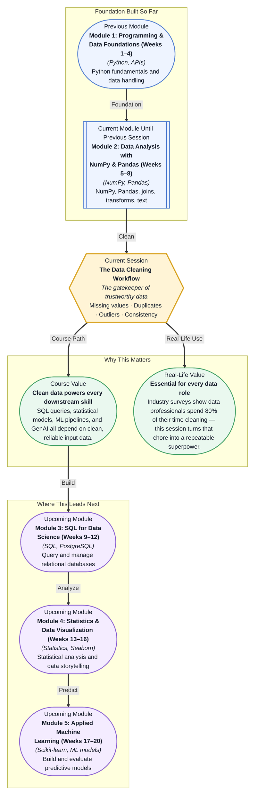

# Pre-read: The Data Cleaning Workflow

## Context of This Session in the Course

You open a customer transactions CSV expecting clean, analysis-ready data. The 'age' column contains "N/A", "-1", and "twenty-five". The 'revenue' column spans from -$50 to $5,000,000, and the same customer appears three times under slightly different name spellings. Your manager expects a clean dataset by end of day, and the raw file has over 50,000 rows.

The natural instinct is to fix each issue as you spot it — delete the negative revenue, guess the dates, remove rows with missing ages one by one. But this ad-hoc approach is a trap. You will forget which changes you made, apply different rules to different parts of the dataset, and produce a table that is "clean" only because the process was undocumented and unrepeatable. When asked how you handled the missing prices or why certain rows were dropped, you will have no defendable answer.

That is where **The Data Cleaning Workflow** becomes essential.

What if you could write a single, reusable Python pipeline that detects every missing value, flags each duplicate row, identifies statistical outliers, and enforces consistency rules — all in a few lines of Pandas code? What if running that pipeline on a fresh dataset took less time than making coffee, and produced a clean data quality report ready for your manager?

This session gives you the repeatable framework to do exactly that. By the end of it, you will stop treating data cleaning as a series of one-off fixes and start treating it as a systematic, auditable workflow — the same approach used by data teams at every serious organisation.

Data cleaning is the systematic process of detecting and correcting corrupt, inaccurate, or irrelevant records from a dataset before analysis. The four pillars of this workflow are **missing value detection and imputation**, **duplicate removal**, **outlier detection**, and **consistency checks** — each targeting a specific way that real-world data breaks.

Think of data cleaning like preparing ingredients before cooking. A chef who skips washing vegetables, trimming bad spots, and checking freshness will serve a meal that tastes wrong, no matter how skilled the recipe. Similarly, a data scientist who skips cleaning will produce unreliable insights, regardless of how sophisticated the model. The cleaning pipeline is your mise en place — it ensures you never serve dirty data.

In this session, you will learn to detect missing values using Pandas' `isna()` and `isnull()` methods, then choose the right imputation strategy — mean filling, median filling, or forward-fill — based on the data's structure. You will identify exact and near-duplicate rows with `duplicated()` and `drop_duplicates()`, apply statistical methods like Z-scores and the interquartile range (IQR) to flag outliers, and enforce consistency through data type validation and categorical standardization. Each technique addresses a distinct failure mode, and together they form a complete cleaning pipeline.

In the **previous session**, you explored text manipulation in DataFrames — using string operations and regex patterns to clean messy categorical labels, extract structured information from unstructured text, and standardize inconsistent naming conventions. That skill taught you how to handle one specific source of messiness: inconsistent text and poorly formatted strings.

Now you will expand that lens into a comprehensive four-pillar pipeline that addresses every type of data quality issue — from numerical outliers and structural duplicates to missing cells and format violations. Where text manipulation gave you surgical precision on individual columns, this session gives you a systematic framework for the entire dataset. The `.str` accessor you mastered in the previous session becomes one tool in a much larger kit.

In this pre-read, you will discover:

- How to **detect** missing values, duplicates, outliers, and consistency violations across an entire dataset
- How to **apply** imputation strategies such as mean filling, median filling, and forward-fill for missing data
- How to **recognise** the difference between outliers that are data entry errors and outliers that are genuine extreme values worth investigating
- How to **build** a repeatable data cleaning pipeline using Pandas that handles all four quality dimensions

---

## Why Missing Values Are Never Truly Missing

The simplest approach to missing data is to drop every row that contains a `NaN` — and in many cases, this is exactly the wrong thing to do. The reason is that missing values follow patterns, and those patterns carry information. Statisticians classify missingness into three categories: **MCAR (Missing Completely at Random)**, where the probability of a value being missing is unrelated to any other variable; **MAR (Missing at Random)**, where the missingness depends on other observed variables but not the missing value itself; and **MNAR (Missing Not at Random)**, where the missingness is directly related to the unobserved value. Each category demands a different response.

For example, if income data is missing primarily for senior executives because they are less likely to disclose earnings, that is MAR — the missingness depends on job title, which you can observe. Dropping those rows would systematically remove high-income individuals and bias your analysis downward. If, however, income is missing in no discernible pattern, you can safely remove those rows or use mean imputation without introducing bias. The Pandas `isna()` method reveals the distribution of missingness across columns, and a simple heatmap of missing values often tells you more about your data quality than any single statistic.

Choosing an imputation strategy then becomes a judgment call. Mean or median imputation preserves your sample size but reduces variance and weakens correlations. Forward-fill (`.ffill()`) works naturally for time-series data where the last known value is a reasonable estimate. For critical datasets, you might build a predictive model to estimate missing values — a technique called **model-based imputation**. The key insight is that "NaN" is never just an absence; it is a signal about how your data was collected, and ignoring that signal is itself a decision.

## The Fine Line Between an Outlier and an Insight

A data point that falls three standard deviations from the mean is a statistical outlier — but whether it is an error or a discovery depends entirely on context. The Z-score method flags any value more than three standard deviations from the mean as a potential outlier, while the **interquartile range (IQR)** method identifies values that fall below Q1 − 1.5×IQR or above Q3 + 1.5×IQR. Both are simple to compute in Pandas — a few lines of boolean filtering — but both are mechanical rules that know nothing about your domain.

Consider a transactional dataset where one purchase is $450,000 while the rest are under $1,000. The IQR method will flag it as an extreme outlier. If this is a coffee shop chain, that value is almost certainly a data entry error. If this is a B2B enterprise software company, it might be a legitimate annual contract. The Z-score and IQR are not decision-makers — they are attention-directors. They tell you where to look, not what to do. This is why the best data cleaning pipelines include a human review step: flag the outlier, investigate its source, and then decide whether to remove, cap, or keep it. Recording that decision in your pipeline code is what transforms cleaning from a black art into an engineering discipline.

## Where Data Cleaning Appears in Real Life

Data cleaning is not a classroom exercise — it is the hidden engine behind every industry data pipeline, and the four-pillar workflow appears in almost identical form across domains. **Healthcare** organisations ingest patient records from dozens of hospital systems, each with different coding standards: the same diagnosis appears as "Type 2 Diabetes", "T2DM", "diabetes type II", and the ICD code "250.00". A cleaning pipeline detects these as consistency violations and standardizes them into a single categorical column before any clinical analysis begins. **Financial services** teams process millions of transaction records daily, where missing values in the "merchant category" field must be imputed for fraud detection models to work, and outliers in transaction amounts are triaged between genuine fraud signals and data entry errors. **E-commerce** platforms merge product catalogs from hundreds of suppliers, each with their own naming conventions and data formats — duplicated product listings must be identified using fuzzy matching on product names, and missing inventory counts must be filled using historical sales patterns.

In **IoT and sensor data**, time-series readings arrive with gaps caused by network failures, and outlier detection is mission-critical: a temperature spike in a chemical reactor is either a sensor glitch to be cleaned or a real anomaly that triggers an emergency shutdown. The same IQR logic applies, but the cost of misclassification is vastly higher. In **marketing and customer analytics**, CRM databases accumulate duplicate contacts — the same person listed as "John Smith", "Jon Smith", and "john.smith@email.com" — and missing demographic fields must be imputed before customer segmentation models can run. In every case, the workflow is identical: detect what is broken, decide how to handle it, document the rule, and move on. The industries change, but the four pillars do not.

## What's Next

After this session, you will be able to:

- Detect missing values in a DataFrame using `isna()` and decide between removal and imputation based on missingness patterns.
- Identify and remove duplicate rows using `duplicated()` and `drop_duplicates()`, including fuzzy duplicate detection.
- Flag statistical outliers using Z-score and interquartile range (IQR) methods, and decide whether to remove, cap, or keep each flagged value.
- Enforce consistency rules by validating data types and standardizing categorical values across columns.
- Chain all four cleaning operations into a single reusable Pandas pipeline with documented decisions at every step.

You do not need to memorize every Pandas cleaning function right now. The goal is to internalize the four-pillar mental model so that when you look at any unfamiliar dataset, your eyes go straight to the problems that matter: **missing, duplicate, outlier, and inconsistent**.

## Interesting Questions for the Live Session

- When you detect an outlier, how do you decide whether to remove it, cap it, or keep it — and what are the downstream consequences of each choice for your analysis?
- If you fill missing values with the column mean, you reduce the variance in your dataset. When is this acceptable, and when does it introduce bias that corrupts your conclusions?
- Your dataset has 1,000 rows with missing values and 100 rows of complete data. Is it ever better to work with just the 100 complete rows rather than imputing the missing values?
- A consistency check reveals that the "country" column contains both "USA" and "United States". Should you always standardize to one value, or are there cases where preserving both is the correct analytical decision?

By the end of this session, data cleaning should feel less like a tedious chore and more like a strategic superpower: **garbage in, garbage out — but clean data in, gold out.**
