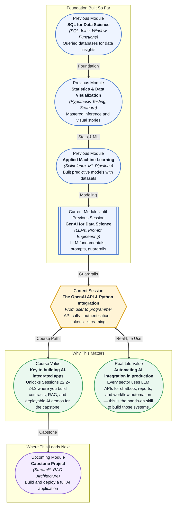

# Pre-read: The OpenAI API & Python Integration

## Context of This Session in the Course

You have spent weeks building a machine learning model that predicts customer churn with 92% accuracy. Your notebook is clean, your features are engineered, and your evaluation metrics are solid. Now your manager asks: "Can we put this in a Slack bot where anyone on the team can type a customer ID and get a natural-language explanation of why they might leave?" You could write a script that loads your model, computes predictions, and prints results to the console. But that is not what is being asked. The request is for a conversational interface — one that understands plain English, provides explanations in plain English, and feels like talking to a knowledgeable colleague rather than running a batch job. Building that requires connecting your Python environment to a service that can understand and generate language on demand, not just predict numbers. That is where the **OpenAI API and Python integration** becomes essential. This session teaches you to move from being a consumer of AI models inside a notebook to being a developer who programmatically invokes LLM capabilities from any Python script.

What if you could write a Python function that, given a thousand customer support emails, automatically categorises them by urgency, drafts a personalised response for each, and flags the ones that need human review — all in under a minute? What if that same function could be dropped into an existing data pipeline, called from a FastAPI endpoint, or scheduled to run every morning at 6 AM? The line between "data scientist who analyses data" and "data scientist who builds intelligent systems" is drawn right here — at the moment you learn to make an API call from Python. This session is where that line gets crossed.

An **API** (Application Programming Interface) is a contract between two pieces of software: if you send a request in this format, you will receive a response in that format. The OpenAI API is a special kind of web API that, instead of returning weather data or stock prices, returns generated text. When you send it a prompt, it processes that prompt as a sequence of **tokens** — the atomic units that language models consume, roughly 0.75 words per token for English — and predicts what text should follow, based on patterns learned from billions of documents. Think of it like hiring a brilliant but extremely literal assistant. The assistant has read everything and can write in any style, but will only work through a strict protocol. You write down your request on a specific form (the API request), hand it to a messenger (the OpenAI Python SDK or the `requests` library), and the messenger returns the assistant's response on another form (the API response). Your job as the programmer is to master that protocol: how to **authenticate** so the service knows you are authorised, how to structure your request so the model understands the task, and how to control **parameters** like **temperature** (which governs randomness — lower values produce more deterministic output) to get consistent, useful results. You will also learn to manage **streaming responses**, where the model sends text back token by token as it generates them, and to reason about **cost**, since every API call consumes tokens at a specific price.

In the **previous session** (21.3: Handling Edge Cases & Consistency), you learned how to make LLMs behave predictably — validating inputs, handling hallucinations, designing robust instructions, and testing prompt versions across multiple runs. Those skills were exercised from the chat interface of a web-based LLM. Now you will learn to automate that entire workflow from Python. The prompt strategies you mastered — system prompts, few-shot formatting, chain-of-thought structuring — become the payload you send via the API. The consistency checks you practiced manually become code that runs every time your application calls the model. Session 21.3 taught you what to say; this session teaches you how to build the program that says it.

In this pre-read, you will discover:
- How to **authenticate** with the OpenAI API and manage API keys securely in Python
- How to **build** a complete request to the ChatCompletion endpoint, including model selection and parameter tuning
- How to **interpret** token usage and cost implications when designing your application
- How to **connect** streaming responses to build interactive, real-time user experiences

---

## Why Authentication Is More Than Just a Key

The first hurdle in using any cloud API is proving who you are. OpenAI identifies you through an **API key** — a long, opaque string that you include in every request's header. Get this wrong, and you will receive a 401 Unauthorized response before the model even considers your prompt. The naive approach is to hardcode the key into your script. That works until you accidentally commit it to GitHub, at which point automated scrapers will find it within minutes and use it to generate thousands of dollars of compute on your account. The professional approach — which you will learn in this session — is to store the key as an environment variable, load it using `os.getenv()` or a `.env` file, and keep it out of your source code entirely. This is not bureaucracy; it is the same discipline that every production Python service follows. Once authentication is in place, you can call `openai.ChatCompletion.create()` with confidence, knowing that every request is properly attributed and billing is correctly tracked. The same authentication pattern — API key in a header, stored as an environment variable — is used by virtually every modern cloud service, from AWS to Stripe to GitHub. Mastering it here means you have mastered it everywhere.

## Tokens Are the Currency of Thought

When you send a prompt to GPT, both your input and the model's output are priced in **tokens**. A token is roughly a chunk of text — a short word like "cat" is one token, while a longer word like "unbelievable" might be broken into three. The total cost of an API call depends on the number of input tokens (your prompt) plus the number of output tokens (the model's response), multiplied by the per-token rate for the specific model you choose. This pricing model creates a design tension that every API developer must navigate. A longer, more detailed prompt produces better results but costs more and consumes more of the model's **context window** — the maximum number of tokens the model can consider at once. GPT-4, for example, offers 8K and 32K context variants, and choosing between them is a tradeoff between capability and cost. You will learn to use the `max_tokens` parameter to cap response length, to inspect the `usage` object in every API response, and to estimate costs before you run a large batch. This token economy is not an afterthought — it is a core design constraint that shapes how you write prompts, choose models, and architect your application. Understanding it turns you from a casual user into a deliberate engineer.

## Where API Integration Appears in Real Life

The pattern you will learn in this session — authenticate, construct a prompt, call an endpoint, parse a response — is the same architecture used by every major AI platform. Anthropic's Claude API, Google's Gemini API, and open-source models running on Replicate or Together AI all use identical request-response patterns with API keys, JSON payloads, and token-based pricing. In fintech, companies use the OpenAI API to automatically generate regulatory compliance summaries from transaction logs, reducing a process that once took hours to seconds. In healthcare, clinical notes are fed through LLM APIs to draft patient follow-up letters, saving physicians hours per day while maintaining medical accuracy. E-commerce platforms power customer-facing chatbots that answer shipping questions, process returns, and escalate complex issues — all through a thin Python wrapper over an LLM endpoint. Content teams embed API calls inside ETL pipelines to generate SEO meta descriptions, summarise blog posts, and translate articles at scale. And in data science itself, API integration is how teams build automated insight engines — pipelines that read a daily CSV, pass each row to an LLM for analysis, and write the results to a dashboard. Every one of these applications starts with the same few lines of Python you will write in this session.

## What's Next

After this session, you will be able to:

- Authenticate with the OpenAI API using environment variables and securely manage API credentials across projects
- Construct and send a complete request to the ChatCompletion endpoint with configurable parameters like temperature and max tokens
- Calculate token usage and estimate the cost of any API call before executing it at scale
- Implement streaming responses to display model output in real time as it is generated
- Handle common API errors including rate limits, authentication failures, and timeout scenarios with structured retry logic
- Wrap an LLM call into a reusable Python function that can be imported across multiple notebooks and scripts

You do not need to memorise every parameter or pricing tier right now. The goal is to understand that from this session forward, LLMs are not just tools you chat with through a browser — they are services your Python code can call like any other API: **the LLM becomes a programmable function in your toolkit.**

## Interesting Questions for the Live Session

- If two different prompts produce the same number of input tokens but one uses much shorter words, should the cost be the same? What does this tell you about how tokenisation actually works under the hood?
- When would you choose a low-temperature (near-deterministic) model response versus a high-temperature (creative) one in a production setting — and how would you design a test to validate that choice?
- A streaming response gives you tokens one by one, but your user interface needs complete sentences. How would you design the boundary between "partially generated thought" and "ready-to-display text"?
- If an API call fails halfway through a long response, you have already paid for the tokens consumed. How would you design a retry strategy that minimises wasted cost without sacrificing reliability?

By the end of this session, the OpenAI API should feel less like a mysterious black box and more like a programmable building block you can wire into any Python project: **the LLM is just another library import away from your data pipeline.**
