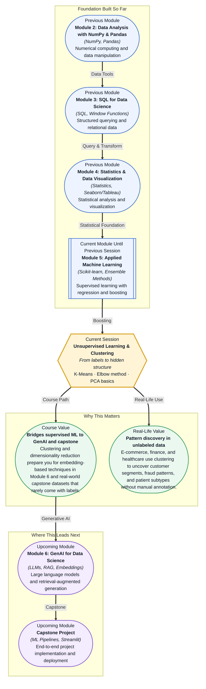

# Pre-read: Unsupervised Learning & Clustering

## Context of This Session in the Course

You open your laptop on a Monday morning and pull up a dataset of 50,000 customer support tickets. Each row has a timestamp, product category, response time, and ticket length — but not a single label telling you which tickets are urgent, which customers are at risk, or what patterns predict escalation. Your task is to surface hidden structure from raw numbers and text, with no answer key provided.

The supervised toolkit you have built over the past eight sessions — linear and logistic regression, decision trees, KNN, random forests, gradient boosting — all rely on one critical ingredient: a target variable. Without labels, there is no error to minimize and no prediction to validate. The intuitive approach of "just look at the data" breaks down when you have dozens of dimensions and thousands of rows; patterns that seem obvious in two dimensions become invisible in higher-dimensional space. The harder you try to find structure by eye, the more you realize you need a different kind of algorithm.

This is where machine learning takes a fundamentally different turn — from learning with a teacher to discovering without one. That is where **Unsupervised Learning & Clustering** becomes essential.

What if you could build a system that automatically groups thousands of unlabeled documents into thematic clusters — revealing customer pain points, emerging trends, and operational bottlenecks — without reading a single ticket yourself? What if you could then visualize those clusters in two dimensions and present a clear, data-driven story to your stakeholders, showing exactly which patterns emerged from the noise? This session gives you the framework and algorithms to turn that "what if" into your standard workflow.

**Unsupervised learning** is the branch of machine learning where you find patterns in data without pre-existing labels or target variables. Where supervised learning asks "what is this?", unsupervised learning asks "what looks similar to what?" At the heart of this session is **K-Means clustering**, an algorithm that partitions data into K distinct groups by iteratively assigning each point to the nearest cluster center, or centroid. Think of K-Means like organizing a massive bookstore by hand: you decide how many sections the store should have (K), place initial signs for each section, and then move every book to the nearest sign, adjusting the sign positions as the piles grow. After several rounds of reassignment, each book settles into its most natural section. The challenge, of course, is choosing how many sections the store should have — too few and romance gets mixed with self-help, too many and Stephen King gets his own shelf. This session explores exactly that tension using the **Elbow method** and introduces **Principal Component Analysis (PCA)** to reduce high-dimensional data down to a handful of interpretable dimensions so you can see clusters that would otherwise remain invisible.

In the **previous session**, you explored Ensemble Learning: Gradient Boosting — an algorithm that builds a strong predictive model by sequentially correcting the errors of weaker ones. Every model you trained up to that point depended on labeled data: a target column that told the algorithm what "right" looked like. You learned to measure performance with accuracy, precision, recall, and ROC-AUC curves, and to tune hyperparameters for better predictions — all firmly within the supervised paradigm. That supervised foundation is what makes this session's shift so powerful. You now understand what models need in order to learn, how they fail, and how to evaluate their output. Unsupervised learning strips away the target variable and asks you to find structure with no answer key — a harder problem that, once mastered, doubles the range of real-world data problems you can solve.

In this pre-read, you will discover:
- How to **apply** cluster analysis to unlabeled datasets using K-Means
- How to **determine** the optimal number of clusters with the Elbow method
- How to **reduce** high-dimensional data to essential components using PCA
- How to **recognise** when unsupervised learning is the right approach over supervised methods

---

## How K-Means Turns Noise Into Neighbourhoods

Imagine standing in a warehouse with thousands of boxes scattered across the floor. Nobody tells you how many piles to make or what each pile should represent, but you know similar boxes belong together. K-Means tackles this by starting with K imaginary centroids placed at random locations, assigning every data point to the nearest centroid, then moving each centroid to the mathematical center of its assigned points, and repeating until the centroids stop shifting. What emerges are K groups where the points within each group are as similar as possible and the groups themselves are as different as possible.

The algorithm is deceptively simple, but its output is highly sensitive to initialization. If the starting centroids land in unlucky positions, the final clusters can be suboptimal. Modern implementations use **K-Means++** initialization, which spreads the initial centroids farther apart to avoid this pitfall. In scikit-learn, this is the default behavior — and it is one of those details that separates a robust clustering pipeline from a brittle one. The real art of K-Means, however, lies not in the algorithm itself but in the question that precedes it: how many clusters should you ask for?

## Why Choosing K Is a Question, Not a Number

The **Elbow method** answers this by plotting the **within-cluster sum of squares (inertia)** — a measure of how tightly grouped points are around their centroids — against values of K. As K increases, inertia always decreases because more centroids mean points are closer to one. The insight lies in the rate of decrease: at the optimal K, adding another cluster produces only a marginal reduction in inertia, creating an "elbow" shape in the plot. In theory, the elbow is where you stop. In practice, it is rarely a sharp 90-degree angle. It is often a gradual curve, and choosing K becomes a decision informed by both the plot and your domain knowledge. Do the resulting clusters make business sense? Are they stable when you run the algorithm again with a different random seed? Many analysts combine the Elbow method with the **silhouette score** — which measures how similar a point is to its own cluster versus neighboring clusters — to triangulate on the right K. The key insight is that choosing K is not a mechanical step you automate; it is a judgment call that requires you to weigh mathematical evidence against real-world interpretation.

## Where Unsupervised Learning Appears in Real Life

Clustering and dimensionality reduction show up across nearly every data-intensive industry, often in places where the absence of labels is the norm rather than the exception. In **e-commerce**, K-Means segments customers into high-value, bargain-hunting, and at-risk groups for targeted campaigns and personalized product recommendations — all without a single labeled "customer type" column. **Healthcare** researchers use clustering to discover patient subtypes, such as identifying which diabetes patients share complication profiles, enabling preventative care strategies that a one-size-fits-all approach would miss. In **finance**, both clustering and PCA detect anomalous transactions: normal spending forms dense clusters while fraud falls far from any centroid, and PCA reduces hundreds of transaction features into a handful of components that make these outliers visible. **Marketing** teams cluster audiences by browsing behavior and purchase history to tailor messaging across channels, replacing manual demographic rules with data-driven segments. And in **NLP**, topic modeling pipelines often begin with a clustering step to organize thousands of documents into thematic buckets before deeper analysis. In every case, the core insight is the same: when you lack labels, structure is still hiding in the data, and these algorithms are designed to find it.

## What's Next

After this session, you will be able to:
- Cluster unlabeled data using K-Means with scikit-learn and interpret the resulting groups
- Determine the optimal number of clusters by applying the Elbow method and analyzing the within-cluster sum of squares
- Reduce high-dimensional data to principal components using PCA and visualize clusters in two dimensions
- Preprocess categorical and numerical features for effective clustering through scaling and encoding
- Distinguish between supervised and unsupervised learning problems and justify your choice of approach
- Evaluate cluster quality using inertia and silhouette scores to validate your segmentation decisions

You do not need to memorize the eigenvector math behind PCA or the centroid update formulas right now. The goal is building the instinct to ask "what patterns are hidden here?" before you ask "how do I predict this?"

## Interesting Questions for the Live Session

- K-Means always converges — but does convergence guarantee meaningful clusters? What could produce misleading groups even after convergence?
- The Elbow method often produces an ambiguous curve rather than a clear elbow — what other metrics or heuristics would you combine with inertia to choose K with confidence?
- PCA projects data onto fewer dimensions but discards variance — how would you decide how many components to keep, and what risks come with keeping too few?
- If your clustering results contradict established business knowledge, do you trust the algorithm or your domain expertise? How would you investigate the discrepancy?

By the end of this session, unsupervised learning should feel less like a mysterious black box and more like a structured way to explore the unknown: **when you don't have the answers, let the data show you the questions.**
